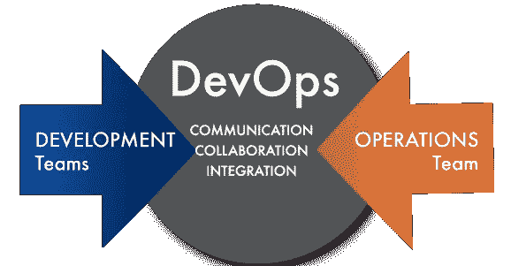
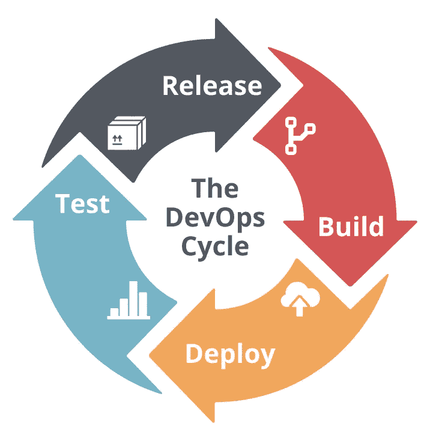
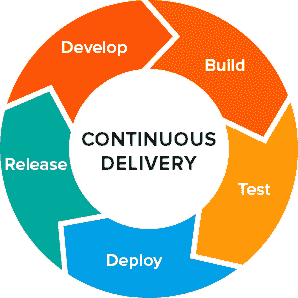
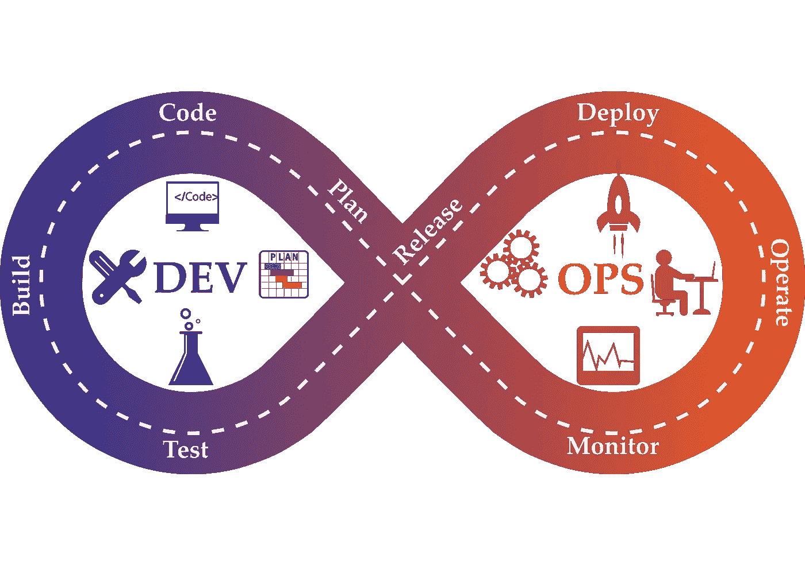
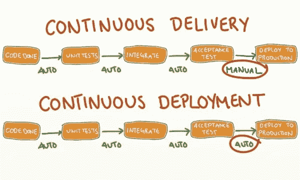
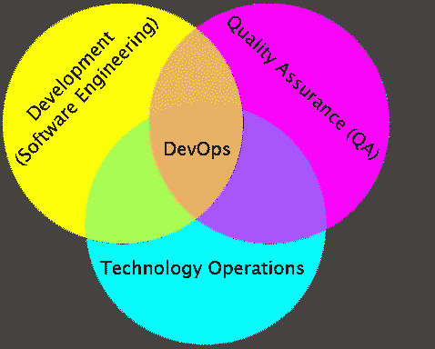

# DevOps 是什么？“用简单的英语”

> 原文：<https://medium.com/geekculture/what-is-devops-in-simple-english-6550fbb129bd?source=collection_archive---------0----------------------->

> **现代软件开发方法**

所以首先，当你听到瀑布、SCRUM、Sprint、敏捷、持续集成、持续交付、持续部署、DevOps、DevSecOps 等术语时；把这些术语看作是做事情的一种方式， ***不是一个技能集*** 。

还有“ ***没有 12 个步骤”*** 要成功实现 DevOps 或敏捷等。基本上就是使用这些概念，并应用它们来创建一个更好地为您的团队或组织工作的工作流程。

> **什么是 DevOps？**

“Dev”指软件应用开发，“Ops”指 IT 运营。定义 DevOps 工程师做什么仍然在变化中，因为 DevOps 不是一个框架或工作流。这是一种正在超越商业世界的文化。

DevOps 是一个有不同解释和定义的概念，但当你深入了解它时，它都是关于开发人员和运营团队打破孤岛，共同努力更快地创新。对于许多公司来说，快速创新的能力——响应市场条件和客户反馈是成功的关键因素。

让我们以一家公司为例，该公司的成功取决于其比竞争对手更快地向在线客户提供产品的能力。公司开发人员团队为新产品、功能、安全更新和错误修复编写代码。在传统的软件开发生命周期过程中，开发团队的工作需要几周时间才能投入生产。

当*开发团队*的代码最终部署到生产环境中时，偶尔会出现意想不到的错误或问题。这主要是因为*开发团队*专注于为其开发环境编写代码，而开发环境并不等同于生产环境。

运营团队(系统管理员)负责维护生产环境的正常运行时间。当公司内的服务器数量大幅增加时，运营团队用来管理服务器的工具可能会失效。

这一挑战会影响新代码在生产环境中的部署方式，这也是为什么*运营团队*通常需要安排代码部署，并且在大多数情况下一个月只允许一次。一旦代码被部署到生产环境中， *Ops 团队就*负责错误诊断或由变更引起的问题。

采用 DevOps 理念需要新的心态、工具和技能。DevOps 整合了开发和运营团队，通过自动化基础设施、工作流程、管道和持续测量应用性能来提高协作和生产力。

DevOps 有四个基本的核心价值观:**文化、自动化、测量和共享。**

DevOps 实践有五个层次:**价值观、原则、方法、实践和工具**。

*DevOps 可分 3 个阶段实施:*

*   第一阶段: ***自动化测试***
*   第二阶段: ***持续集成***
*   第三阶段: ***连续交货***

# 1.自动化测试

敏捷方法和自动化测试是 DevOps 能力的基础。这包括在代码中编写测试，以便通过测试是否失败来评估代码中的每一个变化。

# 2.连续累计

一旦我们有了有效的测试代码覆盖率，整个测试过程就自动化了。Jenkins 是用于实现持续集成的最流行的工具之一。这个概念是基于在后台测试代码的许多服务器，并通过每一次可能的迭代运行它，以便发现它是否能以自动化的方式创建任何 bug。Jenkins 将在过程结束时生成一个报告(比如什么是代码覆盖率，测试是失败还是通过，等等)。)

# 3.连续交货

这个阶段是我们获得真正商业价值的地方。基础包括编写小块代码(新特性、错误修复等)。)进行集成、测试、监控和部署。

每个组织的持续交付/部署渠道和工具是不同的。管道的概念是一系列的阶段，每个阶段都有特定的工具支持。让我们看看连续交付的六个关键阶段以及与之相关的工具。

关键领域有:****持续集成系统******构建******测试*** ，你需要一个工件库，比如(AWS S3、[***CloudRepo***](https://www.cloudrepo.io/)、Nexus、Artifactory、Docker Hub)和 ***使用版本控制(例如:Git、SVN 等。)和源代码管理(例如:GitHub、Bitbucket、Subversion、Mercurial、CodeCommit 等。)，我们提交代码更改，并可以查看所有更改的完整历史。****

**

*   ***计划&编写代码:***开发团队*使用版本控制和源代码管理工具计划和编写代码。*
*   *构建&测试:在编写代码的时候，我们可以使用像 Jenkins 这样的工具进行构建和测试。*
*   ***发布&部署:**他们是工具(如 Jenkins、GitHub Actions、Travis CI、Drone CI 等。)以及配置管理和供应工具，如。(厨师，Ansible，木偶，Terraform 等。)这有助于将代码交付到 web 服务器、后端服务器或云环境中的任何托管资源(如 AWS、Heroku、GCP、Azure 等)的过程自动化。)*

*无服务器架构是在云中创建系统或第三方服务而不是依赖服务器的最新计算方法。Docker 是无服务器架构的一个例子。Docker 与 Puppet 协同工作，使代码更具可移植性，可以存储在多个云中，以实现更好的灾难恢复计划(AWS 云是目前最受欢迎的)。*

*   ***操作&监视器:**使用*新遗迹*等工具可以监视一切。*

****持续部署*** 描述了软件何时快速部署到生产中，因为团队成员要确保应用程序通过完整的自动化测试。*

**

****一个 DevOps 团队如何完成以上所有工作？****

*   *CI 和测试工具，允许团队测试、构建和部署新代码，同时持续集成每个变更(监控重复工作的执行，更容易地集成项目变更，并访问输出以快速识别问题)*
*   *用于源代码控制的工具，允许团队管理、跟踪和记录对应用程序代码的所有更改—(版本控制系统，用于跟踪计算机文件中的更改和协调多个团队之间的工作流，并用于软件开发中的管理)*
*   *用于配置管理和供应的工具允许团队创建一个基础设施，在该基础设施中，应用程序代码将被托管并以自动化的方式交付，可能跨越位于不同位置的几个服务器。*

****配置管理*** 定义了应该如何构建 web 服务、硬件规格、操作系统、软件包、安装脚本等。这就像基础设施和建筑的蓝图。 ***供应*** 是根据您的配置管理设置构建基础设施的过程。*

**

****DevOps 团队****

*   *开发(开发人员)*
*   *质量保证(QA):测试代码以确保它是稳定的并满足软件需求*
*   *运营(生产支持、系统管理)*
*   *DevOps 工程师*

****好处****

*提高软件交付率，加快上市时间*

*通过自动化基础架构保持更好的业务重点*

*更高的软件质量和效率*

*更少的错误*

*降低交付成本*

> *“这些内容的灵感来自 Brandon Kolybaba、Rackspace organization、 [Ernest Mueller](https://twitter.com/ernestmueller) 和 [James Wickett](https://twitter.com/wickett) 的不同资源和在线课程。”*
> 
> *如果你喜欢这篇文章，请给它一些掌声支持。你可能也喜欢 [**什么是 Docker？用简单的英语说**](/@yannmjl/what-is-docker-in-simple-english-a24e8136b90b)*

> *干杯！！*

**

*📝稍后在[杂志](https://blog.usejournal.com/r/?url=https%3A%2F%2Fusejournal.com%2F%3Futm_source%3Dmedium.com%26utm_medium%3Dnoteworthy_blog%26utm_campaign%3Dtech%26utm_content%3Dguest_post_read_later_text)上阅读这个故事。*

*👩‍💻每周日早上醒来，你的收件箱里会有本周最值得关注的科技新闻。[阅读科技简讯](https://blog.usejournal.com/r/?url=https%3A%2F%2Fusejournal.com%2Fnewsletter%2Fnoteworthy-in-tech%2F%3Futm_source%3Dmedium.com%26utm_medium%3Dnoteworthy_blog%26utm_campaign%3Dtech%26utm_content%3Dguest_post_text)中值得注意的内容。*