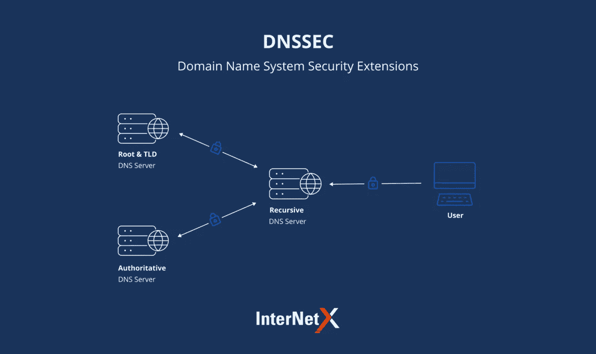

# 什么是 DNSSEC，它是如何工作的？

> 原文：<https://medium.com/geekculture/what-is-dnssec-and-how-does-it-work-dc02d089e956?source=collection_archive---------16----------------------->

[在上一篇文章](/geekculture/what-is-a-domain-name-system-c7ce04a99dab)中，我们已经看到了什么是 DNS。我们已经看到，DNS 查询和响应是以纯文本形式发送的。如果你没有读过那篇文章，我强烈推荐你去读一读，以便更好地理解。无法验证来自目标服务器的响应。当 DNS 在 20 世纪 80 年代被设计出来的时候，安全性并不是一个问题，因为互联网非常小。想象一下，您的 DNS 解析器将 DNS 查询发送到一个权威的 DNS 服务器，DNS 解析器除了可以检查生成 DNS 响应的 IP 地址之外，没有其他方法对响应进行**认证。但这还不够，因为入侵者可以修改 DNS 流量并将源 IP 设置为权威服务器的 IP，还可以将域名的 IP 地址设置为某个恶意服务器。现在，客户端结束了与恶意服务器的通信。例如，如果您正在请求一个网上银行网站，某个入侵者来了并修改了 DNS 响应，它在 DNS 服务器中将该域名的 IP 地址设置为一个与您的网上银行网站一模一样的欺诈网站。现在，您最终会与欺诈性网站进行通信，输入您的凭据，等等。**

现在，解析器 DNS 服务器缓存 DNS 查询的结果。将发送对同一网站的查询的其他用户也将最终与这些欺诈性网站通信。这也称为缓存中毒攻击，因为 DNS 缓存中有一些恶意条目。除此之外，入侵者还可以捕获你的浏览模式。

当 DNS 暴露于这些漏洞时，DNS 的设计者 IETF 在 20 世纪 90 年代提出了一个解决方案，称为 DNSSEC，代表域名系统安全扩展。

DNSSEC 为 DNS 协议增加了两个重要功能

1.  **认证:**它允许 DNS 解析器加密验证数据来自最初生成响应的区域。每个 DNS 区域服务器(根，TLD，一个权威的 DNS 服务器)使用其私钥对响应进行数字签名，该私钥可以在解析器端使用与响应一起发送的相应区域的公钥进行加密。
2.  完整性:由于 DNS 响应是由 DNS 区域使用其私钥进行数字签名的，因此 DNS 响应在传输过程中不会被更改。这就是它提供 DNS 响应完整性的方式。

Source: [https://www.internetx.com/fileadmin/_processed_/3/c/csm_DNSSEC_748a5887ad.png](https://www.internetx.com/fileadmin/_processed_/3/c/csm_DNSSEC_748a5887ad.png)

**信任 DNSSEC 公钥:**

每个区域都发布它的公钥，但是如何验证一个区域的公钥呢？因为区域公钥可能不可信。当解析器向根服务器发送请求时，它发送 TLD DNS 服务器的 IP 地址以及其子服务器的公钥，即由其私钥数字签名的 TLD DNS 服务器。这意味着，如果您可以信任根 DNS 服务器的公钥，您也可以信任 TLD 服务器的公钥，因为它是由根 DNS 服务器数字签名的。以类似的方式，TLD 服务器也发送它们的子服务器(即由它们的私钥数字签名的权威服务器)的公钥和 IP 地址。因此，如果您可以信任 TLD 服务器的公钥，您也可以信任权威服务器的公钥。请记住，根区域服务器是 DNS 层次结构中最顶层的服务器，它没有父级来签署其公钥。

签署其他密钥的密钥序列被称为*信任链*。信任链开始处的公钥被称为*信任锚*。

# DNSSEC 不能做的

DNSSEC 是在 IP 网络的 DNS 中保护数据交换的极好手段。我们可以说 DNSSEC 是安全的，它应该包含在互联网安全最佳实践中。同时，有必要清楚地理解它，以避免错误的期望，因为 DNSSEC 不是所有 DNS 相关漏洞的解决方案:

*   它不能保证数据的机密性，因为它没有加密。
*   它不能直接防御 DDoS、网络钓鱼或欺骗攻击。

自从 DNSSEC 使互联网成为一个更安全的地方，但它没有被广泛使用？原因是在全球范围内实施它是一项巨大的事业。这需要承诺、共识和大量支出。它被使用得越多，我们就越能确定这个协议将会成为一个真正的标准来获得真实的 DNS 查询答案。