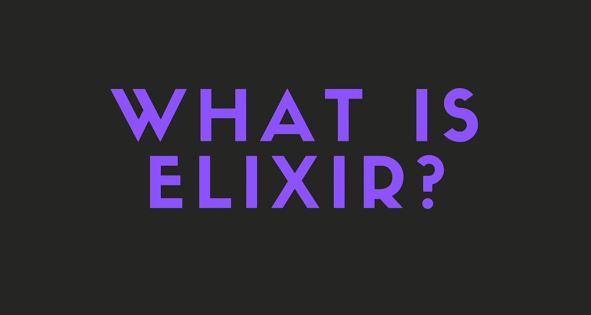

# 什么是仙丹？

> 原文：<https://medium.com/geekculture/what-is-elixir-3f6a96d8f642?source=collection_archive---------22----------------------->

什么是仙丹，为什么它很牛逼？

如果你是一个 web 开发人员，你可能听说过 Elixir，并且知道 Discord 使用它。

在这个故事中，我将解释什么是长生不老药，为什么你应该关心和它的利弊。

请注意，我不会在这里展示代码。不过不用担心，我会每天写关于仙丹(当然还有其他语言/技术)的故事！

开始吧！

# 首先，什么是仙丹？

> Elixir 是一种动态的函数式语言，用于构建可伸缩和可维护的应用程序。
> 
> [——https://elixir-lang.org/](https://elixir-lang.org/)

这是 Elixir 官网上说的。这是真的。

Elixir 是一种功能性的动态类型语言，构建在 Erlang 的 VM 之上，并向下编译为 Erlang 字节码。

我不会在这里解释什么是 Erlang，但是如果你想了解更多，请访问 Erlang 的官方网站。

基本上，Erlang 是一种很快但有点复杂的古老语言。它被广泛使用，尤其是在电信行业。

 [## Erlang 编程语言

### Erlang 是一种编程语言，用于构建大规模可伸缩的软实时系统，具有高性能要求

www.erlang.org](https://www.erlang.org/) 

灵药是由 José Valim 创造的，他是一个 Ruby 开发者。他采用了 Ruby 语法，对其进行了改进，并将其用于 BEAM。(Erlang 虚拟机)

这使得 Elixir 快速、可伸缩和可维护。这也是 Discord 选择仙丹作为后端的主要原因。目前，Discord 将 Elixir 和 Rust 结合使用，为超过 1100 万用户提供服务，他们做得相当不错。

> Elixir 编程语言将函数式编程与不可变状态和基于角色的并发方法包装在一个整洁的现代语法中。它运行在工业级的高性能分布式 Erlang 虚拟机上。
> 
> -迪夫·托马斯，编程灵丹妙药

# 仙丹的主要特点

*   **Elixir 构建在 Erlang VM 之上。** Elixir 可以访问 Erlang 可以访问的所有并发工具，这使它成为构建可伸缩的分布式系统的最强大的现代语言之一。
*   **仙丹具有类似红宝石的语法。**如果你已经用 Ruby 编程了，那么 Elixir 的语法会感觉很熟悉。Ruby 是最简洁和面向生产力的语言之一，但是它在性能和并发性方面有所欠缺。Erlang VM 解决了这两个问题，因此，Elixir 是两全其美的产品。
*   **仙丹是功能性的。虽然 Elixir 和 Erlang 可以说是自成一组(它们都是面向过程的)，但是 Elixir 也拥有你所期望的现代 FP 语言的所有结构。特别是，不可变的数据结构对并发性帮助很大，模式匹配对于编写声明性代码非常有用。**
*   **仙丹有动态分型。与 Haskell 和 Scala 等其他函数式语言相比，Elixir 具有动态类型。这意味着类型是在运行时检查的，而不是在编译期间。虽然在构建关键系统时这可能是一个缺点，但它也提高了简单 web 应用程序的开发速度。静态类型可以通过类型规范引入到 Elixir 中。**

# 该不该学仙丹？

是的。在我看来，每个开发人员都应该尝试 Elixir，并决定他/她是否喜欢它。

我对长生不老药有相当大的偏见，认为它很难、复杂而且没有必要。

你猜怎么着？我现在是一个长生不老药的爱好者，正在写关于它的故事！

不过，真的。仙丹改变你的思维方式，幸运的话让你沉迷其中，哈哈！

# 长生不老药的坏处

小社区。尽管我喜欢 Elixir 社区，并且认为他们非常友好，但这并不能改变 Elixir 社区很小的事实。

它与 JavaScript 或 Python 社区相去甚远，也没有那么多社区制作的资源和教程来学习它。这意味着你将不得不自己学习很多东西。

但是不要误解我。Elixir 文档非常简单明了，对于其他 Elixir 学习资源也是如此。我可以保证，学习长生不老药不会有任何问题。

我是怎么说的，它只是少了一些社区自制的资源和教程，仅此而已。

但是，这其实没那么糟糕。因为自学会提高你的技能，而且你会更容易记住东西。

我说过，我认为每个开发者都应该尝试 Elixir，并决定社区对他们是否重要。

对我个人来说，小社区根本不是问题。

# 学习灵丹妙药

以下是学习长生不老药的资源列表:

## Elixir 的官网

Elixir 的官网有一个学习板块，你可以在这里学习 Elixir，还可以看到最好的 Elixir 书籍、课程等等。

 [## 学习资源

### 我们的网站提供了一个入门指南，以了解更多关于 Elixir 的基础，并探索如何建立项目…

elixir-lang.org](https://elixir-lang.org/learning.html) 

## 精英学校

有个网站叫 ElixirSchool，教你灵药和流行的灵药框架和库。

 [## 长生不老药学校

### 了解如何使用模式匹配而不是保护子句来实现 Elixir 中真正干净的控制流。了解如何…

elixirschool.com](https://elixirschool.com) 

## 介质上的烯丙基边缘

你没听错。你可以在灵媒上跟随我，从我的故事中学习长生不老药！

# 仙丹生态系统

Elixir 不如 JavaScript 或 Python 流行。尽管如此，越来越多的人开始每天使用它。

有很多像[炼金术](https://github.com/cronokirby/alchemy)(不和谐库)[苦艾酒](https://github.com/absinthe-graphql/absinthe)(graph QL)[艾什](https://www.ash-elixir.org/) (APIs)这样的仙丹库。

基本上，Elixir 有一个小但友好有效的社区。我在 Discord 和 Forum 上很快得到了我的问题的答案，成员们总体上也很友好。

## [凤凰](https://phoenixframework.org/)

最大和最流行的仙丹框架是 Phoenix。Phoenix 是最好的 Web 框架之一，它的速度非常快。

Phoenix 拥有开箱即用的 MVC、PubSub、LiveView 等功能。

我个人很喜欢凤凰。我从来没有像喜欢菲尼克斯一样喜欢过一个框架。

# 仅此而已。感谢您阅读这个故事！

如果你喜欢这个故事，一定要为它鼓掌！你想问我什么都可以。

在 Twitter 上关注我:

 [## re _ ally 边缘

twitter.com](https://twitter.com/Re_allyedge) 

在 Patreon 上支持我:

 [## 阿里木阿尔斯兰卡亚是创造编程故事和教程。帕特里翁

### 今天就成为阿里木阿尔斯兰卡亚的赞助人:在世界上最大的…

www.patreon.com](https://www.patreon.com/allyedge)