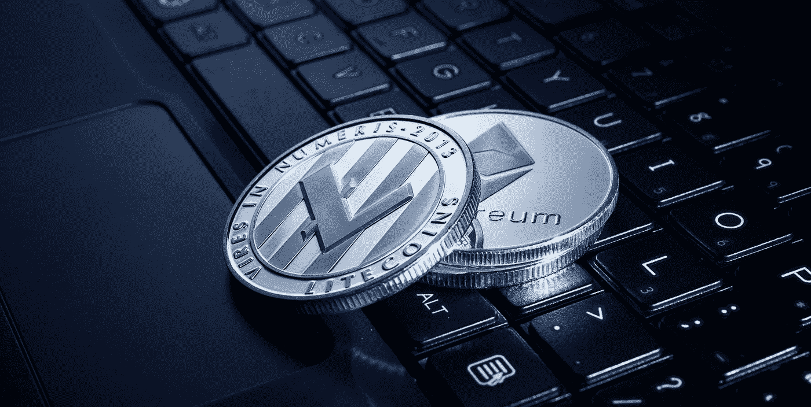

# 什么是 ERC20？替代硬币和替代代币说明

> 原文：<https://medium.com/geekculture/what-is-erc20-altcoins-alttokens-explained-9fe569f293e1?source=collection_archive---------16----------------------->

Photo by [Jievani Weerasinghe](https://unsplash.com/@jievani?utm_source=medium&utm_medium=referral) on [Unsplash](https://unsplash.com?utm_source=medium&utm_medium=referral)

如果你关注新硬币推出和加密货币新闻，你可能会经常听到“ERC20”这个词来描述某人在以太坊上推出的热门新硬币。他们这么说是什么意思？

简而言之，ERC20 是一种标准化，它需要一个令牌来实现某些功能，以便可以在各种位置轻松使用。需要 ERC20 令牌才能轻松访问…