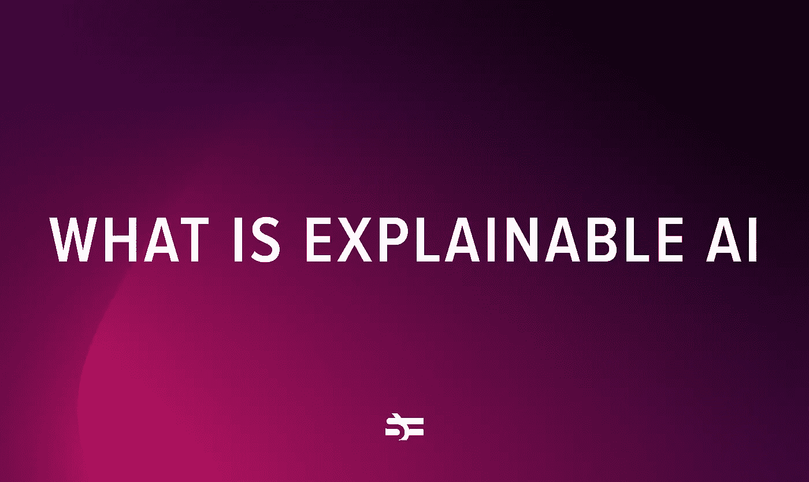

# 什么是可解释的人工智能，它是用来做什么的

> 原文：<https://medium.com/geekculture/what-is-explainable-ai-and-what-is-it-used-for-32f64b4ff4f9?source=collection_archive---------15----------------------->

## 机器学习模型能解释他们的决定吗？

当我们谈论人工智能问题时，信任往往是首先想到的。今天，人工智能被用于许多领域，包括对人类生活有直接影响的领域，如医疗保健和司法。为了能够信任这些领域的机器决策，我们需要它们…