# 机器学习-0 级-探索性数据分析

> 原文：<https://medium.com/geekculture/what-is-exploratory-data-analysis-8d972a83ae78?source=collection_archive---------63----------------------->

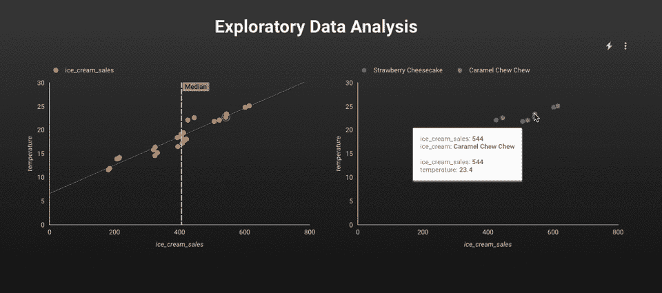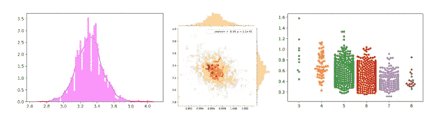

# 什么是探索性数据分析？

> *探索性数据分析是指对数据进行初步调查的关键过程，以发现模式、发现异常、测试假设并借助汇总统计和图形表示检查假设。*

首先理解数据并尝试从中收集尽可能多的见解是一个很好的做法。EDA 就是在数据被弄脏之前，理解手头的数据。

**EDA 用样本数据集解释:**

为了分享我对我所知道的概念和技术的理解，我将以 UCI 机器学习库中可用的葡萄酒质量数据集的白色变体为例，并尝试使用 EDA 从数据集中获取尽可能多的见解。

首先，我导入了必要的库(在本例中是 Pandas、NumPy、Matplotlib 和 Seaborn)并加载了数据集。

注意:无论我能得出什么样的推论，我都提到了要点。

*   原始数据由分隔符“；”分隔在给定的数据集中。
*   ”的帮助下仔细查看了数据。head()" panda 库的函数，它返回数据集的前五个观察值。同样”。tail()"返回数据集的最后五个观察值。

我用“.”找出了数据集中的行和列的总数。形”。

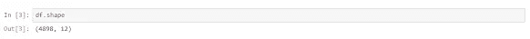

*   该数据集包括 4898 个观察值和 12 个特征。
*   其中一个是因变量，其余 11 个是自变量——物理化学特性。

了解列及其对应的数据类型并发现它们是否包含空值也是一种很好的做法。

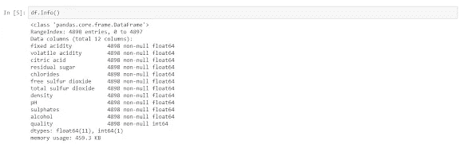

*   数据只有浮点数和整数值。
*   没有变量列具有空值/缺失值。

pandas 中的 describe()函数在获取各种汇总统计数据时非常方便。该函数返回数据的计数、平均值、标准差、最小值和最大值以及分位数。

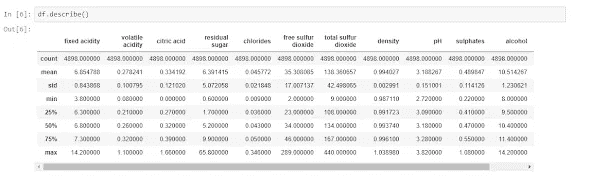

*   这里您可以注意到，平均值小于每列的中值，在索引列中用 50%(第 50 个百分位)表示。
*   预测值“残余糖”、“游离二氧化硫”、“总二氧化硫”的最大值与 75%之间存在显著差异。
*   因此，观察 1 和 2 表明，在我们的数据集中存在极端值-异常值。

仅通过观察因变量得出的一些关键见解如下:

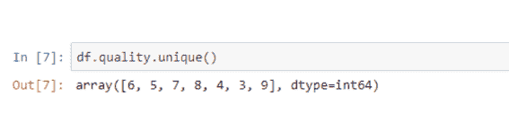

*   目标变量/因变量本质上是离散的和分类的。
*   “质量”评分范围为 1 至 10 分；其中 1 表示差，10 表示最好。
*   1、2 和 10 质量等级不是由任何观察给出的。只有获得的分数在 3 到 9 之间。

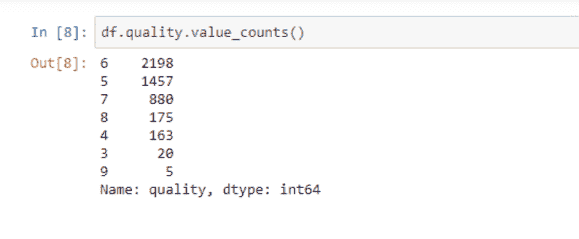

*   这告诉我们每一个质量分数按降序排列的数量。
*   “质量”在类别 5、6 和 7 中的值最多。
*   对第 3 类和第 9 类只做了一些观察。

**数据可视化**

我粗略地看了一下数据。但这就是数据科学，你参与的越多，就越难停止探索。现在让我们用漂亮的图表来探索数据。Python 有一个可视化库 Seaborn，它构建在 Matplotlib 之上。它提供了非常有吸引力的统计图来执行单变量、双变量和多变量分析。

让我们简单看一下这三种类型的数据分析。

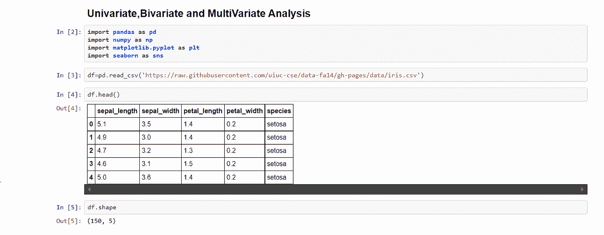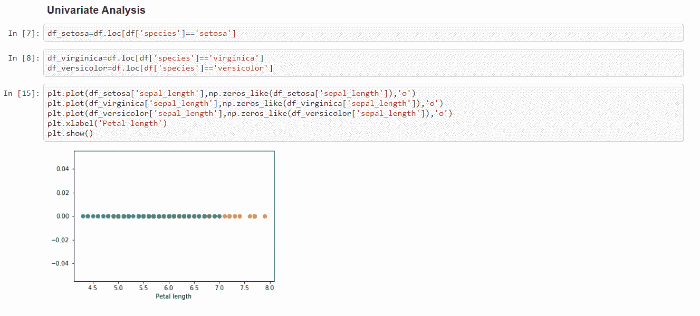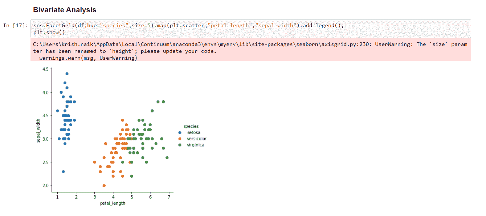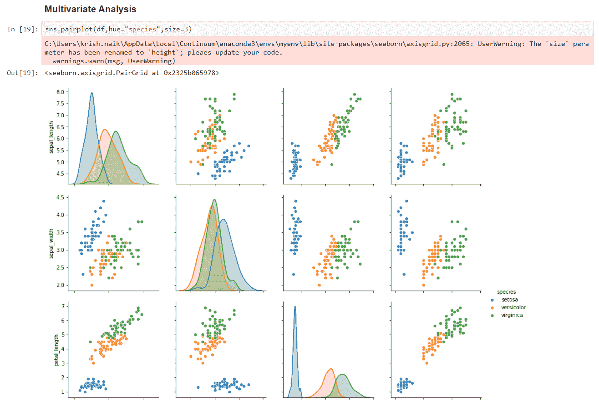

# 使用 Matplotlib 和 Seaborn 可视化数据

导入`matplotlib`库。

1.面积图

默认情况下，面积图是堆叠的。要生成堆积面积图，每列必须全部为正值或负值(任何值，即非数字值，将默认为 0)。要生成未堆叠的图，将参数`stacked`设置为值`False`。

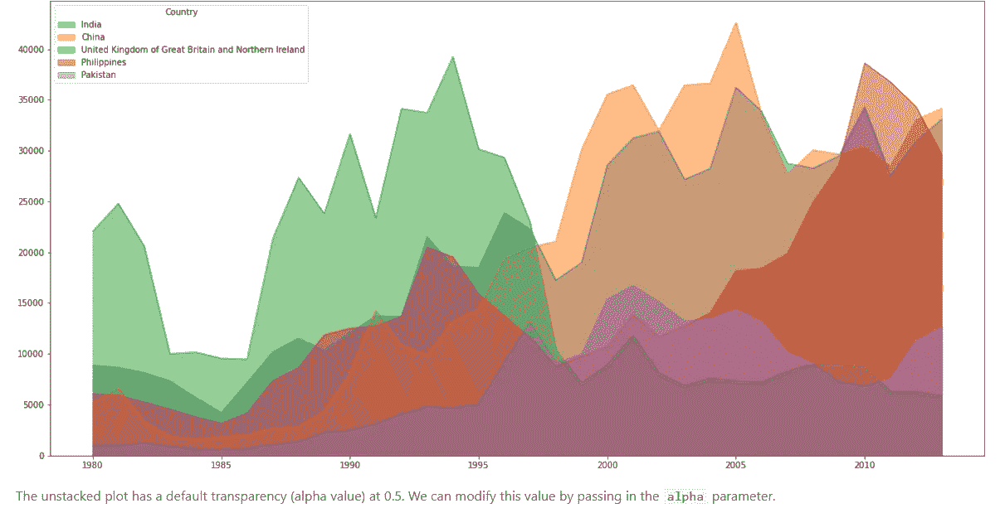

2.直方图

直方图是表示数值数据集的*频率*分布的一种方式。它的工作方式是将 x 轴划分为*个仓*，将数据集中的每个数据点分配给一个仓，然后计算分配给每个仓的数据点的数量。所以 y 轴是频率或每个仓中数据点的数量。请注意，我们可以改变 bin 的大小，通常需要调整它，以便很好地显示分布。

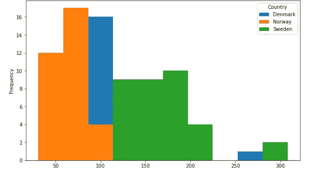

3.条形图(数据框架)

条形图是一种表示数据的方式，其中条形的*长度*表示特征/变量的大小。条形图通常表示按区间分组的数值和分类变量。

为了创建条形图，我们可以通过`plot()`中的`kind`参数传递两个参数之一:

*   `kind=bar`创建一个*垂直*条形图
*   `kind=barh`创建一个*水平*条形图

**竖条图**

在垂直条形图中，x 轴用于标记，y 轴上条形的长度对应于被测量变量的大小。垂直条形图在分析时间序列数据时特别有用。一个缺点是它们在每个条的底部缺少文本标签的空间。

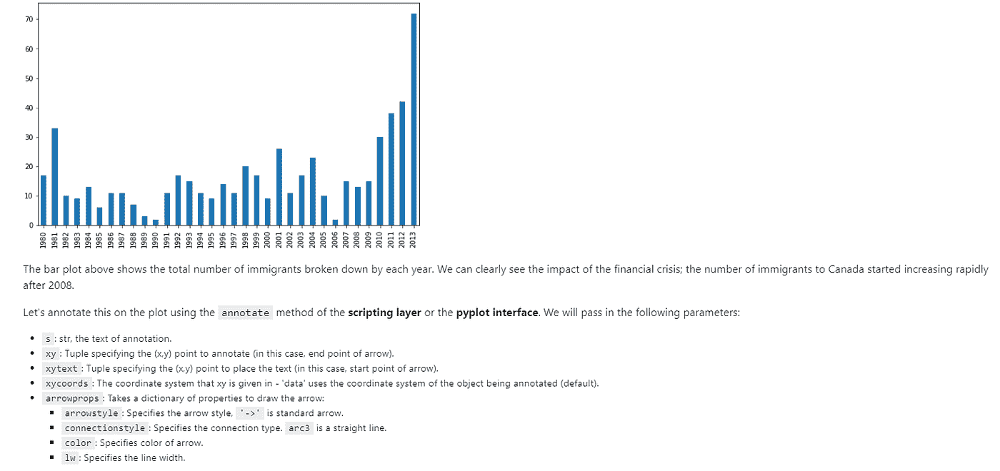

要使用线性回归进行建模，有必要移除相关变量以改进您的模型。人们可以用熊猫来寻找相关性。corr()"函数，并可以使用 seaborn 中的热图来可视化相关矩阵。

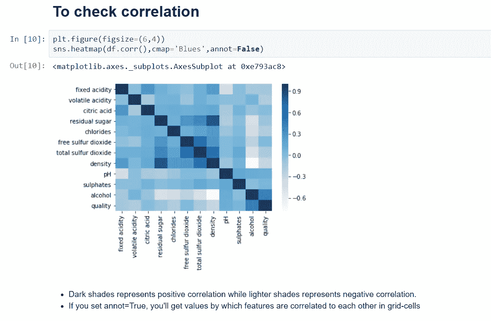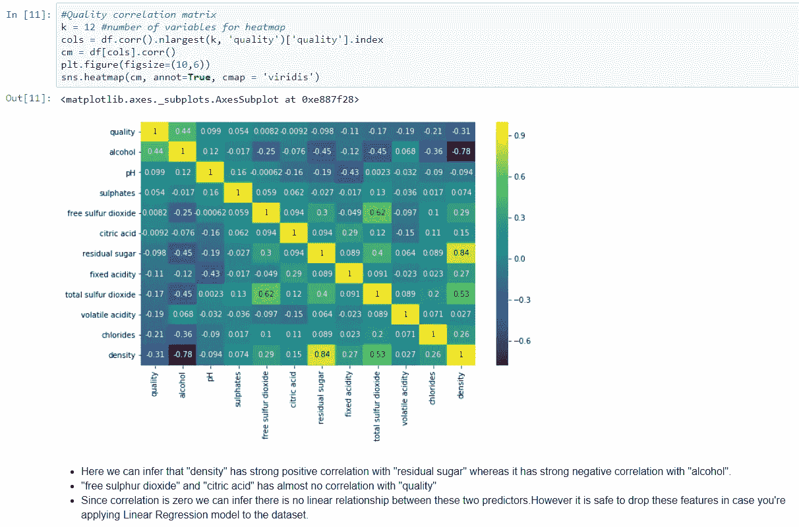

4.箱形图

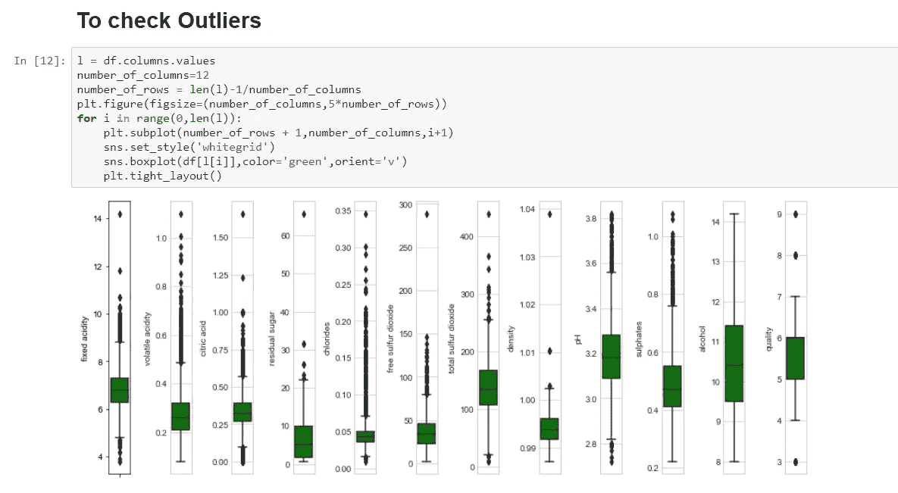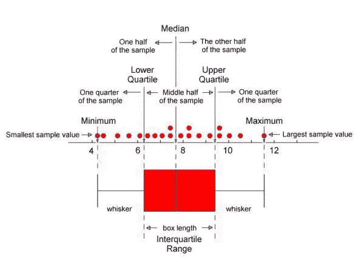

5.散点图

6.华夫饼图表

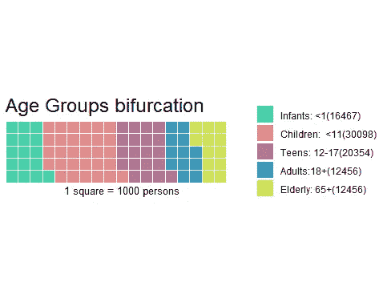

7.树叶图书馆

# 探索性数据分析和数据可视化只需一秒钟

> ***DataPrep 库——在极短的时间内执行更快的 EDA***

数据准备。EDA 是 Python 中最快最简单的 EDA(探索性数据分析)工具。—[https://pypi.org/project/dataprep/](https://pypi.org/project/dataprep/)

想了解更多关于这座图书馆的信息—【https://dataprep.ai/ 

第一步:！pip 安装数据准备

步骤 2:从 dataprep.datasets 导入 load_dataset

从 dataprep.eda 导入 create_report

df = load _ Dataset(" _ Dataset-Name _ ")

创建报告(df)

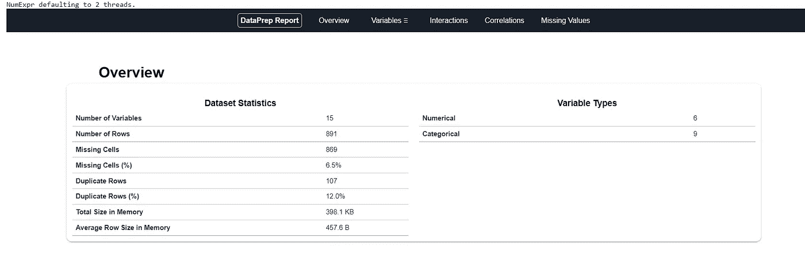