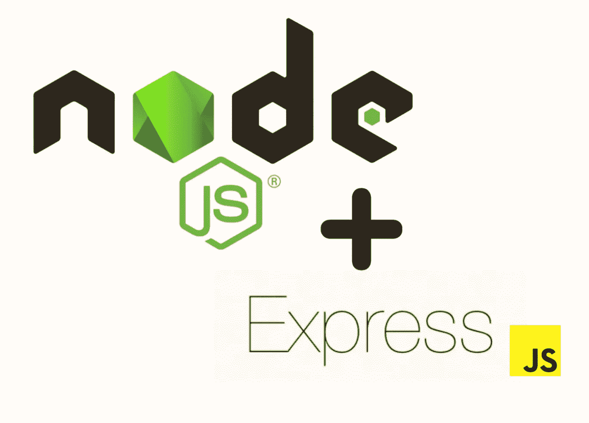

# Node.js 中表达的是什么

> 原文：<https://medium.com/geekculture/what-is-express-in-node-js-f51d178056b9?source=collection_archive---------8----------------------->



Node.js 是一个开源的、跨平台的 JavaScript 运行时。它被广泛用于构建快速和可伸缩的服务器应用程序。Node.js 为构建需要实时服务的应用程序(如聊天应用程序或视频会议应用程序)提供了一个很好的环境。

我们使用 [Express framework](https://expressjs.com/) 来创建快速、安全和可伸缩的 NodeJS 应用程序。Express 是一个用于 NodeJS 的极简 web 开发框架，它为在 NodeJS 中创建 web 应用程序和服务提供了一组健壮的特性。在本文中，我们将学习在 NodeJS 中使用 Express 的基础知识，从安装到使用处理程序和视图引擎。

在本文中，我们将看到所有与 NodeJS 中的 Express 相关的必要概念，以及一些与 Express 相关的基本 node js 面试问题。

在更好地理解 Express 之前，我们先来了解一下 NodeJs。

**什么是 NodeJS？**

NodeJS 是一个构建可伸缩网络应用的平台。它可以在服务器端和客户端运行，非常适合构建实时应用程序。

它可以用来构建从简单的 HTML5 游戏到需要高度性能和可靠性的复杂 web 服务的任何东西。

NodeJS 是 Ryan Dahl 在 2009 年创建的一个开源项目。从那时起，它已经成为构建可伸缩网络应用程序的最流行的平台之一。它在寻求构建实时应用程序(如聊天应用程序或游戏服务器)的开发人员中尤其受欢迎。

NodeJS 可以用于任何编程语言，只要它支持异步编程，如 Java 或 C#。使用异步编程，函数可以立即返回，而不是在继续程序的下一步之前等待响应。这允许开发人员编写对用户输入响应更快的程序。

NodeJS 有两个主要部分:

*   ***服务器*** :服务器是所有传入请求的目的地，并做出相应的响应。
*   ***客户端*** :客户端实际处理请求，并向连接到 NodeJS 服务器的用户或其他应用程序发回响应。

# 什么是 ExpressJS？

Express 是一个构建在 Node.js 平台上的 web 应用框架。它是用 Node.js 构建 web 应用和 API 最常用的框架之一。

Express 允许您响应来自客户端的 HTTP 请求、创建动态端点以及处理用户输入。有了这些特性和一组支持模块，Express 使得构建快速和可伸缩的应用程序变得非常容易。

ExpressJS 是一个用于构建 web 应用程序的模型-视图-控制器(MVC)框架。它建立在 Node 的核心库提供的 HTTP 模块之上，这使得 Express 应用程序易于扩展、安全和可维护。

*   它提供了对路由、HTTP 方法、HTTP cookies 以及所谓的路径变量的支持。
*   它还支持流数据，可用于 WebSockets。

ExpressJS 使用 Node 内置的服务器端 JavaScript 运行时。因为 Node 使用事件驱动的架构，所以它对于服务器端操作来说是轻量级和高效的。Node 最适合需要可伸缩性、实时网络通信(例如，高容量网站)和处理大量数据的应用程序。

# 为什么要用 ExpressJS？

使用 Express 作为 web 框架有很多原因。其中一些列举如下

*   ***可扩展性*** — Node.js 以可扩展性著称。您可以通过向应用程序添加更多服务器和负载平衡器来轻松扩展您的 Express 应用程序。如果您使用 Postgres 这样的数据库，如果需要，您还可以扩展您的数据库服务器。
*   ***性能***——Express 应用运行在支持谷歌 Chrome 浏览器的 V8 JavaScript 引擎上。这款发动机针对速度和性能进行了高度优化。
*   *—Express app 易于理解和维护。通过学习基础知识，您可以使用 Express 创建复杂的应用程序。*
*   ****流行度*** — Express 是构建 web 应用和 API 最流行的 web 框架之一。它被像 Twilio、网飞和 PayPal 这样的大型组织使用。*

# *ExpressJS 的主要特性*

*   ****路由*** —路由器使用正则表达式模式将请求 URL 与其关联的路由进行匹配。然后，路由调用与请求相关联的控制器，并生成响应。*
*   ****Cookies***—Cookies 用于存储用户的信息，如登录详情等。Express 提供了各种设置、获取和删除 cookies 的方法。*
*   ****HTTP 请求*** — Express 包括处理 HTTP 请求和响应的所有必要模块(如— GET、POST、PATCH、DELETE 等)。*
*   ****中间件*** —中间件是一个助手功能，可以用来扩展 Express app 的功能。*
*   ****休息***——(具象状态转移或休息)。Express 应用程序支持 REST-ful web 服务的思想，可以按照规定的标准来开发。*
*   ****web sockets***—web sockets 用于处理客户端和服务器之间的实时双向通信。*
*   ****流式*** — Express 应用程序可以使用流式方法处理大量数据或实时传输数据。*

***使用 Express with NodeJS 的优势***

*Express 是 NodeJS 的轻量级 web 框架。它通过提供一组最佳实践来帮助您以简单的方式编写更快、更易维护的 web 应用程序，所有级别的开发人员都可以利用这些最佳实践。*

*使用 Express 的一个关键优势是它可以帮助您构建 RESTful APIs。RESTful APIs 通常用于创建具有可预测的 URL 结构、一致的命名约定和标准响应格式的 web 服务。通过创建自己的 RESTful API 并使用 Express 构建后端，您可以确保从世界上的任何地方都可以访问您的 API。*

*Express 还为路由、模板和数据验证等常见任务提供了许多帮助函数。这些特性使得开发人员可以轻松地立即开始构建他们的应用程序，然后专注于他们最需要的特定特性。*

****使用 Express with NodeJS 的另一个好处是-****

*   *Express 可以定制，但不能定制。*
*   *我们可以使用中间件来处理请求。*
*   *前端和后端开发都是用同一种语言完成的。*
*   *Express 可以快速连接到 MySQL、MongoDB 等数据库。*
*   *Express 通过使用模板参数来提供 HTML 页面的动态呈现。*

***快递的弊端***

*Express 是最流行的 NodeJS 框架之一，它致力于减少开发时间。例如，它提供了方便的 HTTP 路由系统和强大的请求处理程序。然而，Express 也有一些缺点，在选择使用这个框架之前应该考虑到这些缺点。*

*   *缺点之一是不适合大规模应用。Express 有内置的请求处理程序，但是对于需要实时响应或多个请求处理程序的复杂应用程序来说，这些还不够。*
*   *除了上一个，Express 没有内置任何中间件(比如认证)，所以你需要的任何中间件都必须手动实现。*
*   *另一个缺点是很容易在 Express 代码中编写错误，因为框架本身没有内置错误检查功能。 ***例如*** ，如果你忘记在回调函数中返回一个数组，Express 将不会捕捉到错误，当你稍后试图运行它时，你的代码将会中断。*

***快递还有其他一些缺点——***

*   *有时，没有组织信息的逻辑结构，代码变得不可读。*
*   *回调充满了太多的问题。*
*   *出现的错误消息很难理解。*

# *快速应用程序的架构*

*Express 应用程序遵循典型的 MVC 架构。*

*   *它使用请求路由器将来自客户端的请求路由到适当的控制器。*
*   *控制器使用各种模型(数据)和视图(模板)来生成响应。*
*   *这个响应通过服务器发送回客户机。*

****对快递 app 的请求可能是这样的:****

*   *当客户端发出请求时，请求会被 Express 服务器接收并由路由器处理。*
*   *然后，路由器将请求与路由(模式)相匹配，并将请求分派给控制器。如果路由不能与控制器匹配，请求将被发送到默认错误页面。*
*   *控制器然后查找适当的模型来产生响应。一旦模型数据可用，它就被发送到视图以呈现响应模板。这个响应通过服务器发送回客户机。*

# *快速 Web 应用的用例*

*   ****入门 web 开发框架—*** 如果你刚开始构建 Web 应用，Express 是个不错的选择。它很容易理解，你可以用它来构建不同行业的任何类型的应用程序。*
*   ****API***—如果你想构建一个为其他应用提供数据或服务的应用，可以使用 Express 创建一个 API。*
*   ****微服务*** —如果你想构建各种各样的微服务，你可以使用 Express 来创建每个微服务，然后将它们连接在一起，构建你的 app。*
*   ****实时应用*** —如果你想构建一个实时应用，又想使用 WebSockets，可以使用 Express 创建一个实时应用。*

## ***如何在节点中使用 Express？***

*要在 NodeJS 应用程序中使用 Express，您需要安装 ***express*** npm 包。您可以在项目所在地的终端中使用下面一行代码来安装它— **npm install express***

*现在，在下一步中，您需要将 express 包含到您的节点应用程序中，并允许您的应用程序监听特定的端口号。这个例子的代码是-*

```
*const express = require(‘express’)
const application = express()application.listen(9000, () => {
 console.log(“Express Server is running on the port number 9000”);
})*
```

*一旦您运行了上面的代码，那么您就已经完全设置好了您的 express-ready 应用程序。现在，您可以使用适当的请求类型来服务应用程序。*

# ***结论***

*Express 是 nodeJS 中最常用的库。在这篇文章中，我们已经了解了与 Express 相关的所有基本知识，以及它的特点、优点和缺点。以及如何将其嵌入到您的应用中。这也可能是你需要向面试官解释框架的面试问题。我们已经在这篇文章中涵盖了所有内容。还有一些与节点相关的最重要的问题，你必须做好准备。*