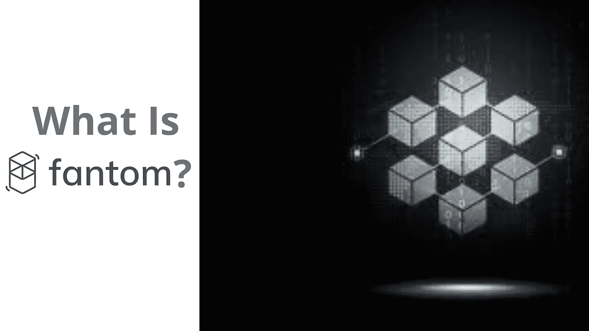
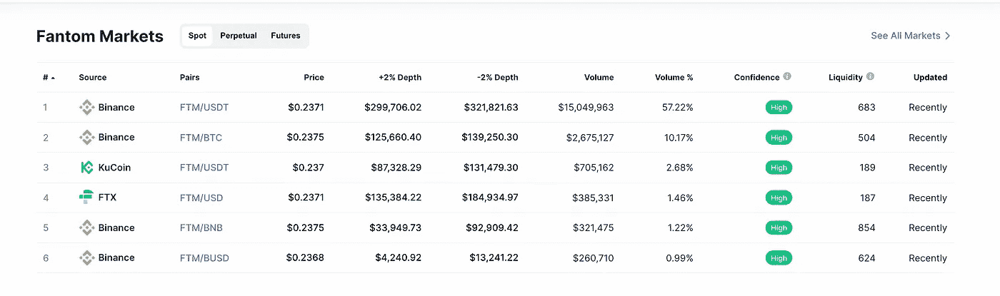
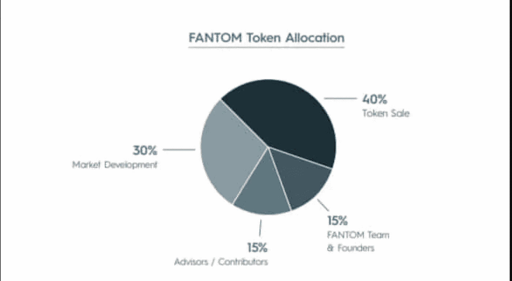
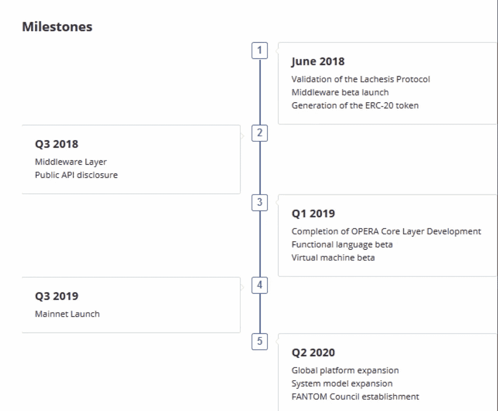

# 什么是 Fantom & FTM 令牌？为什么能成为黑马？

> 原文：<https://medium.com/geekculture/what-is-fantom-ftm-token-why-it-is-the-potential-hidden-gem-67be22a51254?source=collection_archive---------0----------------------->

## 什么是 Fantom 加密& Fantom 是如何工作的？

区块链的真正魅力在于他们的智能合约被用来构建更先进、更安全、更可靠的去中心化应用和金融解决方案。我读得越多，就越着迷，越好奇。为了显示这种好奇心，今天我们将讨论 Fantom & FTM 令牌。

**在未来的旅程中，我们将讨论以下主题:**

*   *什么是 Fantom &为什么我们要关心同一个？*
*   *什么是底层技术？*
*   *Fantom 是如何工作的？*
*   *Fantome 用例？*
*   *Fantom 平台上有哪些著名的项目？*
*   *随机基础&记号组学*
*   *总结&前进的道路*

# **什么是 Fantom &为什么我们要关心同一个？**

它就像一个单一的平台，可以满足多种区块链用例及解决方案的需求。它自夸道:

> “快速、高度完美&一种可以托管多种数字资产和 Dapps 的开源智能合约技术”

## 什么是 Fantom？

Fantom 是一个高性能、可伸缩、安全的有向无环图( [DAG](https://coinmarketcap.com/alexandria/glossary/directed-acyclic-graph-dag) )智能合约平台，旨在克服老一代区块链平台的局限性。

*Fantom 使用了* ***【巨蝮属】*** *，这是一种革命性的&定制的* ***aBFT 共识机制，*** *使 Fantom 比旧技术更快、更便宜。*

既然我们已经定义了 Fantom，就必须理解:我们为什么需要 fantom &它的特别之处是什么？

## 为什么是 Fantom？

我们最顶层的加密项目**比特币**尚未按比例构建，其工作验证共识算法受到设计限制，以支持去中心化和安全性，从而牺牲了速度

有一个流行的术语叫做**区块链困境**，它谈到了可伸缩性、安全性&去中心化之间的权衡。它说不可能同时获得所有这三个属性。

> 比特币的主要关注领域是去中心化和安全选择，从而影响了交易的速度，因此它不太适合日常支付、数据传输、资产交易或消费者和企业在日常生活中依赖的其他交易。

但我们现代的区块链平台正在寻求解决这种区块链困境，fantom 就是这样一个平台，其理念是通过设计和实现银行级安全来尊重去中心化，支持交易的快速结算。

简而言之 Fantom:

*Fantom 的* ***aBFT*** *共识协议提供了无与伦比的*

*   *速度*
*   *安全和*
*   *可扩展性。*

## *速度:*

说到速度，fantom 依赖于其高速共识机制巨蝮属，这有助于令牌或数字资产以前所未有的速度运行

## 安全性:

Fantom 还通过使用 [**无领导利益证明**](https://fantom.foundation/ftm-staking/) 协议来保护网络，从而提供了极高的安全性。与许多其他现有项目不同，Fantom 没有为了可伸缩性而牺牲安全性和分散性。

## 去中心化:(是其核心)

**Lachies:aBFT()**consensus， **algo** 能够在一个无许可的开放环境中扩展到分布在全球的多个节点，提供了很好的去中心化程度。

**什么是异步拜占庭容错(aBFT):**

> 异步拜占庭容错是一致性算法的最高标准。它解决了区块链可伸缩性三难问题，根据这一问题，以下三个组件中只有两个同时是可能的:即去中心化、安全性和可伸缩性

因此，如果你正在寻找一个解决区块链三难问题的平台，那么是的，Fantom 可以成为你真正的伴侣。

现在，我们已经了解了 Fantom 区块链的功能和原因，是时候深入了解它是如何实现我们上面讨论的三个属性的，以及它实际上是如何工作的？

# Fantom 是如何工作的？

正如我们所讨论的，Fantom 是一个一站式解决方案，符合所有必需的属性**去中心化、安全性&可扩展性**，这有助于它在其他竞争区块链平台中脱颖而出，如 **Solana、ETH 2.0、Cardano 等。**

因此，它的功能可以围绕这 4 个核心支柱来理解

*   ***模块化***
*   ***扩展性***
*   ***安全***
*   ***开源***

**让我们逐一解码这些概念；**

## 模块化:

任何可扩展的技术产品都要求它具有很强的解耦能力，并遵循模块化的设计原则。Fantom 已经采用了这种模块化原则，这是由**巨蝮属实现的，这是 Fantom 正在使用的模块化共识区块链层。这一层是完全解耦的，可以灵活地插入到任何分布式分类帐中。**

> 这种 Fantom 的模块化允许开发人员在几分钟内将他们现有的基于以太坊的分散式应用程序移植到 Fantom Opera mainnet 上，从而大幅提升性能并降低成本。

**什么是番剧 mainnet？**

正是这种安全而快速的环境允许开发人员在其上构建分散的应用程序。它是完全无权限和开源的。由 Fantom 的 [aBFT 共识算法](https://fantom.foundation/lachesis-consensus-algorithm/)提供支持。

*它与以太坊虚拟机(EVM)兼容，并通过 Solidity 提供全面的智能合约支持。*

## **可扩展性:**

Fantome 确保每个区块链供电的网络都独立工作，这有助于独立扩展这些网络的性能，而不必太担心拥塞。

> 网络拥塞一直是以太坊无法扩展的最大原因，这导致在其以太坊 1.0 平台上发生的任何交易都需要支付高额的燃气费。现在，ETH 2.0 正在改进，以克服这个可伸缩性的问题，这个问题已经内置在 Fantom 中

以太坊上托管的 dapp 受到网速慢和燃气费高的影响，Fantom 通过为每个 dapp 提供自己独立的区块链来解决这个可扩展性问题，这就好像每个应用都有自己的独立计算机，这些计算机恰好是同一网络的组成部分。

这种模块化和独立的网络层使得位于 fantom 平台上的 Dapps 拥有自己的定制令牌、令牌组学和治理协议。所有这些应用程序网络都互联成巨蝮属，Fantom 的超快 aBFT 共识，帮助每个应用程序受益于底层技术的速度和安全性。

## 总而言之，

> Fantom 是一个由潜在的无限数量的分散计算机(网络)组成的网络，这些计算机虽然共享相同的软件逻辑，但行为完全相互独立。

## 安全性:证据安全机制:

围绕比特币所谓的能源密集型开采，一直存在着相当大的争论和大惊小怪。这在很大程度上是由于其验证和批准任何事务的基础工作证明机制。与比特币和以太坊 1.0 PoW 不同，Fantom 依赖于 PoS 共识机制，因此我们可以认为 fantom 在保护其网络交易安全的方法上是环境友好的。

巨蝮属遵循**无领导的利害关系共识**，通过移除任何信任的领导人来确保更高的安全级别。

**什么是无领导的利害关系证明？**

在使用 PoS 验证交易时，Fantom opera mainnet 的行为有所不同，不像其他一些传统的利害关系证明系统，其中一些验证者对交易的有效性有发言权，opera mainnet 是完全无领导的，从而消除了一组验证者有重要发言权的任何机会。

> 移除前导大大提高了网络安全性。

## Fantom 是完全开源和社区驱动的:

像大多数区块链平台一样，Fantom 也是开源的，他们设想创建模块化的构建模块，供任何人使用，并根据他们的需求进行定制。

您可以通过访问他们的 Github 帐户访问他们的代码来贡献和修改他们的技术:

 [## 幽灵

### 新互联网的核心。Fantom 有 148 个可用存储库。在 GitHub 上关注他们的代码。

github.com](https://github.com/Fantom-foundation) 

同样，Fantom 是无权限的，允许任何人通过运行他们的[节点](https://fantom.foundation/how-to-set-up-a-fantom-validator/)成为验证者。

## 根据他们的官方文件，

在 Fantom 的 Opera 链上，几乎无限数量的验证器节点可以参与保护网络，只要它们保持最少 3175000 个 [*FTM*](https://fantom.foundation/ftm-token/) *处于危险之中。****FTM****是他们的原生代币，可以在集中交易所交易，只能在 Defi 平台交易。*

如果您没有所需的 FTM 令牌，您也可以成为委托人，您只需要 1 FTM 即可。

技术讨论到此为止，现在是时候向前看了，看看有哪些流行的 Defi，Dapps 项目正在利用 Fantom 为自己提供动力。

# 哪些项目正在利用 Fantom？

[**Travala**](https://www.travala.com/)**:**基于区块链的旅游预订平台

Travala 正在利用 Fantom 的区块链平台帮助旅行爱好者预订全球超过 3，000，000 种旅游产品，包括酒店、住宅、航班、旅游和活动，这将极大地推动 Fantom 的采用。

**。创新能源解决方案。**

**Fantom 已经与 DABS 签署了谅解备忘录**

> **DABS 是阿富汗快速发展的国家电力公司。它管理全国的电力生产、进口、传输和分配。**

**他们同意在 DABS 的业务范围内就先进审计软件的数字化和实施进行合作。这是一个支持阿富汗智能能源的巨大合作伙伴关系，有助于 Fantom 平台的更多采用和验证。**

## **阿富汗商业和投资商会:**

**Fantom 还与阿富汗政府的 **ACCI** 达成了又一项合作。他们将与这些公司合作，增强其现有软件，纳入加密和区块链工具，包括原产地证书和质量证书文件的认证。**

## **皇家明星制药公司合作伙伴:**

**Royal Star 是阿富汗最大的药品分销商之一，它与 Fantom 合作解决该地区普遍存在的假药问题。**

**要了解 fantom 破解的更多合作和整合，请参考他们的官方网站:**

**[https://fantom.foundation/partners/](https://fantom.foundation/partners/)**

# **Fantom 的分散融资:**

**Fantom 是为数不多的对 Defi 生态系统有强大支持的集成平台之一。**

> **Fantom 的 DeFi 堆栈建立在 aBFT 共识的基础上。它比它的前辈更快、更便宜、更可靠、更安全。**

**在 Fantom 上，您可以使用以下简单步骤直接从您的钱包访问 Defi 并进行交易**

*   **将 FTM 存入钱包( **fWallet** )**
*   **用你的 **fMint** 制造 fUSD**
*   **使用 fUSD 在 **fLend** 上交易、借出和借入**

****欲了解更多详情，请访问:****

**[https://fantom.foundation/defi/](https://fantom.foundation/defi/)**

# **市场统计、基本面和令牌组学:**

## **什么是 FTM 令牌？**

**FTM 是 Fantom 网络上的主要令牌。FTM 用于**

*   **通过标桩保护网络**
*   **为了治理**
*   **支付和网络费用。**

## **市场统计:**

## ****根据** [**货币市场**](https://coinmarketcap.com/currencies/fantom/)**

**今天的实时价格是₹157.50 卢比，24 小时交易量为₹56,676,101,178 卢比。我们实时将 FTM 更新为印度卢比价格。Fantom 在过去 24 小时内下跌了 1.26%。目前 CoinMarketCap 排名第 29 位，实时市值为₹400,844,571,337 卢比。它的流通供应量为 2，545，006，273 FTM 硬币，最高限额为。供应 31.75 亿芬兰马克硬币。**

****现价**:**

*   **今日(撰写本文时)的实时**芬顿价格为₹157.50 卢比，24 小时交易量为₹56,676,101,178 卢比。****

**市场排名是:29**

****总市值** : ₹400,844,571,337 卢比**

****总流通供应量为**:2545006273 FTM 硬币**

****最大供应量为**:31.75 亿 FTM 硬币。**

## **Fantom 的创始人和团队**

**当谈到分析任何密码的基本原理时，必须了解谁是项目背后的创始人和核心团队成员。Fantom 基金会是由韩国计算机科学家建立的**

*   **安炳益博士。**
*   **目前，该平台的首席执行官是 Michael Kong。**

**Fantom 还有一个强大的团队支持他们强大的开源愿景，包括工程师、科学家、研究人员、设计师和企业家。**

****参考下图，该图来自他们的官方网站:****

********

**[Source](https://fantom.foundation/about/?__cf_chl_jschl_tk__=12e6a3bb0f5e5bb8b85633126650fca52048a016-1625337896-0-AQcUJ-1c1ks9MfqVCiaYOWpyWcOaOBPxz4NpNcCidYo1BOs3rYYHyKLimmXJVHdRRuKaoExrSqZTwGLYZsYufdcIHeiQ1K8H_Dnes89Bjm6iGLpn36pnMgGZbN7xJgmqmUazBNl65_Lv_Xj4Nvgs2Wx-e6RLyAn6BIjQMGrcDwPXH9jOQ6NRNVNVRfp6_DSctyM8ylnR1dUfbhqLt5QaCF7uj-xr4LruYTTkEFaSrrO02hp2vqj9DXmVfk4upk7igpfscZxj47n0Jj2mQXn7irR3Q_bUxluooqSeLscva9lo8lzAyTDyLnVDaNqb3M_LO_R5p-L8Fs_PJ8lUeo8zFxV7YAV4QqgoF6xt28msJPMY6O3htjf4gSBKZZ782UdcXzYb9ips1YK0KN78pWzBe-8)**

## **哪里可以交易 FTM Token？**

**FTM 已经在一些主要的集中交易所上市，如**

****

**source: [coinmarketcap](https://coinmarketcap.com/currencies/fantom/)**

*   ***比特币基地***
*   ***币安***
*   ***Gate.io***
*   ***OKEx 韩国。***

## **Fantom Tokenomics:**

****

**总共有 31.75 亿个 FTM 令牌，在 ICO 发布时提出的分发策略是**

*   ***40 %的代币销售从*开始**
*   ***30 %的市场开发***
*   ***15 %的顾问/贡献者***
*   ***15 % Fantom 团队&创始人***

# **Fantom 路线图:**

**另一个决定因素是，当选择任何加密项目作为投资组合的一部分时，应该寻找路线图。它清楚地表明，根据他们作出的所有承诺，已经实现了什么，还有什么有待实现。这也有助于一个人分析他们的团队在实现他们自己的承诺方面的能力。**

**有了这个想法，让我们看看 Fantom 的旅程到目前为止是怎样的，这个路线图是在 2018 年 ICO 的时候提出的**

****

**[src](https://icobench.com/ico/fantom/milestones)**

****根据路线图:****

> **Fantom 歌剧连锁店于 2019 年 12 月 27 日上线。**

# **总结和未来之路:**

## **我觉得:**

**Fantom 是那些基本面看起来非常有前途的加密宝石之一。他们已经与阿富汗政府和巴基斯坦政府达成了一些非常有前景的交易，并且在制药和食品追溯领域也有一些很棒的合作。他们的技术和团队看起来坚如磐石，他们的生态系统看起来都有可能在 2021 年及其后蓬勃发展。**

> **总而言之，我觉得如果他们正在寻找一个可以长期超越他们当前价格标签的加密宝石，就应该保持对 FTM 的鹰眼。Fantom 由于其强大的基本面和合作伙伴关系，很大程度上可能在 2021-22 年开花结果，因此看起来仍然被低估。它具备成为一个成功的支持 Defi 的区块链生态系统的所有要素，为蓬勃发展的 Defi & Dapps 空间提供支持。**

****有关 Fantom 的更多技术细节，请访问:****

** [## 开发者文档

### 了解如何在 Fantom 上构建快速、可伸缩且安全的 dApps。Fantom 与 EVM 兼容。

docs.fantom.foundation](https://docs.fantom.foundation/) 

# 免责声明！

CryptoWise 在此表达的观点不是投资建议，仅用于教育目的。投资者应该在对比特币、加密货币或数字资产进行任何高风险投资之前进行尽职调查。请注意，您的转账和交易风险由您自己承担，您可能遭受的任何损失由您自己负责**