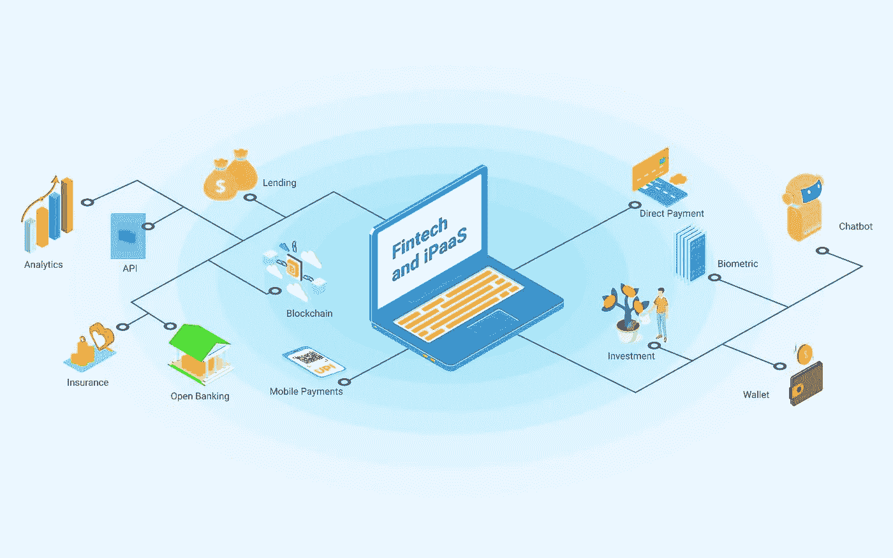

# 什么是 FinTech？—金融科技中的 API，以及金融科技用例

> 原文：<https://medium.com/geekculture/what-is-fintech-apis-in-fintech-and-fintech-use-cases-81d99c2f1133?source=collection_archive---------7----------------------->

云服务在全球越来越受欢迎。其中一个重要原因是从传统 IT 基础设施向软件即服务的转变(SaaS)。事实上，全球 58%的人口使用云产品，这一趋势将继续下去，并将导致金融科技解决方案的更广泛使用。

金融科技是一个在过去几年中快速增长的行业，并且有着光明的未来。

在本文中，我们将全面介绍:

*   什么是 FinTech？
*   金融科技中的 API
*   API 的优势
*   金融科技示例/用例
*   通过 Quickwork 利用 API 的强大功能
*   结论

# 什么是 FinTech？

**“金融=金融，科技=科技”**

金融科技是一个相对较新且通常抽象的术语，适用于任何能够帮助消费者和企业以比传统方式更快、更有效的方式获得金融服务的不断发展的技术。

金融科技(FinTech)是一类新技术，旨在改善和自动化金融产品和服务的交付和使用。金融科技是一个快速增长的行业，其应用涵盖多个行业，包括消费者银行、财富管理、保险、投资银行、支付系统、P2P 贷款等。FinTech 在个人金融方面提供了新的解决方案，可以极大地改善用户的生活，为企业节省时间和金钱。

例如，想一想去银行查看你的余额和在手机上显示这些信息之间的区别——就像查看你的电子邮件一样。这是金融业历史上最重要的两项发明。你知道你的银行能给你带来什么好处吗？

从在线查看金融交易的能力，到让你向人们付款的应用程序，再到让银行做出快速贷款决策的工具，一切都是金融服务发展的一部分。

相关:[金融科技革命:用 API 开放银行& iPaaS](https://blog.quickwork.co/fintech-revolution-open-banking-with-apis-ipaas-quickwork)

现在我们知道了什么是金融科技，让我们来理解支撑这些金融科技的支柱？

**应用编程接口**

简单地说，应用程序编程接口(API)是允许两个应用程序相互通信的代码。这是您连接日常使用的应用和服务的一种方式。例如，当你使用脸书、发送电子邮件或查看天气时，你正在使用 API。

在这里阅读更多关于 API 的内容:[什么是应用集成，如何实现企业级效率](https://blog.quickwork.co/what-is-application-integration/)

银行和金融业在过去几年里经历了破坏性的增长。在过去几年中，推动这种变化和增长的两个重要因素是金融科技公司和 API 的崛起。正因为如此，个人可以在任何他们想去的地方管理他们的财务，而不需要和银行打交道。

由 API 支持的开放式银行的兴起使得第三方提供商在行业中更加普遍。这导致了各种金融科技应用和程序的发展，通过简化人们管理资金的方式来改善金融生活。

# 金融科技中的 API

金融科技是指通过使用高科技、基于计算机的系统来提供金融服务和产品的新型公司。金融科技行业是增长最快的科技行业之一，通过创新的数字平台提供广泛的金融服务和产品。

API 是一个让其他程序相互交流的程序。例如，API 允许 FinTech 程序与金融机构的服务器进行交互。API 是金融科技和金融服务相互沟通的技术手段。使用 API，程序可以相互访问信息，进行事务处理或修改。

**API 的优势**

**性价比:**

API 有助于定制客户体验，从长远来看可以节省银行的资金，并帮助他们的客户。银行客户可以完全根据自己的需求定制服务，而不是被枯燥、过于简化的平台所束缚。

由于使用了 API，银行能够为客户提供更多的服务。一个例子是银行账户与软件的集成，这使得客户可以在一个地方管理他们的财务。

**数据可访问性:**

在 2016 年推出 PSD2 之前，银行可以对公众隐藏其数据和信息。将数据和信息锁起来被认为是一件好事，但这使得程序和用户很难访问他们需要的有价值的数据。PSD2 使第三方可以访问财务数据。

管理或访问个人数据的权利一直是数字时代的核心财产，也是 GDPR 和 PSD2 的基础。在这个智能自动化的新时代，我们现在可以用手机控制生活的方方面面。

新的欧盟法规将使用户更加清楚他们的数据发生了什么。用户现在有合法权利知道他们的个人信息是如何被使用的。以前，用户必须信任一家公司不会滥用他们的数据。现在，他们可以让公司知道他们是否想继续使用他们的信息。

**增长导向**

近年来，金融科技 API 的数量急剧增加，有助于为金融科技应用提供各种各样的金融数据。持续的增长和发展意味着金融技术变得越来越强大。它将继续发展壮大，走向未来。

# 金融科技用例

尽管科技行业与颠覆性技术和初创公司联系在一起，但大企业和银行也在使用同样的金融科技服务。下面快速浏览一些金融科技的例子，以及该行业如何利用这些相同的技术来增强他们现有的商业战略，并扰乱他们未来的行事方式。

**银行:**

手机银行已经成为金融服务业的重要组成部分。随着 GoCardless 和 Revolut 等新银行的普及，许多银行正在提供手机友好型银行功能。这些功能吸引了多样化的客户群，使消费者更容易管理他们的财务。

新银行本质上是针对移动优化的银行，在其网络和纯应用平台上提供各种银行服务。他们无需物理分支机构或实体办公室即可运营。从个人支票账户到资金转账、贷款到储蓄账户，这些银行应有尽有。一些更受欢迎的 neobanks 包括 Chime、Simple 和 Varo。

**加密货币&区块链:**

加密货币现象是一种新的金融创新，它将让我们重新思考我们与货币打交道的方式，货币将转化为数据。作为加密货币基础的区块链技术是一种新型数据库，可用于存储和共享信息。这两者都被视为金融科技领域之外的领域，但它们越来越多地作为消费者的补充解决方案一起工作。

**投资&储蓄:**

金融科技引发了一场投资革命。随着越来越多易于使用的应用程序提供给消费者，投资壁垒正在降低。市场上有数百个应用程序，这个蓬勃发展的行业让消费者投资变得前所未有的容易。Robinhood 是最受欢迎和最知名的应用之一，它让任何人都可以非常轻松地投资和了解市场。

**交易:**

金融科技的发展见证了人工智能技术的兴起，这些技术可以从海量数据集中提取金融见解。通过使用先进的自然语言处理，这些技术允许交易者和投资者在几秒钟内获得有意义的见解。

**支付:**

金融科技是一个快速增长的高增长行业，这加剧了支付领域的竞争和破坏。金融科技公司正在以实时支付的形式改变公司之间的互动方式。现在，只需点击智能手机上的一个按钮，向世界各地汇款比以往任何时候都更容易。PayPal、Venmo、Square 和 Stripe 等公司正在改变我们的支付方式，资金在世界各地流动。

**放款:**

金融科技正在彻底改变消费者获得贷款的方式。该技术允许我们个性化贷款流程，并根据收入、信用记录和位置等因素为每个人量身定制。这使得人们更容易借钱，并大大增加了得不到充分服务的人口获得信贷的机会。

此外，消费者可以每年多次请求他们的信用报告。这样做，就有可能监控你的信用状况。当涉及到管理信贷和对最适合你的贷款或其他类型的金融产品做出更好的决定时，这可能是有帮助的。这是一个很大的好处，因为你可以通过不重复申请同一笔贷款来省钱。

**保险:**

保险业通常是新技术的后来者。然而，随着保险科技公司(基本上是为人们提供保险的初创公司)与保险公司合作，扩大其覆盖范围并实现流程自动化，这种情况正在发生变化。柠檬水保险(涵盖可穿戴设备)和 PolicyBot(帮助从保险公司收集报价以换取费用)等公司正在引领该行业的未来。

相关:[银行&金融机构如何从 iPaaS](https://blog.quickwork.co/integration-how-banks-financial-institutes-can-benefit-from-ipaas/) 中获益

# 通过 Quickwork 利用 API 的强大功能

Quickwork 是金融公司的领先创新中心。我们提供解决方案来帮助我们的客户解决他们最具挑战性的产品开发挑战。我们的技术、产品和工程专家团队提供将创新理念转化为成功产品和服务所需的专业知识。

Quickwork API 平台提供了一种为金融和银行开发金融科技应用的无代码方式。它易于使用，并且其基于云的方法允许企业快速启动和运行。Quickwork 的 API 是为安全性而设计的，平台的 REST 架构提供了无与伦比的灵活性。

# 结论

金融科技的增长表明，传统金融机构终于理解了客户服务的概念。过去，这些公司对消费者需求反应太慢，结果发现很难继续增长。现在，随着金融科技的崛起，客户不再期待公司提供同样的旧服务。对于任何寻求在这个新市场中生存的公司来说，快速响应的消费者服务已经变得至关重要。

此外，财务解决方案不再一成不变。现在有这么多定制的金融产品可供选择，客户可以选择最适合自己的需求。

金融科技公司越来越能够提供满足特定客户需求的窄范围定制服务。例如，消费者可能需要一个高利率储蓄账户，将资金投资于股票市场。或者，他们可能需要从信用不太好的个人对个人贷款机构借钱。金融科技公司将以比传统银行或贷款机构低得多的成本满足这一需求。

[*阅读并了解有关金融科技、开放式银行、保险科技以及 iPaaS 如何融入其中的更多信息。*](https://blog.quickwork.co/tag/fintech/)