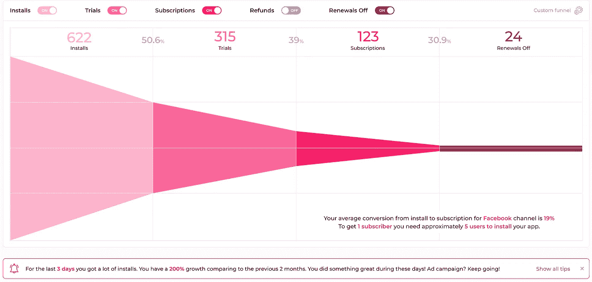
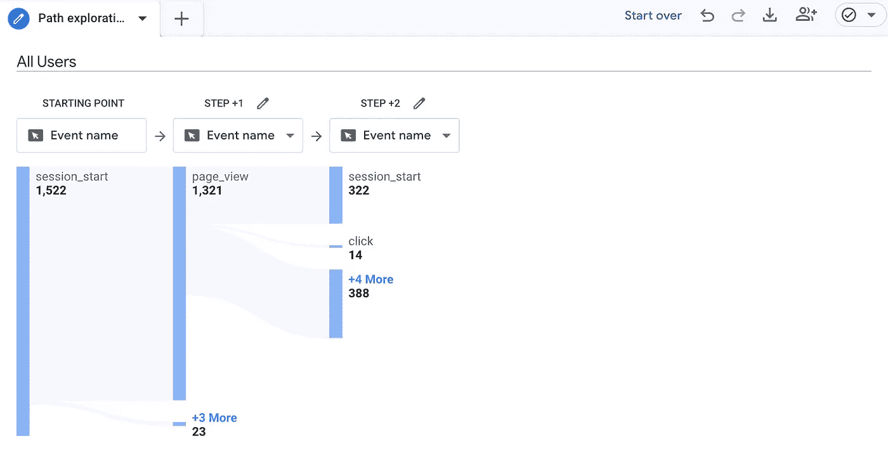

# 什么是订阅应用的漏斗分析？

> 原文：<https://medium.com/geekculture/what-is-funnel-analysis-for-subscription-apps-cc99333978d1?source=collection_archive---------18----------------------->

[Funnel Analysis](https://www.appflow.ai/blog/funnel-analysis-for-subscription-apps)

漏斗分析是一种流行的分析方法，用于数字营销领域，将用户旅程分解为几个重要步骤，这些步骤将导致最终目标--转化。一般的漏斗分析是建立在获取、激活、转化和保留的基础上的，但它根据产品的复杂程度而变化。在本文中，我们将讨论什么是订阅应用的漏斗分析，以及它如何帮助订阅增长。

# 什么是订阅应用的漏斗分析？

[订阅应用的漏斗分析](https://www.appflow.ai/blog/funnel-analysis-for-subscription-apps)追踪基于订阅的应用中的用户行为以及两个行为之间的转化率。例如，有两个重要的用户行为:安装应用程序和订阅。漏斗分析跟踪整个用户旅程的用户行为或转化，即有多少安装了该应用的用户实际订阅了该应用，以便应用营销人员可以轻松计算出每个渠道的投资回报率。

要创建一个漏斗，首先要确定每个应用程序用户将采取的重要步骤，从了解应用程序到为其付费。简化的用户路径将是潜在用户看到并点击应用程序的推广，重定向到应用程序商店，安装应用程序，注册，尝试应用程序功能，订阅和支付应用程序。

你可以想象，不是每个注册用户都会尝试应用程序的功能，也不是每个尝试过应用程序功能的用户都会订阅应用程序。所以用户数量会随着用户路径减少。它就像一个漏斗，上宽下窄，代表在用户旅程中进入下一步的用户数量。这就是为什么我们把这种分析方法称为“漏斗分析”。

不用说，对订阅应用进行漏斗分析的目的是为了发展应用订阅业务。那么漏斗分析如何提振 app 订阅业务呢？请继续阅读，寻找答案。

# 漏斗分析如何提升 App 订阅量？

漏斗分析跟踪用户在整个用户旅程中的行为，并计算有多少人通过了每一步，显示需要处理的问题或错误。以下是使用漏斗分析增加订阅收入的三种方式:

1.  **识别最有效的获取渠道** 漏斗分析可以通过比较来自不同获取渠道的不同漏斗来识别最有效的获取渠道。例如，你在推特和脸书上通过广告推广你的应用。如果你想计算营销渠道的有效性，请分别对这两个渠道的用户进行漏斗分析。转化率差异的结果将有助于确定高质量访客来自哪里。如果你了解转化用户是如何了解应用的，你就可以更多地关注这些获取渠道，增加潜在转化的数量，这最终会带来更多收入，从而有助于应用业务的增长。
2.  **找出用户摩擦点** 一个漏斗分析工具将用户旅程可视化，并显示每个阶段的[流失率](https://www.appflow.ai/blog/churn-for-subscription-apps)和转化率，帮助你了解用户试图离开的时间和地点，这可能是你想要平滑的典型用户摩擦。幸运的是，漏斗分析有助于找出潜在的用户摩擦点，并使您能够找出阻止用户到达最终目的地的因素。因此，您可以将优化工作集中在最大的机会上。例如，如果注册用户使用了应用程序功能，但未能完成，及时弹出的指南可能会鼓励他们继续使用。请记住，我们的目标是增加进入下一步的用户数量。这样就会有更多的用户流向目的地— —订阅，这是一个订阅类 app 能够成长的直接因素。
3.  **监控应用性能** 在监控应用性能方面，漏斗分析是一项非常诚实的评估。它记录了订阅应用程序用户旅程中发生的事情，并用数据反映了问题。例如，如果您发现到达付费墙但未付费的用户数量突然增加，您应该[检查付费墙](https://www.appflow.ai/blog/how-to-optimize-app-paywall-with-a-b-testing)并找出原因，这可能是技术、设计更新问题或其他问题。不管是哪种原因，都要警惕处理。否则，这些问题将直接导致废弃率上升、转换率下降和收入损失。

# 在订阅应用中引导漏斗的工具

面对海量的应用内订阅数据，进行漏斗分析既费时又费力。幸运的是，出现了易于使用的自动化工具，可以帮助进行漏斗分析。

# Appflow.ai

[Appflow.ai 的漏斗分析](https://demo.appflow.ai/#/analytics/funnels?app_id=$_all&time=now-6d&time=now&environment=prod&project=61dfef44440a4a5550d07ffd)功能跟踪用户的关键行为:不同渠道的安装、试用、订阅、退款和续订，并将数据可视化为漏斗形状。

在漏斗过滤器中，您可以选择不同的采集通道。然后，漏斗将立即向您显示用户旅程和特定渠道的转化率。这样，你就可以很容易地比较每个渠道的有效性，这将有助于选择正确的渠道，获取更多的用户。

再者，通过精准的数据分析，appflow.ai 在漏斗的右下方显示特定渠道的平均转化率。

为了满足订阅应用的需求，appflow.ai 还提供了[免费订阅数据分析](https://www.appflow.ai/analytics)和其他有用的工具，如推送通知、付费墙 A/B 测试等。

# 谷歌分析

谷歌分析可以通过追踪重要事件来帮助你建立渠道。首先，你需要建立漏斗的目标。然后使用[目标流量](https://support.google.com/analytics/answer/1651582?hl=en#zippy=%2Cin-this-article)功能按来源过滤，看看转化流量来自哪里。最后，你可以看到漏斗。

# 综上

漏斗分析是一种非常强大的方法，可以帮助你了解你的用户在转化过程中的位置。因此，您可以消除应用程序用户摩擦点，提高用户参与度，改善用户入职体验，促进用户订阅，并最终推动应用程序业务。

 [## 应用内订阅分析和管理工具- Appflow

### 在一个地方管理 iOS 和 Android 应用内订阅数据、付费墙 A/B 测试和推送通知。转换…

www.appflow.ai](https://www.appflow.ai/)