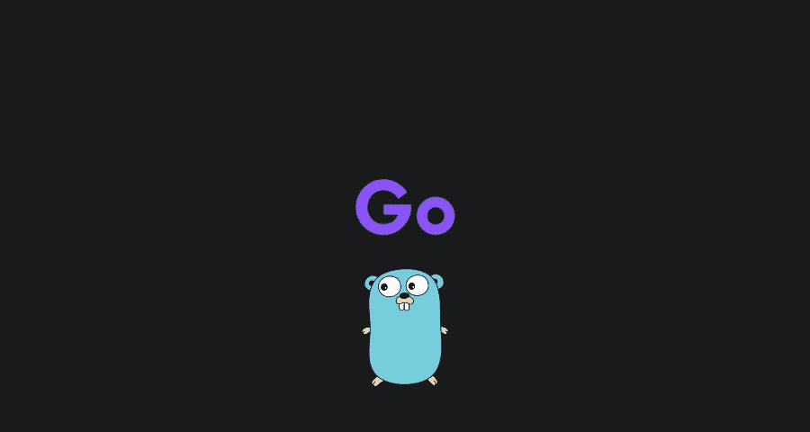

# 围棋是什么？

> 原文：<https://medium.com/geekculture/what-is-go-baffab707deb?source=collection_archive---------15----------------------->

了解围棋是什么，为什么我喜欢它，为什么你也应该学习它。

在这个故事中，你将了解什么是围棋，以及我为什么喜欢围棋。

我还会根据你的兴趣来帮你决定是否应该学习围棋。

就我个人而言，Go 是我最喜欢的编程语言！

开始吧！

# 首先，什么是围棋？