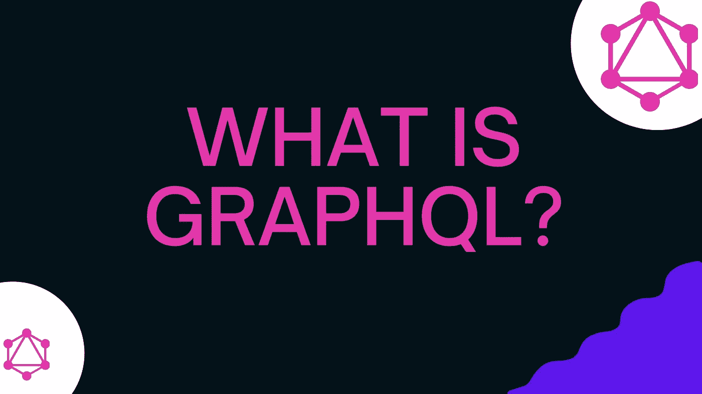

# GraphQL 是什么？

> 原文：<https://medium.com/geekculture/what-is-graphql-5a20dea88934?source=collection_archive---------9----------------------->

简单来说，这就像你去一家披萨店，点一份“自己做披萨”——你选择基底、酱料、奶酪和配料，当披萨做好了，你就会得到你想要的东西。

有了 REST，就像你从预定义的菜单项中挑选一个披萨。你可能会得到你想要的配料，但你也可能会得到你没有要求的其他配料(如西红柿)，有时，我们将不得不手动…