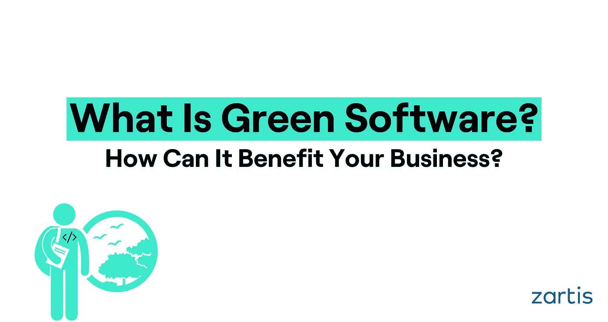

# 什么是绿色软件&它能给你的企业带来什么好处？

> 原文：<https://medium.com/geekculture/what-is-green-software-how-can-it-benefit-your-business-4b4119b562f7?source=collection_archive---------26----------------------->

## 采用绿色软件工程的实用技巧

2018 年，视频流产生的温室气体排放量[相当于整个西班牙的温室气体排放量](https://theshiftproject.org/wp-content/uploads/2019/07/Excutive-Summary_EN_The-unsustainable-use-of-online-video.pdf)。

歌曲“Despacito”在 YouTube 上的浏览量相当于五个非洲国家(T2)一年消耗的电量。