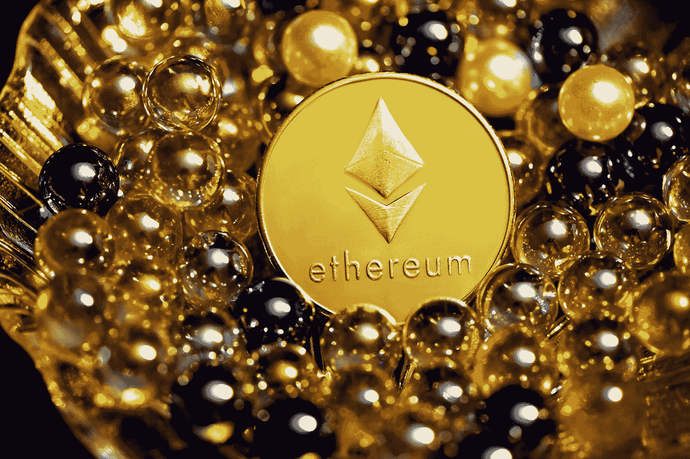

# 什么是 Gwei？以太气解释道

> 原文：<https://medium.com/geekculture/what-is-gwei-ethereum-gas-explained-c766330c2250?source=collection_archive---------0----------------------->

Photo by [Executium](https://unsplash.com/@executium?utm_source=medium&utm_medium=referral) on [Unsplash](https://unsplash.com?utm_source=medium&utm_medium=referral)

随着以太坊变得越来越主流，多了解一点它在幕后是如何工作的很重要。让我们探索代币，Gwei 和以太坊！

简单来说。1 Gwei 是 0.000000001 以太(十亿分之一以太)，用于衡量以太坊网络上的交易成本。

# 什么是交易成本？