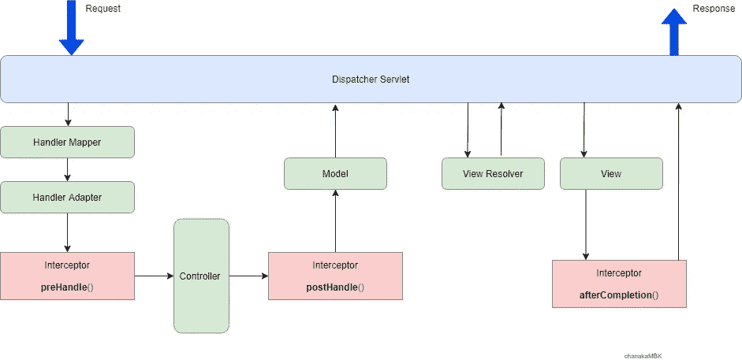
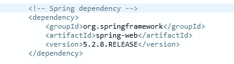
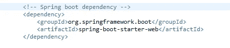
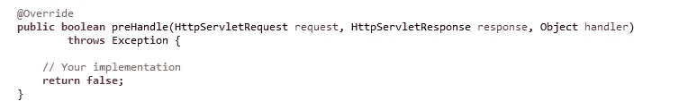
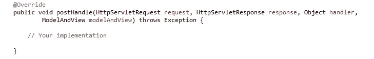
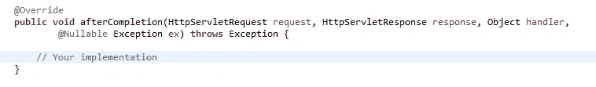
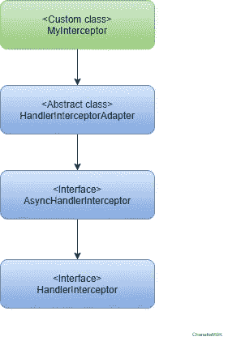
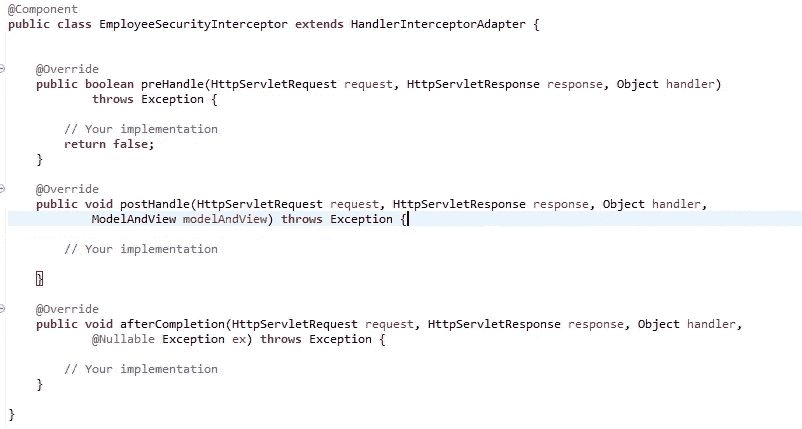
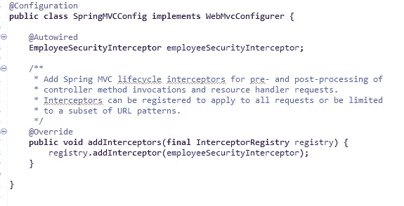
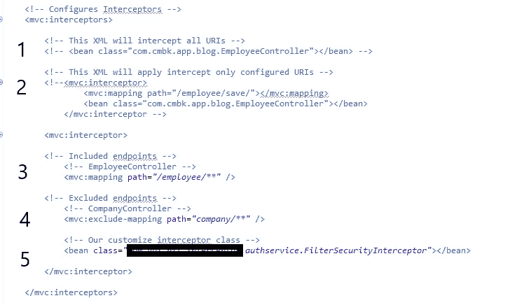

# Spring MVC 中的 HandlerInterceptor 是什么

> 原文：<https://medium.com/geekculture/what-is-handlerinterceptor-in-spring-mvc-110681604bd7?source=collection_archive---------0----------------------->

在这篇文章中，我将描述 Spring MVC HandlerInterceptor，它的用法和行为。

**概述**

在去**手柄接收器**之前，让我们讨论一下**手柄映射**。它用于将一个方法映射到一个特定的 URL。以便 **DispatcherServlet** 能够在处理请求时调用它。另外， **DispatcherServlet** 使用 **HandlerAdapter** 来调用该方法。

现在，我们对上下文有了一个快速的了解，这是**手柄接收器**开始发挥作用的时候了。它有三个阶段，如处理前、处理后和完成后(渲染视图对象)的动作。

在项目中，我们可以使用这个拦截器进行请求验证、请求认证、避免重复代码等…

请查看图表以更好地了解流程。

Interceptor work with Spring MVC

**依赖关系**

Spring dependency

Springboot dependency

**弹簧处理器拦截器**

在开始实施之前，让我们看一下内容。它是一个接口，包含 4 个主要方法。使用这些方法我们可以
做各种预处理和后处理。

**prehandle():** 在实际的处理程序执行之前调用，但是视图还没有生成。
**postHandle()** :在处理程序执行后调用。
**afterCompletion()** :在完成请求并生成视图后调用。
**afterConcurrentHandlingStarted()**:启动异步执行，用于类型和/或实例检查。这在实际场景中非常少见。

> ***这是 preHandle()实现的样子:***

这将在请求到达处理程序方法之前拦截请求。此方法返回一个布尔值。

如果为真，它允许请求在处理程序本身的处理器的另一个拦截器的执行链中继续。

如果为 false，spring 假定拦截器已经处理了请求，而我们的控制器永远不会处理这个请求。中断执行链中的任何未来执行，包括实际的处理程序。

> ***这是 postHandle()实现的样子:***

该方法位于 HandlerAdapter 和 DispatcherServlet 呈现视图之前，允许拦截器将附加属性注入 ModelAndView 对象。这个方法将以相反的顺序在链中的每个拦截器上被调用，所以第一个拦截器将是最后一个被调用的。

> ***这是 afterCompletion()实现的样子:***

这将在请求处理完成后调用。通常，此方法可用于执行某种类型的资源清理。这个方法将以相反的顺序在链中的每个拦截器上被调用，所以第一个拦截器将是最后一个被调用的。

**实施**

有两种方法来实现。
1)实现一个**句柄接收器**接口。
2)扩展**HandlerInterceptorAdapter**抽象类。

我将使用第二种方法。但是最后它会调用 HandlerInterceptor。请看图表。

**配置**

有两种不同的方法来配置拦截器。

对于 Springboot 项目，我们需要在实现**webmvcconfigure**的 SpringMVCConfig 类中覆盖 **addInterceptors()** 方法。这个 SpringMVCConfig 类是我们的自定义实现。

Spring class configueration

对于 Spring，我们可以在**MVC-dispatcher-servlet . XML**中使用 XML 配置，如下所示。使用这个我们可以定义哪个控制器请求应该通过使用 **< mvc:mapping >** 和**<MVC:exclude-mapping>**标签的拦截器。

XML configueration

1.  如果你想无限制地配置你的控制器类，你可以使用**1 号**配置。
2.  如果你想用拦截器配置一个特定的 URI，你可以使用 **No:2** 配置。
3.  如果您想在拦截器中包含或排除任何特定的 uri，您可以使用 **No:3，4** 配置。
4.  向我们展示了在 XML 文件中配置拦截器类的方法。

我已经完成了两篇关于使用拦截器进行认证的博文。请访问以下链接，查看拦截器的实际用法。

[**使用 HandlerInterceptor 对 Springboot REST API 应用程序进行基本认证**](https://chanakambkarunarathna.medium.com/basic-authentication-for-springboot-rest-api-application-with-handlerinterceptor-3e2cc4480b9c)

[**使用 HandlerInterceptor 对 Springboot REST API 应用程序进行 JWT 认证**](https://chanakambkarunarathna.medium.com/jwt-authentication-for-springboot-rest-api-application-with-handlerinterceptor-e302bec791e3)

希望这能对你有所帮助，如果你有任何问题，请留言或评论。