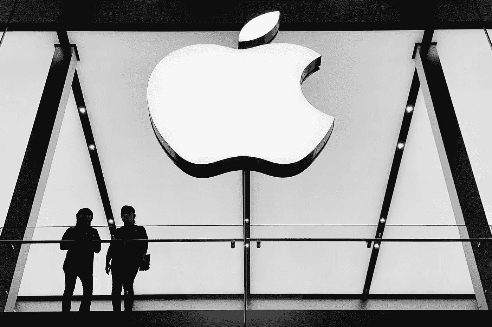

# 苹果商店发生了什么？

> 原文：<https://medium.com/geekculture/what-is-happening-at-apples-stores-beff72f2061c?source=collection_archive---------25----------------------->

Laurenz Heymann

今年有不少关于工会的故事，从星巴克到亚马逊再到苹果。大公司再一次在他们的仓库、商店和其他地方面临着工会浪潮。可以预见的是，他们中的大多数人都在试图反击和破坏工会，这通常会给工会更多的权力和话题。虽然[围绕此事的大部分对话](https://www.bloomberg.com/news/articles/2022-05-19/amazon-threatened-workers-over-union-vote-labor-officials-find)都集中在[亚马逊](https://www.vice.com/en/article/xgdpqj/amazon-is-bombarding-workers-with-union-busting-messages)身上，只是因为它是卷入工会辩论的最大和最突出的公司。然而，苹果似乎正在这方面迎头赶上，在工会方面经历了令人震惊的糟糕一周。让我们快速回顾一下。

# 买一送一

多个州的苹果商店已经准备好就工会化投票，两家商店已经确定了选举日期。苹果同意了，因为这是必须的，但让员工确定日期并不意味着公司放弃了。相反，这家科技巨头加大了反工会的力度。据来自亚特兰大[和纽约](https://9to5mac.com/2022/05/19/apple-union-busting/)商店的员工称，苹果已经获得了声名狼藉的[律师](https://www.inputmag.com/culture/apple-union-busting-littler-mendelson)的帮助，开始采取更直接的策略。该公司正在举行“俘虏观众”会议，代表们在会上谈论工会的罪恶，禁止传播支持工会的传单，并且通常会尽一切可能切断支持工会的信息流动，或者加剧商店中的反工会情绪。在一周内提出的两项指控都声称苹果违反了联邦法律，很难说这些策略是否奏效。这种拙劣的处理方式不仅不可能说服员工加入苹果公司，而且似乎还产生了滚雪球效应。苹果现在不仅仅是获得了工会破坏者的恶名，还将被卷入法律战。考虑到事情的规模，这很可能导致公司想要阻止的结果。当他们击退立法者并与工会正面打交道时，工会组织者可能会夺取胜利并创造历史，就像苹果过去那样。

# 天气预报:晴天

Laurenz Heymann

要明确的是，我们不要认为法律上的麻烦会摧毁苹果，甚至实质性地伤害它，它更多的是分散注意力。然而，随着这些投诉的出现，这些商店的工会成功的机会大大增加了。掌握公司违法和虐待员工的确凿证据对工会的努力来说再好不过了。考虑到甚至亚马逊的工人已经设法组织了工会，可以肯定地说，任何公司都可能输掉这场比赛。鉴于苹果的笨拙做法和工会不断增强的力量，押注工会获胜似乎是个好主意。

有趣的是，这三家商店的投票是否会在全国掀起一股工会浪潮。也许苹果与工会的激烈斗争将成为团结工人所需的催化剂，并给公司带来历史性的颠覆。时间会证明一切，但这次天气预报是晴天。