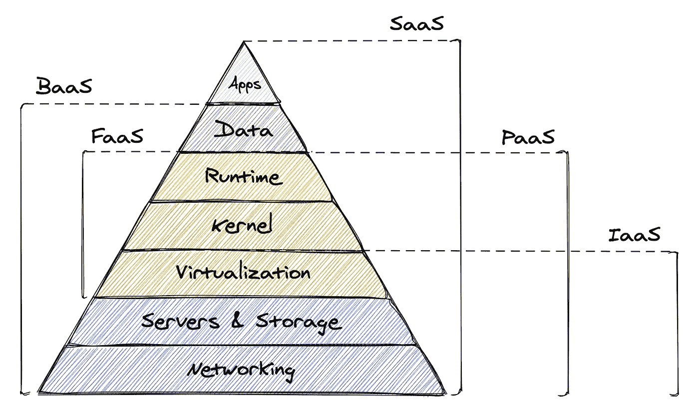

# 什么是 IaaS，PaaS，*aaS？

> 原文：<https://medium.com/geekculture/what-is-iaas-paas-aas-7ec315b55d93?source=collection_archive---------6----------------------->

## 以及科技领域的机会。

Made w/ [Excalidraw](https://excalidraw.com/). Loosely inspired from sources: [bmc](https://www.bmc.com/blogs/saas-vs-paas-vs-iaas-whats-the-difference-and-how-to-choose/), [IBM](https://cloud.ibm.com/docs/cloud-infrastructure)

你可能听说过各种*aaS 缩写。IaaS、SaaS 等。它们到底是什么意思？为什么这么多？

为了理解它们，让我们回顾一下构成运行在互联网上的软件核心的基本组件。

# 金字塔的主要层面