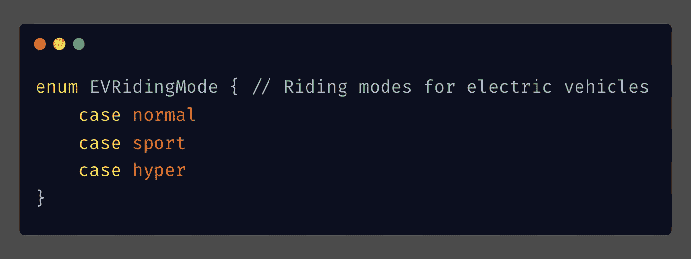
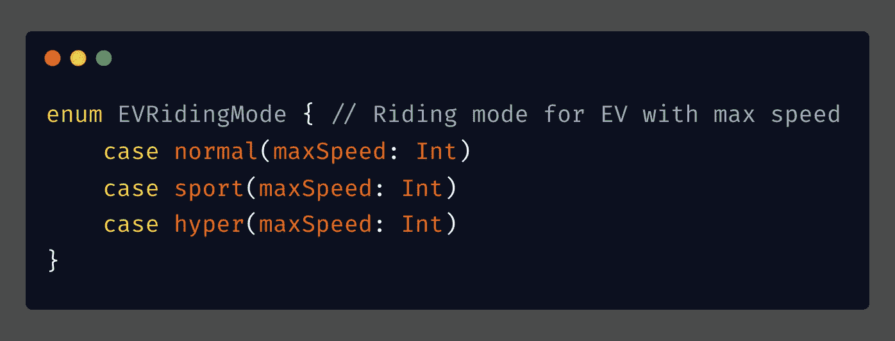
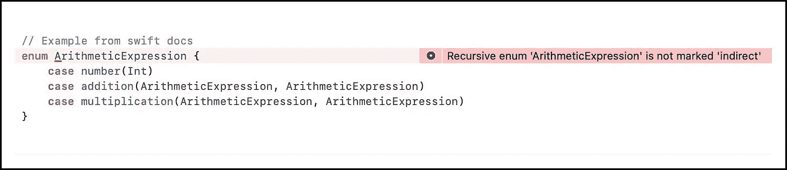
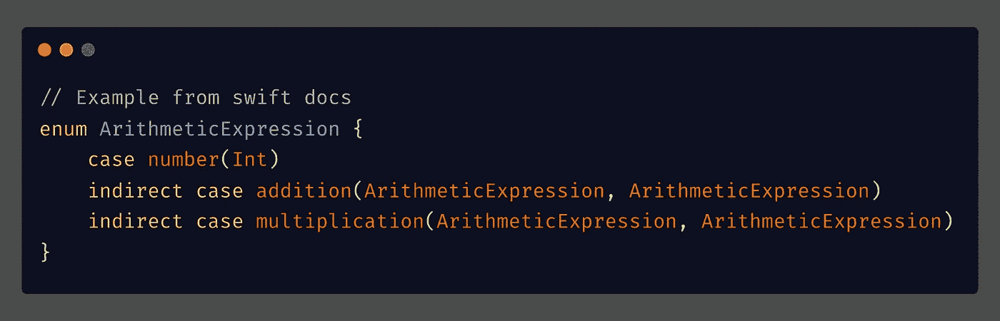
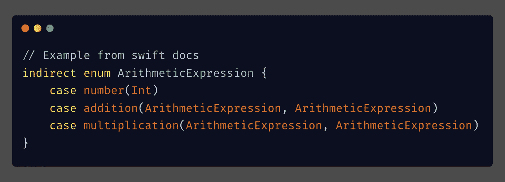

# swift 中的间接枚举是什么？

> 原文：<https://medium.com/geekculture/what-is-indirect-enum-in-swift-f4da5a6a9199?source=collection_archive---------6----------------------->

在本文中，我们将学习什么是`*indirect*`或`*recursive*`枚举。不过我们先来了解一下`swift`中的*枚举*。

一个*枚举*为一组相关值定义了一个公共类型，并使您能够在代码中以一种类型安全的方式使用这些值。

*enumeration in Swift*

或者，我们也可以用枚举事例指定任何类型的关联值:

*enumeration with* associated values in swift

## 现在我们来了解一下什么是间接或者递归*枚举？*

当我们在同一个值类型对象中添加一个值类型对象时，我们就创建了一个递归。

enumeration with recursion in swift

我们知道，Swift 枚举是值类型，类型的大小应该在编译时计算。但是不可能计算递归枚举的最终大小。

为了克服这种情况，我们通过在枚举案例前写`indirect`来表示枚举案例是递归的，这告诉编译器间接(即通过引用)存储相关的枚举而不是值。

我们称它们为`indirect` enum，因为它们修改了 swift 存储它们的方式。

Example: indirect enum case in swift

或者，我们可以在`enum`关键字之前编写`indirect`关键字，为所有有关联值的情况启用间接寻址。

Example: indirect enum in swift

> 你通过在一个枚举案例前写 indirect 来表明它是递归的，这告诉编译器插入必要的间接层。

# 结论

*   Swift 枚举是值类型，类型的大小应该在编译时计算。
*   间接枚举是引用自己作为关联值的枚举。
*   关键字告诉编译器插入必要的间接层。
*   `indirect case`将仅在这种情况下存储为参考类型
*   `indirect enum`将存储为所有关联案例的参考

# 有问题吗？

如有疑问，欢迎在下方评论，**。**

如果你喜欢这篇文章，请分享给你的朋友，并给我留下评论。此外，点击鼓掌按钮(👏)下面来表示你有多喜欢这篇文章。

感谢阅读！👨🏼‍💻

# 您可以在以下网址找到我:

[Twitter](https://twitter.com/milan_panchal24)|[LinkedIn](https://www.linkedin.com/in/milanpanchal/)|[GitHub](https://github.com/milanpanchal)|[Medium](/@milanpanchal24)|[hacker rank](https://www.hackerrank.com/milanpanchal)|[leet code](https://leetcode.com/milanpanchal/)|[堆栈溢出](https://stackoverflow.com/users/1748956/milanpanchal)

 [## 通过我的推荐链接加入媒体-米兰·潘查尔

### 作为一个媒体会员，你的会员费的一部分会给你阅读的作家，你可以完全接触到每一个故事…

medium.com](/@milanpanchal24/membership)