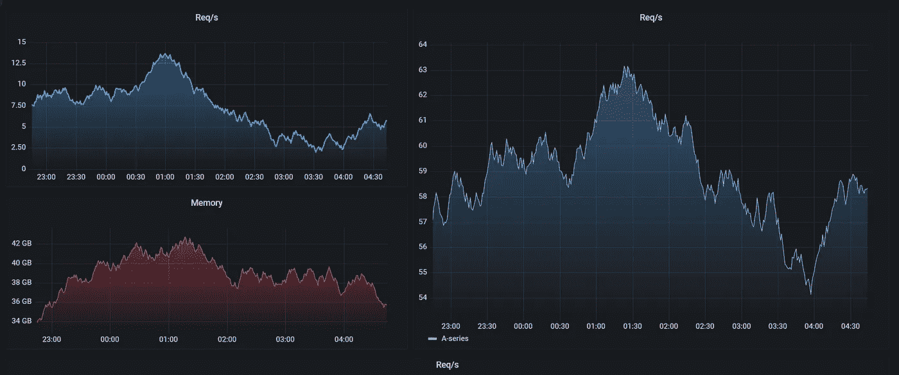

# 在大型科技公司做数据科学家是什么感觉？

> 原文：<https://medium.com/geekculture/what-is-it-like-to-be-data-scientist-at-a-big-tech-company-dd9f9fab7f2d?source=collection_archive---------12----------------------->

Source: play.grafana.org

在拥有数亿客户或用户的大规模公司中，数据对于构建反馈回路和制定业务战略至关重要。像网飞或谷歌这样的大公司收集了大量的数据，从每日活跃用户到广告转换率，无所不包。