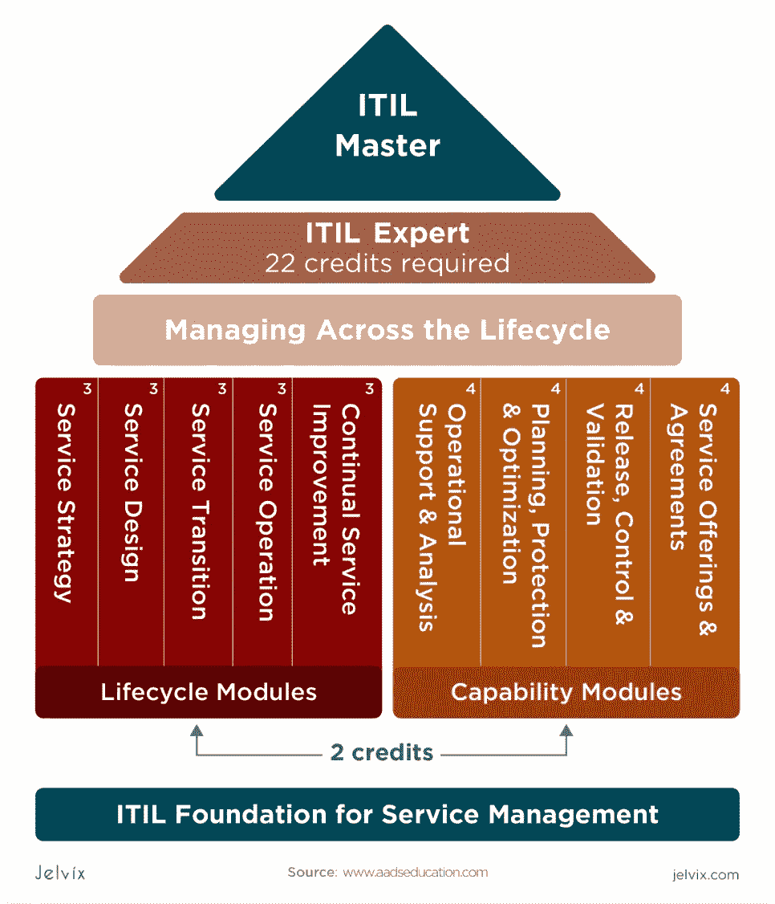
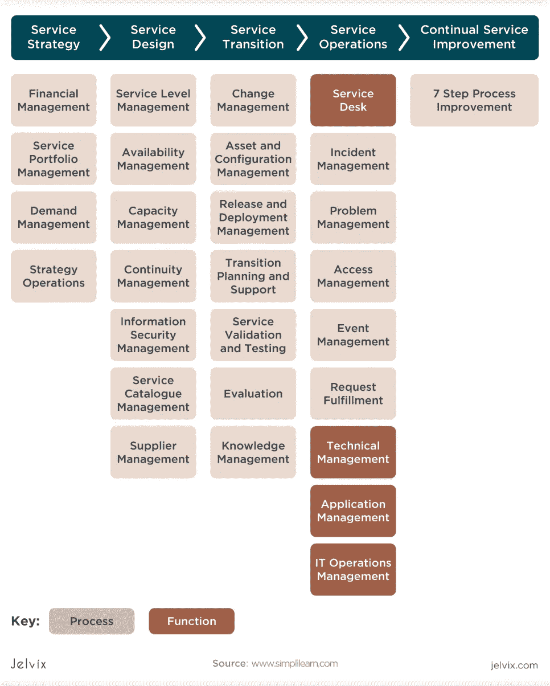
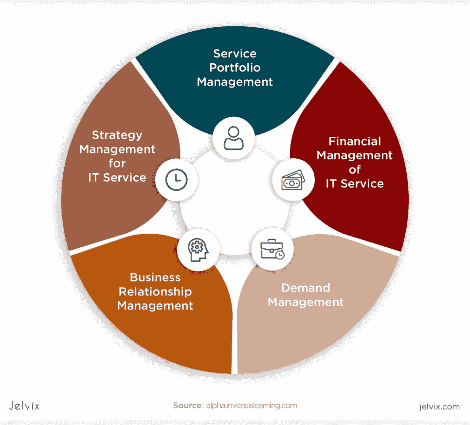
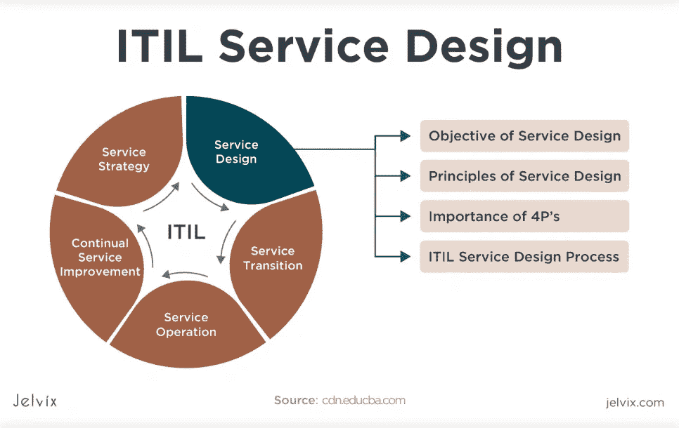
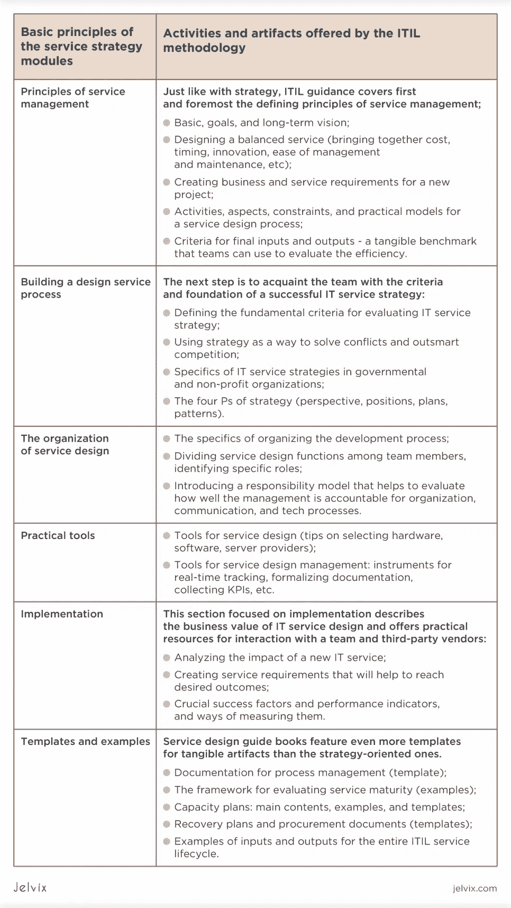
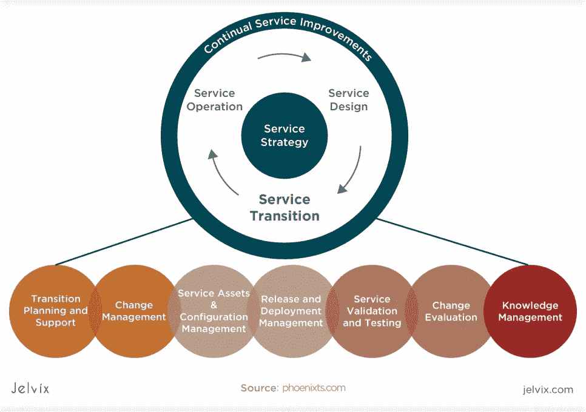
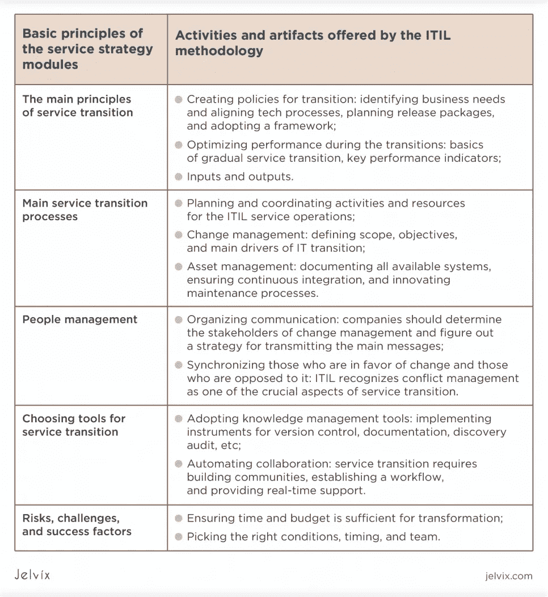
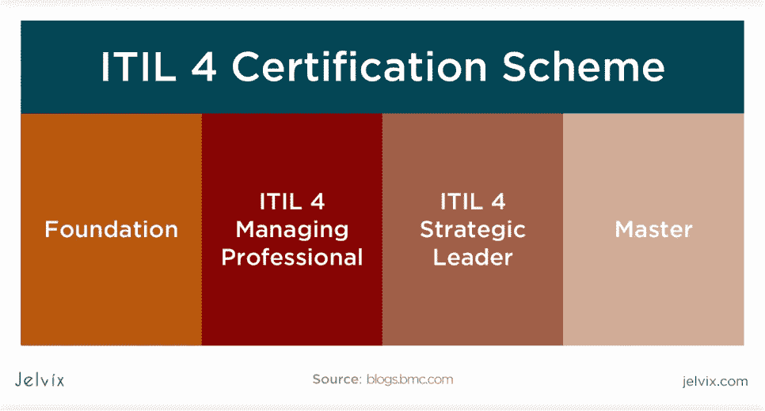

# 什么是 ITIL？优势、主要流程、认证

> 原文：<https://medium.com/geekculture/what-is-itil-benefits-main-processes-certifications-40eb03fda6fe?source=collection_archive---------14----------------------->

软件开发市场的增长，特别是[外包](https://jelvix.com/blog/main-risks-of-outsourcing)，推动团队和企业主寻找新的技术标准。需要一套特定的标准来评估供应商和组织开发。

这就是 ITIL 的用武之地，它是最流行的 IT [方法论](https://jelvix.com/blog/software-development-methodologies)和度量标准之一。在本文中，我们将了解首席 ITIL 的实践、优势和实现技巧。

# ITIL 代表什么？

ITIL 的首字母缩写代表信息技术基础设施库，它是一套 IT 服务管理的实践。ITIL 本身并不规范代码质量；它描述了构建、交付和组织 it 服务的方法。

# 什么是 ITIL？

ITIL 是一个用于组织和管理 IT 服务的框架。ITIL 基本组件发表在 ITIL 基金会指南。到目前为止，他们有 4 个，ITIL 4 是最新版本。

然而，除了这四本书，还有一整个图书馆的辅助材料。实施该框架的公司可以获得分别涵盖每个模块的书籍，甚至获得 ITIL 认证。

# 用 ITIL 有什么意义？

ITIL 主要由运行复杂 IT 服务的大中型组织使用。他们需要一个清晰的结构来管理、[、服务设计](https://www.interaction-design.org/literature/topics/service-design)、支持和沟通。ITIL 为他们提供了最佳实践、模板和现成的解决方案，所有这些都在一个框架内工作。您不需要混合几种方法，希望它们很好地同步，因为所有方面都包含在一种方法中。

ITIL 有广泛的用途

信息技术基础设施库由描述特定过程的多本书、清单和指南组成。这些任务是通用的，不依赖于组织的技术堆栈或行业。

ITIL 的认证由私人组织 AXELOS 管理。这并不是对 It 服务质量的普遍认可。因此，公司不需要任何官方许可或文件来实施 ITIL 的做法。

# ITIL 的目的

ITIL 是一个资源库(书籍、指南和模板),描述了处理 IT 服务的最佳方法。由 ITIL 专家提出的方法在国际上得到认可，并被美国州和地方政府、金融机构([美国银行](https://www.bankofamerica.com/)和其他)、大学(特别是[耶鲁大学](https://www.yale.edu/))以及公司([沃尔玛](https://www.walmart.com/)、 [IBM](https://www.ibm.com/ua-en) 等)采用。)

公司将 ITIL 作为最佳实践的集合。通过采用 ITIL 的关键原则和依靠官方指导，企业可以统一他们的组织过程。对于那些想要开始数字化转型的公司来说，ITIL 是一个很好的起点。这是科技公司、企业主和首席技术官的必备资源。

为了了解 ITIL 是否是贵公司可以依赖的东西，我们鼓励您首先查看免费资源。[官方网站](https://www.axelos.com/search.aspx?stype=site&searchtext=&searchmode=anyword&product=2&language=0&price=0&order=1)有数千份免费的指南和清单。

总之，ITIL 资源帮助企业主改革和组织 IT 管理、[变革管理](https://asq.org/quality-resources/change-management)、风险评估、规划、沟通、谈判以及与客户的沟通。有了免费资源，公司可以评估框架并采用基本原则。

# 什么是 ITIL 过程？

ITIL 帮助公司几乎从零开始建立他们的 IT 服务——这是主要目的。然而，IT 服务封装了多个流程和领域。让我们仔细看看 ITIL 最关注的是哪些流程，以及它不愿意考虑哪些方面。

# 核心 ITIL 组件

ITIL 方法涵盖多达 20 个 IT 服务管理流程，并且还在不断扩展。并非所有这些服务对大多数组织都是必要的；然而，有一些关键模块你绝对应该关注。我们描述了对 IT 服务管理影响最大的因素，而不考虑行业或技术细节。

# ITIL 服务战略

服务战略是 ITIL 方法论的定义阶段之一。在从业者指南和免费资料中，ITIL 专家建议通过仔细改变公司当前的服务策略——或者从头开始设计一个新的服务策略——来开始采用这个框架。

**ITIL 服务战略方法**

ITIL 将重点放在战略优先上的做法并不独特。大多数组织框架正是从这里开始的——毕竟，战略为整个组织奠定了基础。

ITIL 涵盖的活动和技术，帮助企业主定义其 ITIL 服务的战略。该策略包括关键原则、目标、技术关注点、长期和短期工件，以及管理技巧和诀窍。

我们认为，ITIL 方法论以其理论与实践的平衡而突出。当一个团队开始进入 ITIL 服务战略实践时，成员可能会被大量的信息淹没。然而，实践是以一种理论紧接着实践技巧和资产的方式很好地构建的。

**ITIL 资源服务战略:**

*   [ITIL 服务战略](https://www.axelos.com/store/book/itil-service-strategy) —这本书描述了建立服务战略的基本原则，对于理解 ITIL 的主要实践是必不可少的；
*   [服务策略大纲](https://www.axelos.com/Corporate/media/Files/Syllabi/The_ITIL_Intermediate_Qualification_Service_Strategy_Certificate_Syllabus_v5-4.pdf) —一份免费指南，描述了希望获得 ITIL 认证的公司的服务策略标准。这是一个很好的方法来了解框架设置了多高的门槛，并熟悉实际应用程序。

# ITIL 服务设计

服务设计模块涵盖了设计新的 IT 服务和改革现有服务的各个方面。如果策略设计模块专注于获取关于方法论的知识和建立理论框架，那么系统设计课程会提供更多实际的见解。

在我们看来，关于这些过程的材料特别适合那些开始将 IT 服务集成到他们一贯的实践中的公司。它也非常适合那些想要引入新服务或改革现有服务的人。

**ITIL 服务设计的基本原则**

IT 服务设计部分是整个图书馆中最有用的部分之一。它提供了大量改变范式的理论解释，但更有价值的是实用资产的集合。

团队可以使用模板、示例和文档内容来为 IT 服务构建完整的文档。这些文档在服务的整个生命周期中与客户、[涉众](https://www.investopedia.com/terms/s/stakeholder.asp#:~:text=A%20stakeholder%20is%20a%20party,employees%2C%20customers%2C%20and%20suppliers.)和供应商一起使用，也可以用于下一个服务。

**ITIL 官方 IT 服务设计资源**

[ITIL 服务设计](https://www.axelos.com/store/book/itil-service-design)——ITIL 服务设计原则的基本指南，包括关键模板和示例。

[ITIL 小规模实施](https://www.axelos.com/store/book/itil-v3-small-scale-implementation) —大型组织是大多数 ITIL 的主要目标受众。

# 服务转型

当一家 IT 公司将 IT 服务转移到一个新的环境，对组织进行调整并改变战略时，将会面临挑战。由于 ITIL 特别关注数字化转型的不同阶段，服务转型自然是该方法中最重要的模块之一。

高效的服务转换是定义不再满足期望的服务并重新设计它的过程。ITIL 方法描述了过渡的触发因素和指标、[业务需求、](https://en.wikipedia.org/wiki/Business_requirements)和最佳实践。学习完该模块后，业务团队可以创建新的服务包，建立 ITIL 环境，并衡量收益。

ITIL 服务转型资源

# ITIL 的主要原则

ITIL 方法具有适用于整个 IT 服务生命周期的核心价值。这些原则被遵循 ITIL 实践的组织所采用，并帮助他们为数字化转型奠定长期基础。

## 关注价值

团队应该了解终端 IT 服务为用户和所有成员提供了什么价值。这就是为什么 ITIL 的 IT 服务设计和战略规划总是从设立基准和检查目标开始。

*   最终结果优先于花费的时间；
*   为了确定价值，公司应该接受实时跟踪；
*   应该鼓励个人成长和学习。

## 保持简单实用

重点应该始终放在优化用户体验上。开发人员和 ITIL 服务经理必须考虑解决问题的最佳方法，而不是仅仅满足于一个选项。

*   [UI/UX 设计](https://jelvix.com/expertise/ui-ux)团队应参与需求形成过程；
*   [用户体验](https://jelvix.com/blog/ux-design-process-and-stages)应该经过整个生命周期的测试和验证；
*   采用最佳测试实践并符合最新标准是 ITIL 方法的首要任务。

## 从你现在的地方开始

一些团队错误地认为，为了引入新的实践，他们需要拆除现有的基础设施。ITIL 通过重新利用旧资源帮助企业主节省时间和金钱。

*   评估当前实践，确定哪些可行，哪些不可行；
*   在开始转型之前，开始收集数据以评估现有基础设施；
*   确定转型的风险和挑战。

# 整体工作

IT 服务的成功转型基于长期的方法。有时，团队过于关注一件事——他们开始痴迷地实现文档或自动化每一个动作。然而，真正的挑战不是专注于一个方面，而是以平衡的方式将所有方面结合起来。

*   在应用 ITIL 理论之前，检查自动化和重新设计的成本；
*   鼓励各部门在整个 ITIL 流程中开展合作；
*   研究你的竞争对手使用的实践。

# 迭代进展

为了及时发现错误，并迅速向市场推出变化，ITIL 鼓励团队拥抱持续集成。多年来，我们一直在发布交互较少的产品，所以这个原则对我们来说一直很自然。迭代方法让团队看到进展，识别错误，并防止技术债务的积累。这是一种更快更简单的方法。

*   **拥抱** [**敏捷**](https://jelvix.com/blog/agile-vs-waterfall) **实践**:一种灵活的软件开发方法建立在交互的概念之上；
*   **采用用于持续交付和集成的工具**:您需要自动推出更新并与团队共享的软件；
*   **为每次迭代获得用户和测试人员的反馈**

文档是 ITIL 方法论的核心。团队应该协作，进行对等评审，并接收其他成员的反馈。管理层与每个人一起制定决策——所有团队都参与其中，并准备好承担责任。

虽然指定负责的实体更好，但是整个团队都应该参与讨论；

*   拥抱协作[项目管理](https://jelvix.com/blog/product-manager-vs-project-manager)软件；
*   协作:开发人员和[测试人员之间的对等编码会议和交流](https://jelvix.com/services/quality-assurance-testing)模糊了团队成员之间的界限。

# 谁受益于 ITIL？

由于 ITIL 是一个相当大规模的方法论，有很多好处。企业主、经理和开发人员可以利用他们的机会。那么，如果你决定实施 ITIL，会有什么好处呢？

## 组织

ITIL 允许组织规划和执行数字化转型。例如，如果一家大公司想要扩大其研发中心，他们需要创新管理和[开发流程](https://jelvix.com/blog/application-development-lifecycle)。ITIL 告诉他们如何正确地做这件事——从选择这种变化的时机到衡量其最终结果。

ITIL 的实践是面向长期的。在 5-6 年前实施 ITIL 的公司继续从中获益。这是因为他们已经建立了文档、度量和管理系统的坚实基础。一旦实现，这些方法和工具可以永远使用。

ITIL 帮助组织智胜竞争对手。今天不可预测的经济和技术因素，如 COVID-疫情可以干扰战略，并可能导致预算骤降。ITIL 方法提供了多种 B 和 C 计划，帮助公司面对各种紧急情况。这是他们从竞争中脱颖而出并不断追求技术创新的原因，无论市场如何变化。

## 经理

ITIL 方法主要面向 IT 服务的管理链。首席技术官、项目经理和[人力资源经理](https://workology.com/what-is-a-human-resource-manager/)将从采用文档、计划和度量实践中受益，如库中所述。

在我们看来，ITIL 最有价值的部分是工件——有形的文档模板，可以直接用来管理你公司的数据。你所要做的就是得到模板，阅读它的应用，并长期坚持这些实践。

## 开发商

尽管 ITIL 材料并不直接面向开发人员，但工程团队也从他们的实施中受益。当企业所有者和管理者对团队的成长有一个清晰的愿景时，开发人员可以专注于创新。

总的来说，ITIL 的目标是消除分散实际技术注意力的不必要的管理挑战。自动化、评估和合作实践减轻了单个开发人员的负担。

# 如何获得 ITIL 认证

ITIL 组件通过信用系统和认证进行衡量。该公司得到了拥有该库的组织的正式认可，并将其作为他们成功采用实践的证明。像 IBM、惠普企业和微软这样的公司欢迎他们的团队获得 ITIL 认证。

**ITIL 认证的类型:**

*   **基础**:证明团队很好掌握 ITIL 生命周期和 IT 管理关键原则的基础证书；
*   **从业者**:证明公司知道如何在简单项目中应用这些原则的证书。本模块要求学习变更管理、指标和沟通实践；
*   中级:中级模块主要关注服务生命周期，尤其是服务设计和转换；
*   **专业管理人员**:IT 服务经理，能够展示在创建、交付和支持 IT 服务方面的专业技能，展示在特定模块(如高速 IT)方面的专业技能，并指导、规划和改进。
*   **战略领导者**:在 itOL 4 中，这是专业知识的最后阶段，需要展示对 IT 服务的战略眼光和深刻见解。

# 结论

获得 ITIL 认证是完善组织中 IT 组织和管理实践的最后一步。是必要条件吗？不会。即使只是熟悉链接指南中的基本原则和工件，也会帮助您同步开发过程并交付更多价值。最终，认证过程会激励组织，并为公司的最终用户提供商业价值。

如果你想与管理和发展实践完全符合 ITIL 的团队合作，你可以[联系我们的团队](https://jelvix.com/contact-us)。Jelvix 团队从这个库的第一个版本开始就一直关注它，并积极应用专家推荐的原则和工具。因此，我们准备帮助您在研发和软件开发部门建立相同的流程。

*原载于*[*https://jelvix.com*](https://jelvix.com/blog/what-is-itil)*。*