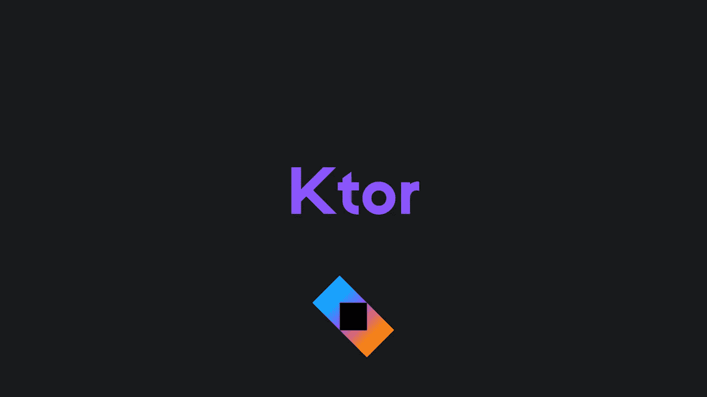

# Ktor 是什么，为什么要学？

> 原文：<https://medium.com/geekculture/what-is-ktor-and-why-should-you-learn-it-b7e5600a4d50?source=collection_archive---------4----------------------->

开始使用 Kotlin 构建后端。

大家好，我回来了！我有大约两个月不能写任何故事，但是从现在开始，我会试着每两三天写一个新故事，就像我以前做的那样。

不管怎样，在这个故事中，你会学到什么是 Ktor，以及为什么你应该学习它。我会谈谈 Ktor 是什么，它提供什么，它是否值得学习。

开始吧！

# Ktor 是什么？

> 创建异步客户端和服务器应用程序。从微服务到多平台 HTTP 客户端应用，一切都很简单。开源、免费、有趣！

Ktor 官网是这么说的，也是真的。

在 Ktor 中，您可以使用 Kotlin 构建令人难以置信的客户端和服务器。它可以是微服务、多平台 HTTP 客户端应用或任何您想要的东西。它是开源的，免费的，有趣的。

您可以开始用 Ktor 构建后端，而不必学习任何新的语言。

我知道，每个人的快乐程度都不一样。但对我来说，这很有趣。

Ktor 是 JetBrains 做的，如果你还没听说，JetBrains 还创造了 Kotlin，IntelliJ IDEA，Android Studio 等很多工具。

# Ktor 的特点

Ktor 可以做很多事情，下面是 Ktor 的一些最重要的功能。

*   按指定路线发送
*   处理请求和响应
*   模板
*   内容协商和序列化
*   认证和授权
*   离子
*   超文本传送协议
*   套接字
*   记录
*   监视
*   管理

还有很多。

真的。正如您所看到的，Ktor 提供了很多特性，并且都非常容易实现。

我不会在这篇文章中解释所有这些特性的作用，但我会写很多关于 Ktor 和用 Ktor 构建东西的故事，所以如果你感兴趣，请确保在我发布最新帖子后关注我！

# 为什么你应该学习 Ktor

一般来说，学习 Ktor 或后端开发有很多原因。所以，下面是学习 Ktor 的两个最重要的原因。

## 不需要使用像 Firebase 这样的服务

有没有尝试过构建一个需要后端的大型应用程序？嗯，如果你不知道后端开发，你可能会使用类似 Firebase 的服务，它可能非常有限。

因此，在某些时候，定价和可扩展性也成为一个问题。那你会怎么做？你要么付一大笔钱，要么雇一个后端开发人员来为你构建定制的后端。两种方式都很贵。

不过，有一种更简单、更便宜的方法。可以随时学习 Ktor 和后端开发，免费搭建自己的后端。当然，托管还是会需要一些钱，但是会比前两种方式便宜很多。

## 更多的工作机会

了解后端和 Ktor 会让你更容易找到工作，或者如果你是自由职业者，它会让你申请后端开发人员的工作。

两种情况都是双赢！

# 最后的想法

如果你想学习后端开发，并且你已经知道 Kotlin，Ktor 是一个非常好的入门框架。

希望这个故事对你有帮助。我很想知道你是否已经决定尝试 Ktor！

# 仅此而已。感谢您阅读这个故事！

如果你喜欢这个故事，一定要为它鼓掌！你想问我什么都可以。

在 Twitter 上关注我:

 [## re _ ally 边缘

twitter.com](https://twitter.com/Re_allyedge) 

在 Patreon 上支持我:

 [## 阿里木阿尔斯兰卡亚是创造编程故事和教程。帕特里翁

### 今天就成为阿里木阿尔斯兰卡亚的赞助人:在世界上最大的…

www.patreon.com](https://www.patreon.com/allyedge)