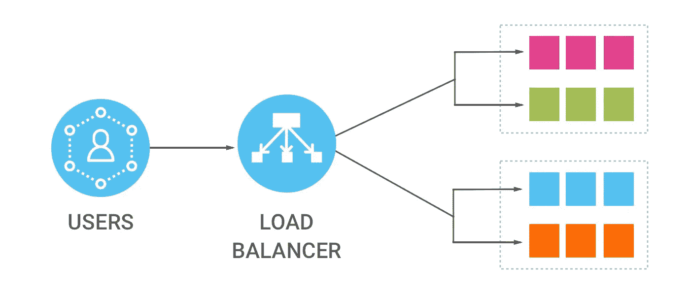
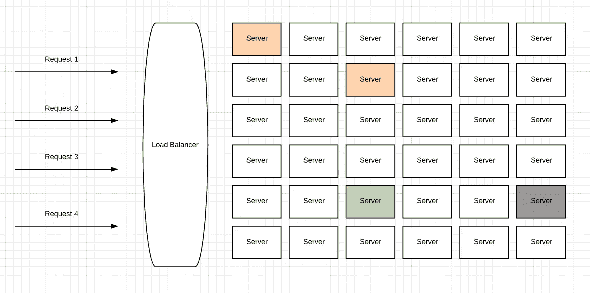
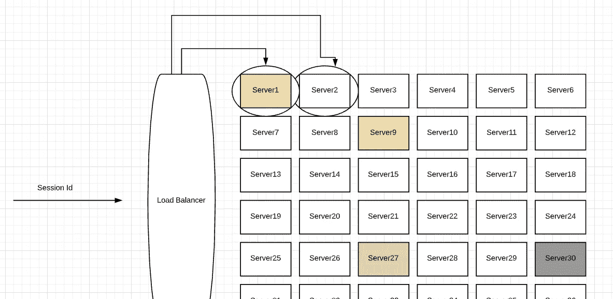

# 什么是负载平衡，负载平衡的用途是什么

> 原文：<https://medium.com/geekculture/what-is-load-balancing-and-what-are-the-usages-of-load-balancing-144a75f1bc6a?source=collection_archive---------3----------------------->

如果你在大公司工作，如果你想处理大量的流量，你应该听说过人们经常使用的术语**负载平衡器**。让我们看看**什么是**负载均衡和**为什么我们更喜欢**负载均衡。

## 什么是负载平衡？

我们以亚马逊为例。Amazon 可能会在 UI 部分的后端部署很多服务器。让我们考虑部署在 Amazon 基础设施中的不同服务器，它们运行与 Amazon UI 相同的代码。现在，请求到达了这些服务器中的每一个吗？假设我正在访问 Amazon.com 网站，亚马逊如何知道它需要重定向到特定的实例？一个新的请求需要如何到达一个不同的实例。这很好**负载平衡器**是有用的。**负载平衡器**执行路由(例如:请求 1 去往标记为**绿色**的特定服务器，请求 2 去往标记为**黄色**的不同服务器，请求 3 去往**红色**服务器，请求 4 去往**黑色**服务器)。所有这些请求可能来自不同的用户，也可能来自同一个用户。这样，我们可以通过将请求分配给几个服务器来平衡负载。

## 负载平衡的用途是什么

**负载平衡器**，

*   **通过在多台服务器之间高效分配，将传入流量**分配到网络。
*   **可靠性和高可用性**通过只将请求重定向到网络中可用的服务器来维护。如果有不可用或脱机的服务器，这些服务器将从负载平衡设置中删除。内部负载平衡器维护所有服务器的健康检查。并且该请求将仅被重定向到可用的服务器。
*   **易于使用**根据需求添加和移除网络中的服务器。比方说，亚马逊需要为一项特殊功能扩展其服务器。他们知道对服务器的请求数量会更多。在此基础上，他们可以根据需求扩大或缩小规模。他们只需要简单的配置更改。

## 负载平衡算法

负载平衡器使用不同的算法来重定向来自不同服务器的请求。我们可以看到 3 种不同的常用算法，公司更喜欢用它们来设置负载平衡。

*   **循环调度** ( **顺序请求分配** ) —请求在这里被重定向到不同的服务器。假设网络中有 3 个服务器，第一个请求发送到第一个服务器，第二个发送到第二个服务器，第三个发送到第三个服务器，所有请求都遵循这个顺序。每个服务器每次都会收到一个新的请求。
*   **最少连接** ( **请求发送到网络中最少使用的服务器** ) —请求将被发送到请求最少或处理资源最少的服务器。为了做到这一点，负载均衡器需要知道哪个服务器具有最少的资源，从而需要做一些额外的计算，因为要知道所使用的资源的计数。这可能会从所有服务器获取一些元数据，并获得一些计算时间。
*   **IP 哈希** ( **根据客户端 IP 向服务器发送请求** ) —当某些网络或某些特定服务器需要防止优先于其他服务器时，这很有用。假设客户端发送一个请求，客户端请求需要小心地发送到一组特定的服务器。也就是说，使用了 IP 哈希。因此，重定向可以基于客户端 IP 地址来完成，并且只有特定于该客户端 IP 地址的特定服务器才会被重定向到该特定网络。

> 您可以在 IP 哈希上重定向特定服务器的特定请求，并基于此来提高服务器的性能。

## 负载平衡器中的会话持久性

例如，我们正在使用亚马逊购物车，我们在购物车中添加了大量信息。这个特定的购物车信息存储在会话中(客户端浏览器)。浏览器通常存储所有的缓存信息并存储它。而且每次有新的请求发出，浏览器都会给出相同的会话 ID。因此，通常情况下，如果请求被重定向到不同的服务器，会话 ID 往往会丢失。因为服务器 1 生成的第一个会话可能对服务器 2 不可见。因此会话信息将丢失，购物车也将消失。

这是一个常见的用例，我们必须在应用程序端处理它。我们可以使用一个公共缓存(Redis 缓存来存储我们的会话信息),或者我们需要允许负载平衡器每次都访问同一个实例。一般来说，这些负载平衡器有粘性会话的概念。因为他们知道特定的会话 ID 第一次出现时应该被重定向到服务器 1，而对于第二次出现的相同请求，我需要重定向到服务器 1，我不会考虑流量和其他因素。

大多数负载平衡器都有会话持久性的概念，因为它们知道如果请求是从同一个客户端发送的，它们需要重定向到同一个实例。一般来说，假设您需要处理这个问题，那么您可以使用缓存机制，将这个会话 ID 存储在不同的缓存中或存储在单独的数据库中，并将请求路由到不同的服务器。

这些方法之间的唯一区别是读取操作会更多，并且缓存机制中的**性能**会更高。

因此，在本教程中，我们讨论了**什么是负载平衡，负载平衡器的用法，负载平衡算法，以及会话持久性**。我希望大家对负载平衡器有一个基本了解，并能够在企业应用程序实现中使用它。

谢谢大家！