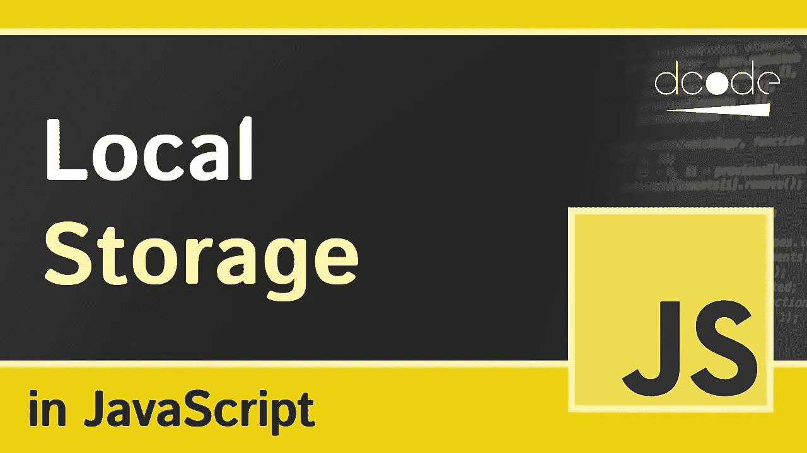
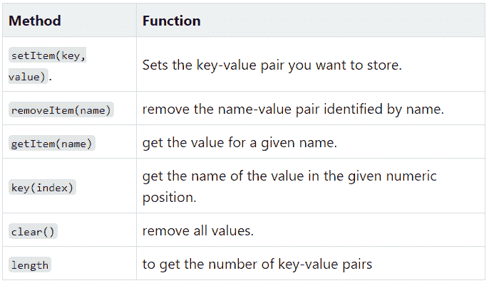
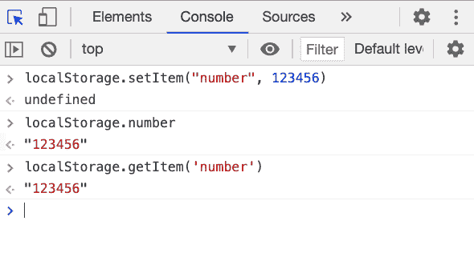
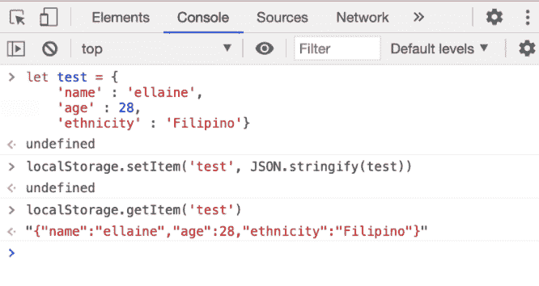
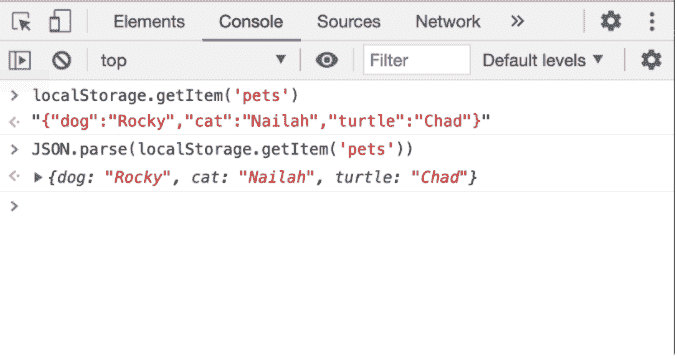
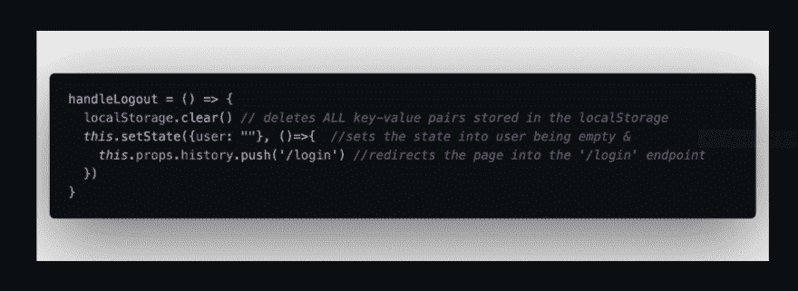

# 什么是 localStorage？

> 原文：<https://medium.com/geekculture/what-is-localstorage-6724d4be38a5?source=collection_archive---------40----------------------->

本地存储在我做编码练习
时的一个活动中。当我们被教育利用它来忍受 JWT 验证的信息时，我意识到了它的真实性，这就是我所意识到的全部。

我一点也不知道本地存储比令牌有更多的用途！
让我们一起快速浏览一下，了解一下什么是 localStorage？

# 方法:

这方面的一个例子是:

当您从存储对象中恢复信息时，您通常会获得字符串形式的信息。会话存储和 Cookies 也是如此。同样，您可以将对象存储在 localStorage 中。我们只需要利用 JSON.stringify()来存储项目。

就像你看到的，一旦存储，整个对象变成一个字符串，即使当试图取回数据。但是可以使用 JSON.parse()将这些数据转换回对象。

就像这样；

# 限制和使用

有人说，目前大多数互联网浏览器允许你存到 5MB，而其他人说这几乎是无限的。

关于保存信息，localStorage 会保存它，直到程序关闭或运行 localStorage.clear()命令。

在我过去的项目中，当客户端退出 web 应用程序并获取程序中的任何令牌时，我使用 localStorage.clear()。

请看我们的 handleLogout 工作；

切换主题的组件的一部分是 onClick eventListener，它触发包含 if 语句 use 的 switchTheme 函数。
看到本地存储的主要用途是真正存储可以在许多不同的事情上使用的键尊重集。

原来如此！我相信您在浏览这个关于本地存储的博客时度过了一段美好的时光，并且在持久化信息(除了 treats 或 state)方面帮助了您。

## 您是否有以另一种方式利用本地存储的其他经验？在底下的备注里告诉我！我想不出还有什么比给他们一次机会更好的了！