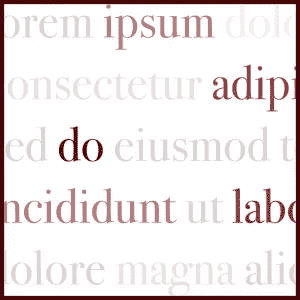

# 什么是 Lorem Ipsum，为什么应该使用它

> 原文：<https://medium.com/geekculture/what-is-lorem-ipsum-and-why-you-should-use-it-be89f124ff80?source=collection_archive---------49----------------------->

## 假文本对 UI 设计有什么帮助？

假设你是一名平面设计师，正在设计一个新的网站界面；或者你正在准备一个移动应用的布局——所有这些通常包含或多或少的文本内容。所以你可能在某处只有一个标题，或者甚至更长的段落，你需要准备一个考虑到这一点的整体大纲。