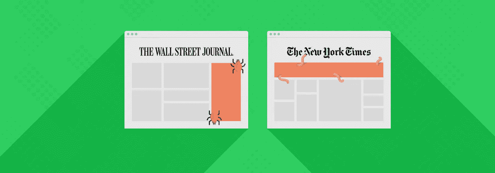
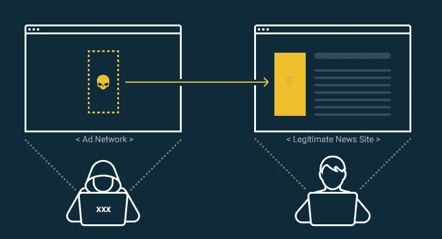
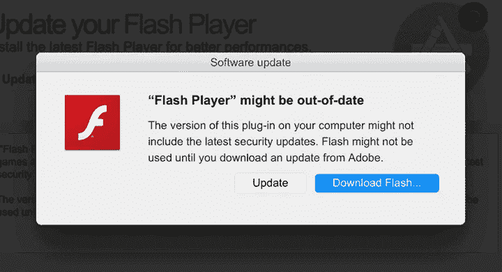

# 什么是广告？

> 原文：<https://medium.com/geekculture/what-is-malvertising-9109512464be?source=collection_archive---------24----------------------->

M 广告[(恶意广告)](https://en.wikipedia.org/wiki/Malvertising)是利用在线广告网络在受欢迎和受信任的网站上传播受感染的广告。

这些广告会出现在你在[最喜欢的新闻网站](https://www.theguardian.com/technology/2016/mar/16/major-sites-new-york-times-bbc-ransomware-malvertising)或你的[社交网络](https://www.techradar.com/news/this-vicious-malware-will-steal-your-facebook-google-and-apple-passwords)上，看起来合法，但会将受害者重定向到损坏的网页或在他们的电脑上安装恶意软件。

# Malvertising 是如何工作的？

在线广告行业是一个巨大而复杂的机器，有许多实体在交流和共享数据。

出版商和广告商在**广告交易平台**(称为库存)上买卖广告空间，**广告网络**在广泛的网站上提供广告，而**广告服务器**存储并交付在线广告。这些系统的复杂性使它们成为聪明黑客的理想目标。

这是一个关于恶意广告攻击工作原理的简单解释:

1.  网络罪犯在网站上或从广告网络购买广告空间。
2.  网络罪犯上传受感染的广告，并在他们购买的空间中显示，巧妙地将其伪装成合法广告。
3.  受感染的广告显示在您访问的网站上，攻击发生在您:

a.点击广告，或者…

b.在网站上加载广告，许多被感染的广告无需点击就能自行攻击。

# 广告的类型

第一个恶意广告的例子是在 2007 年发现的，基于一个特定的 Adobe Flash 漏洞，并被用于利用 Myspace 和 Rhapsody 等网站。今天，恶意广告已经适应了新的和复杂的媒体环境，利用各种技术为您提供恶意软件。

从那以后，恶意广告在所有平台上都变得越来越普遍，越来越多不需要任何直接互动的“路过式”下载已经成为常态。

## 隐写术

隐写术是一种在文本或图像中隐藏秘密信息的古老技术。网络罪犯使用这种技术将恶意代码隐藏在广告的图像中，在许多情况下，广告网络和用户都无法区分真实广告和虚假广告。

## 多语言图像

就像隐写术一样，多语言图像包含恶意代码，但也包含用于执行代码和启动攻击的脚本。不需要外部脚本来提取恶意软件包，多语言图像是一种更有效和更危险的隐写术。

## 技术支持诈骗

在这个骗局中，黑客试图让你相信你的电脑有问题。技术支持诈骗广告将安装一种破坏正常功能的浏览器劫持恶意软件，然后告诉你拨打一个号码来解决这些问题。当您拨打该号码来解决问题时，您将连接到一个骗子，他们会尽力将您与您的金钱和个人信息分开。

## 稀缺软件

像技术支持骗局一样，scareware 试图用弹出窗口来吓唬你，说你的计算机感染了病毒，促使你立即采取行动。系统会提示您下载假冒的网络安全/防病毒软件，这些软件要么会收集您的信息，要么会用恶意软件感染您的计算机。

## “快速致富”计划和虚假调查

只要你完成一个简单的任务，比如填写我们的 a 表，留下评论或完成一项调查，你就不用看很远就能看到承诺让你变得富有的广告。事实上，你可能得到的唯一免费的东西就是电脑病毒。

## 假冒的软件更新

与 scareware 类似，这些广告试图吓唬您，让您认为您的计算机存在风险，因为一些软件已经过期，提示您点击并下载更新。系统会提示您更新操作系统或其他已安装的软件，更新可能会更新您的程序，但也会安装恶意软件。

# 广告例子

由于恶意广告通常通过流行的广告网络传播，它们进入了一些世界上最受欢迎和读者最多的网站。近年来，恶意广告攻击了 Spotify、MSN、路透社、纽约时报、YouTube 和许多其他网站。

以下是几个最突出的例子:

*   2020 年新冠肺炎攻击
    仍在使用旧的过时的 Internet Explorer 浏览器的人们遭到了一次与新冠肺炎有关的恶意广告攻击，促使用户点击一个虚假的咨询说明。恶意广告安装了可以窃取用户个人数据和密码的恶意软件。
*   **2019 VeryMal 攻击**
    虽然短暂，但 [VeryMal 恶意广告攻击](https://www.zdnet.com/article/malvertising-campaign-targets-apple-users-with-malicious-code-hidden-in-images/)袭击了两家最重要的广告交易所，这些交易所向许多顶级出版机构提供广告。VeryMal 是一种基于隐写术的攻击，目标是 Mac 用户，并将他们重定向到一个安装了 Shyler 木马恶意软件的欺骗性网站，伪装成 Flash 更新。
*   **2017 RoughTed**
    凭借绕过广告拦截器和规避众多杀毒程序的能力， [RoughTed 在](https://blog.malwarebytes.com/cybercrime/2017/05/roughted-the-anti-ad-blocker-malvertiser/)中自成一派。因为它有能力动态创建新的网址，这使得跟踪和拒绝评估它正在使用的域名变得特别困难。解决办法
*   **2016 AdGholas 攻击**
    经过非常巧妙的伪装， [AdGholas malvertising 攻击](https://www.computerworld.com/article/3101823/the-adgholas-malvertising-campaign-infected-thousands-of-computers-per-day.html)用隐私软件的虚假广告打击雅虎、MSN 等大牌网点。由于基于隐写术，该攻击将用户重定向到一个恶意登录页面，该页面使用多个 Flash 漏洞下载并安装恶意软件。

# 如何防止广告不当

由于恶意广告不需要点击或任何其他互动就能感染你，保护你自己并不容易。最彻底的一步是通过使用一个广告拦截器(如 uBlock Origin)和一个好的浏览器(如 Mozilla Firefox)一起禁用广告。

*   **使用良好的杀毒解决方案**
    如果你使用的是 Windows 10，[你不需要另一款杀毒软件](https://bitidentify.com/blog/why-you-dont-need-another-antivirus/)，如果你使用的是旧的 Windows 系统，你可以浏览[今年的反病毒测试](https://www.av-test.org/en/antivirus/home-windows/)并从中选择一款。
*   **更新你的软件**
    软件中的漏洞是黑客首先寻找的东西之一，恶意广告通常会利用这些漏洞。使用最新的软件是网络安全的基石之一。
*   **使用安全浏览器**
    [Mozilla Firefox](https://www.mozilla.org/en-US/firefox/new/)是最好、最安全的浏览器之一，它对插件有极好的支持。
*   使用广告拦截器
    广告拦截器是浏览器的一个插件，顾名思义，它可以阻止广告向你显示。使用一个好的广告拦截器可以阻止恶意广告，我们建议使用广告拦截器插件 [uBlock Origin](https://addons.mozilla.org/en-US/firefox/addon/ublock-origin/) ，因为它是开源的。
*   **三思而后行点击**
    了解如何通过了解欺骗的蛛丝马迹来检测虚假网站，例如缺少 HTTPS、拼写错误的 URL、缺少隐私政策以及条款和条件页面不完整。如果你不确定，你可以在[谷歌安全浏览检查器](https://transparencyreport.google.com/safe-browsing/search?hl=en)上检查网站。

原文可以在 Bitidentify 的博客上找到:[https://bitidentify.com/blog/what-is-malvertising/](https://bitidentify.com/blog/what-is-malvertising/)