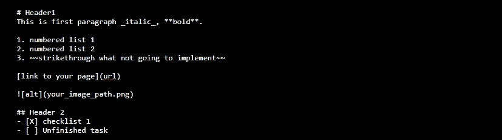
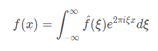
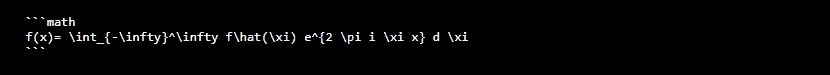
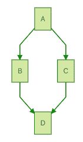
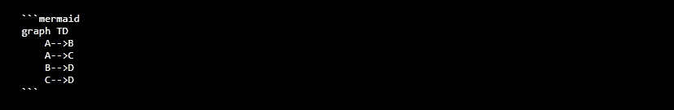

# 什么是降价？

> 原文：<https://medium.com/geekculture/what-is-markdown-1821f1cc080f?source=collection_archive---------31----------------------->

不管我们是否是编程开发人员，我们都接触过所谓的 Markdown 语言。一个很好的例子是当我们试图在 WhatsApp 中加粗或斜体文本时。我们用*和 _ 来表示文本应该是粗体还是斜体。这实际上是降价语言。那是关于什么的？现在减价是如何流行起来的？

# 减价销售概述

Markdown 是一种标记语言(没有双关语)。最初，markdown 是在一个没有格式化功能的老式文本编辑器中创建的，所以一群大学生开始发明他们自己的语法和标准来表示许多重要的文本格式，如标题、粗体、斜体、编号列表等，以便更好地阅读。从那里，它逐渐发展成为人们，尤其是开发人员今天所喜爱的 markdown 语言。

虽然它最初是由程序员发明的，用于提高他们工作中的“生活质量”,但这并不意味着 markdown 的使用仅限于编程人员。它也被许多组织和技术采用，作为生成网页、出版书籍和其他文档生成作品的来源。例如，看看 [O'reily 如何使用 Markdown](https://docs.atlas.oreilly.com/writing_in_markdown.html) 来出版他们的书。

事实上，Markdown 不是第一种标记语言，也不是第一种为格式化目的而创建的语法。在互联网的早期，像维基百科和许多论坛这样的开源网站已经非常受欢迎。因此，他们发明了自己的语法和标准。这就是为什么对于那些熟悉的人来说，你会发现 Markdown 有时与 Mediawiki 有相似的语法。

*Example of the Markdown Syntax*

# 降价的用法

如前所述，编程界越来越喜欢使用 Markdown。这就是为什么你可以找到像 GitHub，GitLab，Bitbucket，JIRA，Slack， [Doxygen](https://www.doxygen.nl/) 等服务早就开始使用 Markdown 了。除了编程领域，你会惊讶地发现，最近，许多社交网站或应用程序，如 WhatsApp 和 Discord，也加入了这一趋势，并开始在其应用程序中引入部分降价支持。继续尝试在你的 WhatsApp 文本中键入 _italic_ 以获得这种效果！

# 数学公式

你也可以在 Markdown 中加入数学公式。即+b^=c 将被渲染为。事实上，Microsoft Word 支持的所有公式都可以使用 Markdown 编写。这意味着使用 Markdown 作为你写论文或研究论文的语言是没有问题的！

再举个例子。这个公式:

当用 Markdown 编写时，它看起来像这样:

# 流程图和图表

除了数学公式，您还可以包括各种图表，如简单的流程图和序列图。人鱼图被广泛应用于 Markdown。下面是一个例子:

它的减价记为:

# 降价的好处

Markdown 易学易用。它就像你拥有的纯文本文件一样，是跨平台的。没有额外的插件意味着你现有的编辑器不需要额外的安装。Markdown 格式对你的编辑来说没有任何额外的花费。

为了让它更好，markdown 是跨平台的。您的减价文本作品的接收者在编辑文本时不一定必须使用您使用的同一编辑器(即 Microsoft Word)，但他或她可以使用他们喜欢的文本编辑器。

想象一下这样一个场景:你与一个在 Linux/Ubuntu 环境下工作的朋友共享你的 Microsoft Word 文档，你的朋友可能无法打开你的文档，因为他们的计算机上没有安装 Microsoft Word。但是如果文档是 Markdown 格式的，他或她就不会有这个问题，因为大多数平台能够从 Markdown 格式读取。

如果你想坚持*单一事实来源*的原则，Markdown 可能是一个很好的文本写作选择。你将所有文件保存在同一个 markdown 文件中，并使用 Doxygen、 [Jekyll](https://jekyllrb.com/) 或任何你喜欢的文本生成器来交付你想要的输出，如网页和 pdf。此外，Markdown 的使用与 git 等版本控制服务配合得很好。您可以将您的文件和更改提交到版本控制中(例如 [git](https://git-scm.com/) )，并在您想要与先前版本进行比较时应用 *diff* ，或者如果您对最新版本不满意，则恢复到先前版本。

# 结论

希望这能给你一个简单的介绍和学习 Markdown 的兴趣，并开始适应你的日常写作风格。你需要的只是一个记事本🙂

你觉得这篇文章有用吗？在上面的文章中，我提到了用降价法出版图书。我将在以后的文章中更详细地讨论这个问题！

# 进一步阅读

1.  [https://daringfireball.net/projects/markdown/](https://daringfireball.net/projects/markdown/)
2.  [https://about . gitlab . com/blog/2019/04/24/the-gitlab-handbook-by-numbers/](https://about.gitlab.com/blog/2019/04/24/the-gitlab-handbook-by-numbers/)
3.  [https://typora.io/](https://typora.io/)
4.  [https://katex.org/](https://katex.org/)
5.  [https://mermaid-js.github.io/](https://mermaid-js.github.io/)

如果你有任何想法或想法，请在下面留下你的评论。谢谢！

*原载于 2021 年 9 月 19 日*[*【http://filpal.wordpress.com】*](https://filpal.wordpress.com/2021/09/19/what-is-markdown/)*。*