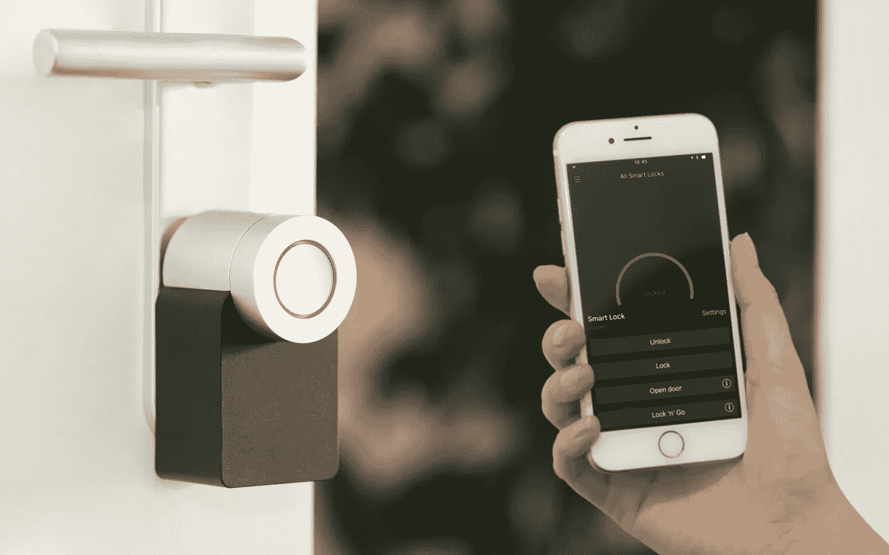

# 什么是物质，它为什么重要？

> 原文：<https://medium.com/geekculture/what-is-matter-and-why-does-it-well-matter-dde14a0f4c4?source=collection_archive---------11----------------------->

## 设置你的智能家居将变得更加容易，以下是你需要知道的一切

Wouldn’t it be nice to control this smart lock through any smart home platform you prefer, using any smartphone? There’s a new standard for that. (Image: Sebastian Scholz, Unsplash)

在现代科技的历史上，有许多概念听起来比实际上更有前途，而“智能家居”无疑是其中之一。这应该是一种数字化管理…