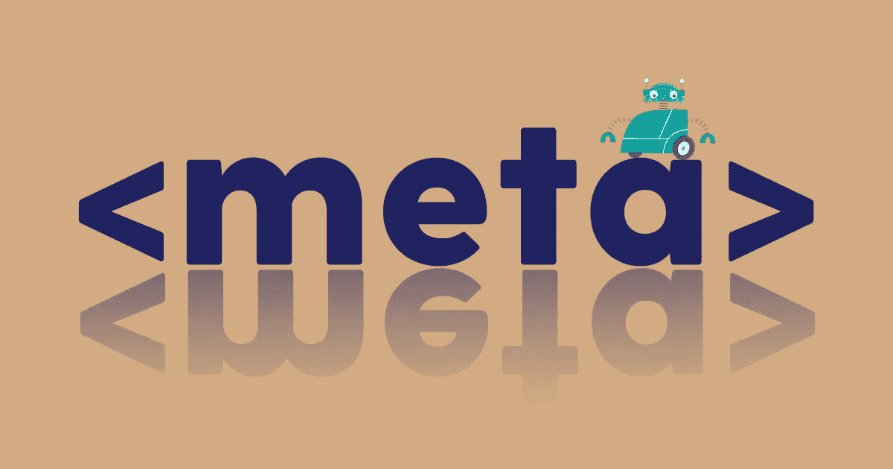
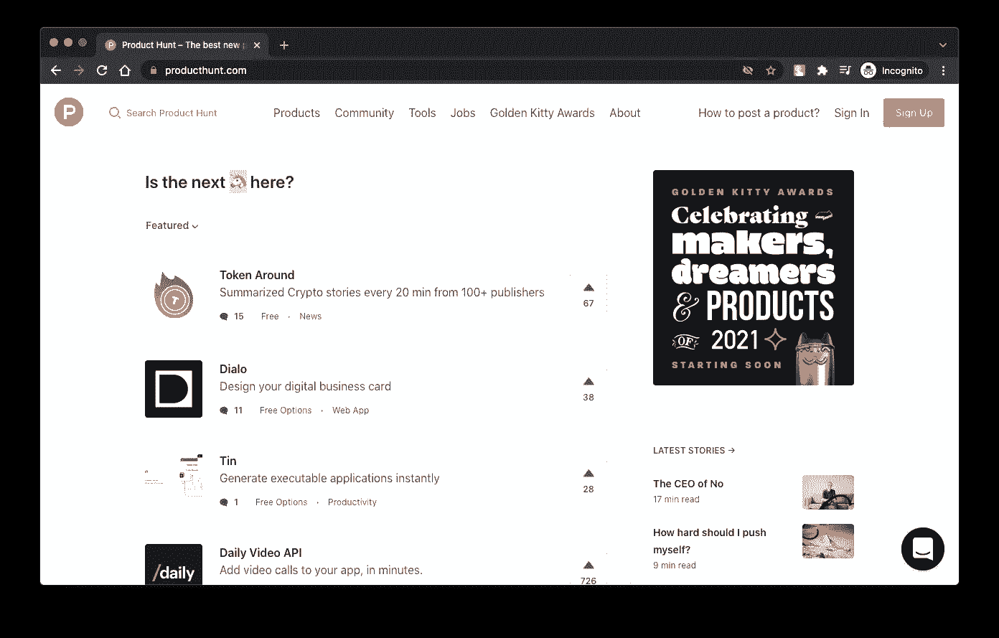

# 让我们深入了解一下

> 原文：<https://medium.com/geekculture/what-is-meta-charset-utf-8-and-why-do-we-use-it-4eee7456fa1c?source=collection_archive---------6----------------------->

所以，我最近看到很多人，主要是 HTML 初学者，询问这个 meta 标签，确切地说是 charset 属性。

Image Courtesy: Author

让我们深入研究一下，好吗？

## 这是什么？

让我们从分解它开始。

*   Meta:它是一个 HTML 标签，包含关于网页的元数据。它们被搜索引擎用来确定页面内容和如何处理网页。
*   字符集:它是一个属性，告诉您的浏览器使用什么字符编码来显示网页内容。
*   UTF 8:它是字符集的版本。

## 为什么重要？

用过表情符号吗？嗯，这个元标签负责将这些表情符号编码成机器可读的字符，反之亦然。如今，大多数网站不得不显示非传统 ASCII 字符。当在 HTML 源代码中收到这样的字符时，浏览器应该能够处理这些字符以正确显示。

## 为什么使用 UTF-8？

嗯，你不太可能已经在用了。UTF 8 字符集涵盖了这个宇宙中存在的所有字符和符号。所以，只有用它来让你的网站被认为是你想要的，才是有意义的。你想使用表情符号或字符，使你的网站看起来现代和图形化，UTF 8 救援。

Image Courtesy: Product Hunt

## 如果我不使用`'怎么办？

好吧，那你就去查 HTML 实体(& # xxx)来使用表情符号或符号并正确显示。

但是，正如我所说的，很有可能你还没有使用它作为，默认情况下，指定 UTF-8 作为编码字符。

**嗯，现在你可能会问，为什么它是专门写的，甚至是在写了'< DOCTYPE html >'之后？**

许多旧的浏览器仍然不支持 HTML5，尽管这是一种规范。所以，对他们来说，包含这个标签是很重要的。

好了，这就是这个故事，希望这个故事值得你花时间，你喜欢它。如果你有，考虑跟我来这里。

你知道吗，按住拍手图标，你可以发出不止一次的拍手声，很简单，对吧！

和平。

如果你想支持我，你可以在这里。非常感谢！！

 [## Bhavesh Rawat 正在创作科技故事、乐器和策展作品。

### 20 岁，博学者，科技爱好者，博客作者，策展人。

www.buymeacoffee.com](https://www.buymeacoffee.com/BhaveshRawat)