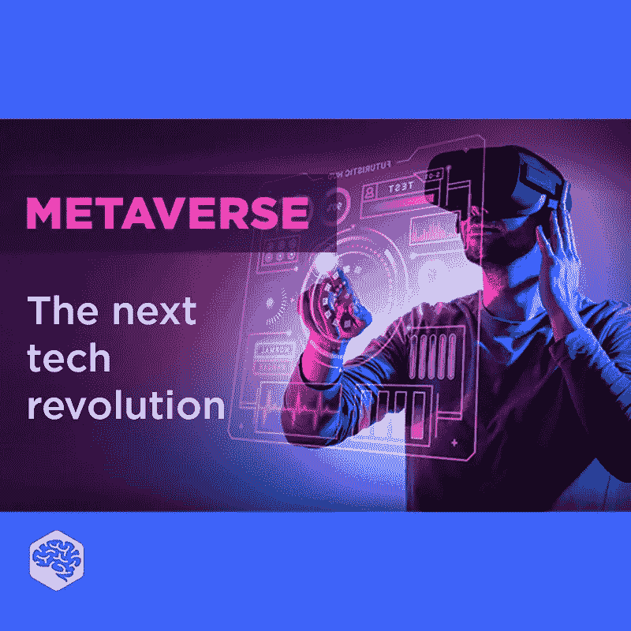

# 什么是元宇宙？这是下一件大事吗？

> 原文：<https://medium.com/geekculture/what-is-metaverse-is-this-the-next-big-thing-fe21b6c5d596?source=collection_archive---------10----------------------->

## 关于互联网的未来，你需要知道的一切

一般来说，元宇宙是一个数字世界的网络，可以包括从虚拟现实到增强现实和区块链的任何技术组合。

这个词是尼尔·史蒂文森在他 1992 年的小说《冰雪奇缘》中创造的，用来描述他想象的未来中广泛使用的虚拟世界。在这本书里，元宇宙是一个虚拟现实世界，被描绘成一个环绕地球的市场，在这里可以买卖虚拟房地产，戴着虚拟现实护目镜的用户生活在他们可以选择形状的 3D 化身中。

让我们来看看这段视频中与元宇宙相关的主要术语。