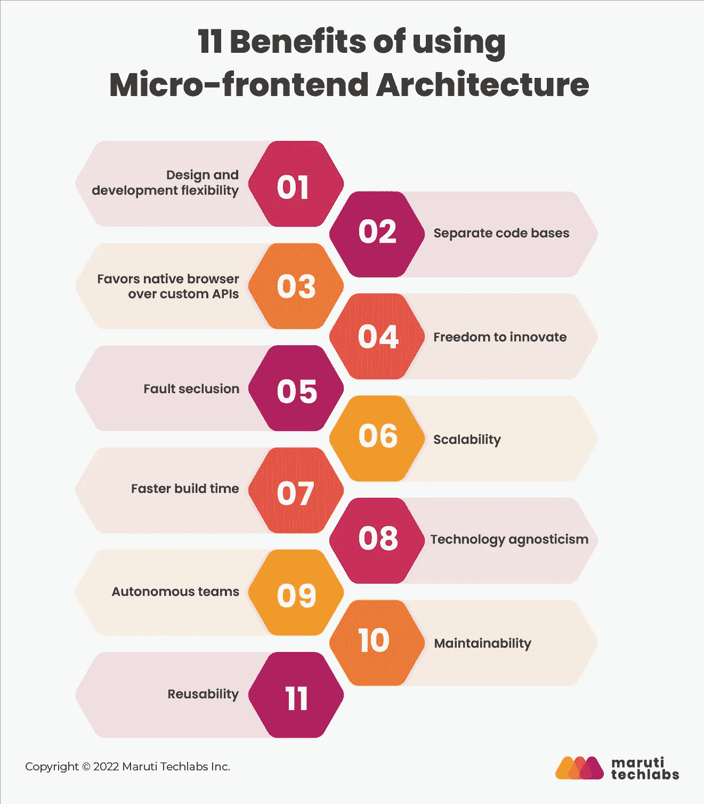

# 什么是微前端？使用微前端架构的优势

> 原文：<https://medium.com/geekculture/what-is-micro-frontend-benefits-of-using-micro-frontend-architecture-f6d667edb03d?source=collection_archive---------9----------------------->

微前端架构是一种前端开发方法，它将一个完整的代码库分成更小的应用程序，每个应用程序处理一个特定的垂直业务。

# 什么时候使用微前端？

中型到大型项目:创建微前端适用于不同团队的大型项目，因为它有助于开发过程的轻松扩展。例如，在构建 Zalando 这样的大型电子商务网站时，微前端会很有帮助。

Web 项目:尽管微前端不仅限于 web，但它们在 web 上是最有效的。需要注意的是，原生 iOS 和 Android 的 app 设计都是统一的。您将无法即时创建或替换现有功能。

生产性项目有助于垂直划分的团队的整体生产力。维护会有额外的花费和挑战。如果你愿意把生产力放在开销之前，使用微前端是可能的。

> 也可以阅读:[基于组件的架构:构建的 8 个最佳实践&管理组件](/geekculture/best-practices-of-building-managing-components-using-cba-143c87b00ac9)

# 使用微前端架构的 11 个好处:

1.  **设计和开发灵活性**
    微前端架构不依赖于任何特定的技术堆栈，可以由不同的团队使用，每个团队对他们想要的服务的方式和内容都有独特的要求。当人们感觉投入更多时，他们会做出更好的决策，缩短开发时间，并添加更多有价值的功能。
2.  **独立的代码库**
    微前端框架通过将大块代码分解成更小、更易管理的片段，简化了代码管理和更新。保持每个团队的代码独立可以保证更有效的开发、测试和部署周期。这对团队和微应用的技术独立性来说是一个巨大的福音。
3.  **偏好原生浏览器而非自定义 API**
    在开发 web 应用时，重要的是要记住用户的浏览器将显著影响应用的体验。由于微前端架构依赖于浏览器事件而不是 API 进行通信，因此它们更易于管理和维护。此外，它有助于实现更快的渲染，而不管较慢的互联网连接和浏览器。
4.  **自由创新**
    微服务和微前端架构的独立性让你可以挑选自己想用的技术。团队可以选择最能满足他们项目和业务领域需求的技术。正因为如此，尖端工具可能会被列入计划。
5.  创建健壮的应用程序是微前端设计的一个至关重要的好处。如果其中一个微型应用程序出现问题，整个系统不会有任何风险。实现了平滑的服务降级，保证了令人满意的应用体验，尽管在某些方面存在 bug。
6.  **可伸缩性**
    你可以使用架构微前端创建一个高度可伸缩的应用。该系统可以通过调整其组件的尺寸来放大或缩小。微前端允许你的开发团队在不影响在线应用整体速度的情况下进行修改。
7.  **更快的构建时间** 使用微前端架构，许多团队可以同时开发微应用。随着生产力的提高，可以更快地创建微应用。如果你可以加快开发周期，你也可以加快推广。因此，在使用微前端架构时，构建和发布您的 web 应用程序需要更少的时间。
8.  **技术不可知论** 有了微前端，设计不绑定任何特定技术。用各种语言和框架编写的组件(JavaScript、React、Vue、Angular 等。)都支持。没有必要强调设置或构建它们。
9.  **自主团队** 建设一个网站的前端是复杂的。由于设计师和工程师之间缺乏合作，公司经常遇到瓶颈。理想的微前端架构可以由一个跨职能团队构建，该团队使用该架构来完成单个组件的端到端活动，改善通信，并专注于细节。
10.  开发人员正转向微前端设计，将一个庞大的程序分成易于管理的小块。每个微 app 使用不同的代码库。特性和功能决定了如何共享每个代码库。模块化设计和独特的代码库提高了可维护性。
11.  **可重用性**
    在多种上下文中实现代码的能力迫在眉睫。在这个场景中，只有一个模块会被开发和发布，但是很多团队都会使用它。

阅读关于[如何实现微前端架构的全文？](https://marutitech.com/guide-to-micro-frontend-architecture/)