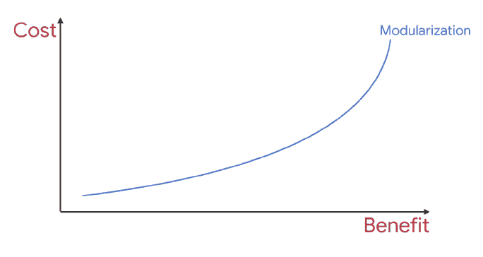

# 什么是模块化 Architecture❓的优势和实施方法

> 原文：<https://medium.com/geekculture/what-is-modular-architecture-benefits-implementation-methods-8c272ebc05eb?source=collection_archive---------5----------------------->

[Build with Legos](http://The Mushroom House)

大家好👋在本文中，我们将研究模块化架构。我们为什么需要它，它的好处，实现方法等等。我们走吧，☕🍫🤗。

## 什么是模块化架构

我们可以将其定义为一种方法，通过将代码文件彼此分离和隔离，将我们的代码文件划分为更小的子部分和层。

## 为什么我们需要模块化 Architecture❓

我们的应用程序每天都在增长。我们不断添加新功能。开发应用程序的开发者也在增加。所以增加新功能的成本在增加。有时一个变化会影响很多领域。这可能会阻碍一些开发人员开始他们自己的任务。此外，增加了测试过程并延迟了发布。由于代码库的增长，应用程序的构建时间也在增加。并且会降低开发人员的工作效率。

因为像这样的情况，我们需要将我们的代码和特性分成尽可能相互独立工作的层。这样，应用程序/项目管理变得更加容易。一个改变影响更少的特性和开发者。构建时间变得更短。此外，您可以将特殊模块的职责设置给特殊的开发人员，以便定义开发人员的主要关注领域。

## 模块化 Architecture❓的优势是什么

其实上面我讲了一点。但是让我们一个标题一个标题地看👊。

## 提高可扩展性

随着应用的增长和新需求的出现，管理应用变得越来越困难。开发者的数量在增加。新特性会影响很多领域，有时一个开发者会阻止另一个开发者。我们可以将项目分成小模块，并将每个模块分配给一些开发人员来解决这个问题。到那时，每个开发者将只负责一些模块，而不是整个项目。

该项目将变得可以单独管理。关注点的分离将会增加。每个模块都有测试和资源。每个开发人员将能够专注于他们自己的模块。这是提高开发人员生产力的关键。还可以通过定义权限来防止开发人员访问每个模块。

## 提高可维护性

当在应用程序中进行任何改变时，通过转到与模块化应用程序中要完成的工作相关的模块，较少的代码被检查，而不是迷失在整体应用程序中的大代码文件和包中。这样，项目的大部分都用相对较少的代码来处理，而不是扫描和试图理解。检测错误和解决 bug 变得更加容易，时间也缩短了。要添加的新功能影响的地方更少。更容易添加。

## 加速持续集成过程

当您在一个单一的应用程序中进行更改时，您可能需要运行所有的测试，而在一个模块化的应用程序中，运行模块和相关地方的测试就足够了。其他模块不受更改的影响。因此，不需要运行其他模块的测试。这稍微加快了我们的 CI 流程。

## 提供较小的安装文件(APK)

通过在模块化应用程序中使用捆绑包和动态特性，我们可以获得更小的安装文件。这是提高用户满意度的一个因素。

## 提高代码的可重用性

当应用程序采用模块化形式时，模块可以很容易地导入并转移到另一个项目中。它使得共享不同项目中使用的通用组件变得更加容易，并且通过构建某些模块，通过代码库创建不同的应用程序变得更加容易。

## 更快的编译

当我们在一个单一的应用程序中改变一个文件时，整个应用程序被编译。但是当我们在一个模块化的应用程序中改变同一个文件时，该文件的模块和相关联的位置被编译。这允许我们在更短的时间内完成构建。

[Building heart with Tetris](https://media.giphy.com/media/f7STAwvEml1eIf0FEq/giphy.gif)

## 实现模块化结构的方法

## 基于层的模块化架构方法

这种方法将应用程序分成不同的层，如数据层、域层、表示层等。，然后将它们转换成单独的模块。它提供了层之间的隔离(ui-业务逻辑…)和一个漂亮的结构。在一个模块中进行的更改不会影响其他模块。这样，模块可以被独立测试。将一个具有良好的包层次结构的应用程序迁移到一个分层的模块化结构会更容易一些。

## 基于特征的模块化体系结构方法

这是一种将应用程序模块中的现有功能逐个模块分离，并使这些功能相互独立的方法。一个特征的改变不会影响另一个特征。这样，只运行与相关模块相关的测试就足够了。

Android 项目中最大的一个优势就是能够使用*动态特性*。这样，可以根据需要下载、安装和使用一些模块。所以应用刚下载的时候，所有的特性都不需要用很大的 apk 下载。确保只有用户将频繁使用的特征被托管在他的设备上。这提高了存储和移动数据的使用率。
这比分层架构更难实现。

[Source](https://starecat.com/content/wp-content/uploads/no-pain-no-gain-in-programming-language-code.jpg)

## 混合模块化架构方法

它是基于层的方法和基于特征的方法的结合。比如说；首先，在顶层实现基于功能的模块化方法，然后在每个功能模块中应用基于层的模块化结构方法。

# 🔚 💚 👏结论

模块化没有单一的解决方案。我们有各种选择。我们必须根据我们的需要来决定我们自己项目的状态。我们必须通过考虑我们的短期成本和模块化对我们项目的长期好处来做出决定。如果我们有一个单一的应用程序，我们可以从基于层的模块化开始。如果我们想在设置好基于层的模块化之后实现*动态交付*，我们可以开始为基于特性的模块化做准备。

在本文中，我们研究了模块化架构的概念、优点和实现方法。感谢您的阅读👏。我希望它是有用的。回头见，注意安全👋🤗。

[So](https://cdn.dribbble.com/users/5279398/screenshots/12044512/media/0a7c512c094905c84abcf6058c0d6c5a.gif)urce

# 资源

Build a modular Android app Architecture (Google I/O’19)

Multi Module Architecture