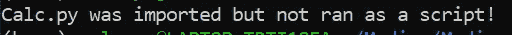
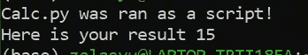

# __name__ == "__main__ "是什么？详细解释。

> 原文：<https://medium.com/geekculture/what-is-name-main-explained-in-detail-a05c1ee885c6?source=collection_archive---------16----------------------->

在我们学习 Python 的过程中，我们会在 GeeksforGeeks 或 StackOverflow 中遇到 if __name__ == "__main__ "一开始，有一段时间，我不知道它是什么意思，对它的解释也太专业和抽象了，不知道为什么这个 if 语句会不断出现！

我将用英语解释这个可疑的 if 语句，或者至少尝试这样做！

要开始回答这个问题，最好先了解要求你使用这个 if 语句的背景和相关玩家。

# 剧本。

> 包含代码的文件。

每个人都用 Python、Java、C 等语言写脚本。这些脚本本质上是文本文件，解释器或编译器可以将它们翻译成可执行的命令。请记住，您在编写脚本时使用了正确的解释器或编译器。如果你不这样做，那么你会得到一个语法错误来阻止你这样做。

# 模块。

> 模块是一个普通的脚本文件，它包含您在另一个脚本文件中需要的函数或类的定义。因此，您可以将所需的脚本作为模块导入。

比方说，你有 2 个或数不清的 python 脚本，为你可怕的专制教授编写程序。

假设您想要取两个或更多文件中一组数字的平均值。你可以在两个文件中编写均值算法，也可以聪明地编写一次，然后导入到那些需要的文件中。

所以现在我们到了另一个概念:“**导入模块**

我假设你已经*导入了 numpy、matplotlib 等模块*。

`import numpy as np`

`from matlplotlib import pyplot as plt`

我们已经这样做了，并将在病房中多次这样做！

“import”所做的是将 numpy 或 matplotlib 脚本复制到脚本中，并放在脚本的顶部。

因此，当您从该模块调用一个函数/方法时，该函数/方法已经在上面定义过了！

> 你感觉不到你脑中的点点相连吗？！

当你开始用像 C 和 C++这样的编译语言和头文件编码时，你会更深刻地理解这个概念。

## 继续前进，因为我们还没有回答我们的主要问题！

因此，要想成为一名更专业的软件开发人员，创建一个 main.py python 文件应该是第一步。

main.py 文件调用所有必要的方法来解决问题。但它将包含也不应包含任何逻辑！所有的逻辑，比如用户界面，或者实际的求解步骤，比如说求平均值，都在其他文件中。

这个概念叫做*函数或者文件分解。这是构建可维护程序的基本技能。*

为什么这个概念是相关的？我很高兴你问了！

# 回答我们的问题

所以我们得到了这个模拟计算器的程序，它由两个文件组成: *main.py* 和 *calc.py* 。

> 我们的 main.py 导入 calc.py。
> 
> 我们的 calc.py 包含函数定义和乘法函数的一次调用。(这个调用和 print 语句在我们可疑的 if 语句之外:__name__ == '__main__ '。

如果我们运行我们的 *main.py* 脚本，那么导入的文件 *calc.py* 将自动运行它的脚本。**因此，当我们运行 main.py 时，就会执行对 multiply 函数的调用**

## 输出(没有 if 语句)

Output — From running main.py w/o our special if-statement

# 比较对比两个版本！

现在这里有一个更好的程序！你看看，我们有

`def main():` 和`if __name__ == '__main__':`

在我们的计算副本中

所以在我们的新程序中，我们包含了 main()函数，即当 calc.py 文件作为脚本运行时应该执行的代码。

但是如果运行 main.py，calc.py 中的乘法函数不会像上次那样执行。

## 输出(运行 main.py):

Output — Ran main.py as a script.

## 输出(运行 calc.py):

Output — Ran calc.py as a script

**if 语句(__name == '__main__ ')确定文件的特殊变量 __name__ 是否等于' main '。**

如果 calc.py 文件作为脚本运行，那么*特殊变量* __name__ 将等于“__main__”，并调用 main 函数。

**如果 calc.py 文件作为一个模块导入到另一个文件中，比如我们的 main.py 文件，那么 __name__ 将等于模块的名称，并且 calc.py 中的 main 函数不会被执行。**

*注意:解释器不关心主函数是否有不同的名字，但是你应该使用约定的名字，这样它的意图对其他人来说就很清楚了。*

# 这就对了。！！

如果你成功了，那么谢谢你的好奇！如果你还是不明白，那么请评论，我会进一步修改这篇文章，以更好地传达这个恼人但无处不在的知识。

懒惰！稳扎稳打慢慢编码！

Image by *World Animal Protection*

# 资源

1.  [https://gist . github . com/d6f 76 bb 4 f 9561 a6 c 50 c 8257746 C4 cf 79 . git](https://gist.github.com/d6f76bb4f9561a6c50c8257746c4cf79.git)
2.  [https://gist . github . com/5e 7929d 5687 c 02136 F4 f 253 C7 a 529 a 44 . git](https://gist.github.com/5e7929d5687c02136f4f253c7a529a44.git)