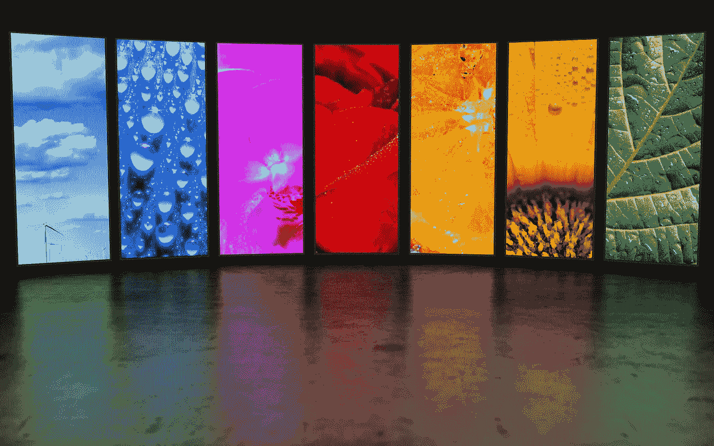

# 什么是 NanoLED，为什么要关注它？

> 原文：<https://medium.com/geekculture/what-is-nanoled-and-why-should-you-care-7cda18f3025a?source=collection_archive---------19----------------------->

## 不仅仅是另一个 xLED

## 另一种显示技术即将出现，这种技术有望在各种设备上大展身手

NanoLED is the name picked by display tech firm Nanosys in order to define quantum dot screens with no need for backlighting at all. (Image: Nanosys)

这看起来像是回到了在某个地方，在某个时刻，几个经过精心挑选的人在喝多了酒之后下的赌注。“嘿，为什么不放出尽可能多的类似的……