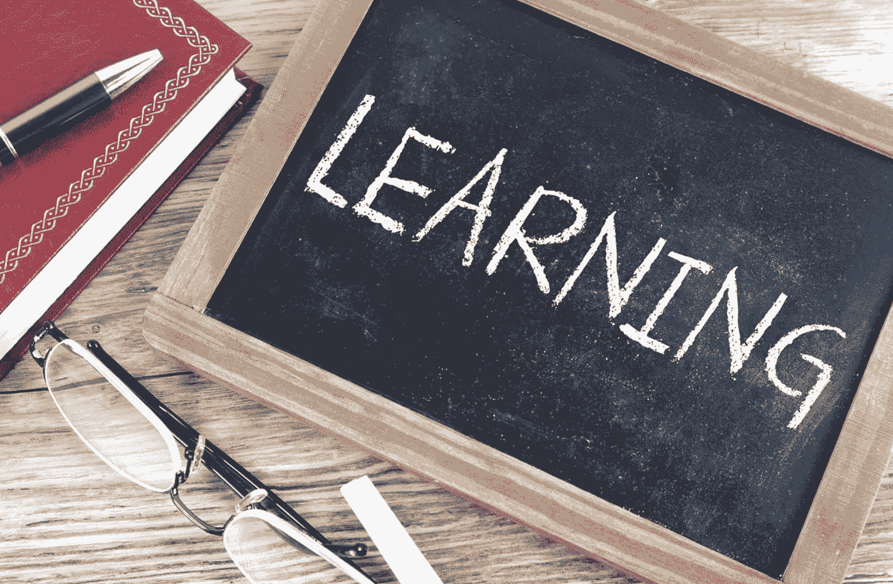

# 什么是消极学习，什么是积极学习？

> 原文：<https://medium.com/geekculture/what-is-negative-learning-and-how-to-avoid-it-452d9e4c8263?source=collection_archive---------12----------------------->

## 特斯拉，核电，尼泊尔 20000 所学校的教训。

Source: [Picpedia.org](https://www.picpedia.org/chalkboard/l/learning.html)

在之前的文章中，我描述了[智能扩大](https://papers.ssrn.com/sol3/papers.cfm?abstract_id=3760631)在不同领域的成功，比如[特斯拉的 Gigafactory 1](/geekculture/tesla-gigafactory-1-as-the-future-of-construction-bcca1f0a0062) 和 [2 万所尼泊尔学校](https://bentflyvbjerg.medium.com/my-first-megaproject-20-000-schools-in-nepal-5091ccf660d2)的建设。我还讲述了日本文殊核电站[哑放大](https://bentflyvbjerg.medium.com/the-wisdom-nuclear-power-plant-dumbest-megaproject-ever-eaff0b9b098b)的失败。