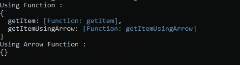

# JavaScript 有什么新特性？

> 原文：<https://medium.com/geekculture/what-is-new-on-javascript-ef69240e2825?source=collection_archive---------46----------------------->


Image from [Pinterest](https://www.pinterest.com/pin/709950328743580333/)

# 一点历史

JavaScript 是一种脚本语言，由 Brenden Eich 在 Netscape 工作时创建，用于他们的旗舰浏览器“Netscape Navigator”。首先，它被命名为“Mocha ”,然后是“LiveScript ”,后来又被改为 JavaScript，因为当时 Netscape 正与 Sun Microsystems 合作，寻找一种解决方案来打破 Internet Explorer 在 Internet 浏览器市场上的垄断地位，并在与 Java 兼容的 web 浏览器中工作。而是 ***Java！= JavaScript。***

JavaScript 基本上被设计为一种核心语言，用于在客户端与 HTML 和 CSS 一起创建网站，而 JS 提供了网站的交互性和动态性。最初它被设计成在客户端运行，现在它已经获得了作为服务器端语言作为后端运行的能力。

# 什么是 ECMAScript？

由于 JavaScript 在客户端使用的灵活性，不同的供应商倾向于逆转并开始使用不同版本的 JavaScript，以保持其增长。1997 年，Netscape 委托欧洲计算机制造商协会(ECMA)为语言规范创建一个标准。

ECMAScript 版本 6 是 2015 年发布的主要版本。引入了重大变化。

现在让我们来讨论 ES6 给 JavaScript 生态系统带来了哪些重大变化。

# 什么是新的？

## 变量

在 ES6 之前，使用***【var】***定义的 JavaScript 块变量甚至可以在块外访问。但是随着 ES6 JS 引入了*关键字，所有使用*关键字定义的变量都不能在块外访问。**

```
**{
   var x = "Hello"
}console.log(x) //Access is possible{
   let y = "World";
}console.log(y) //undefined - Access is impossible**
```

**ES6 的下一次更新是***【const】***。“const”使变量不可修改，只是一个常数。但它的特殊之处在于，只有当它是 ***而不是*** ***数组或对象时，它才是常量。*** 我们来看一个例子**

```
**const x = "Hello World!";x = "Hello Earth";**
```

**在上面的场景中，开发人员不能将变量的内容更改为“Hello Earth ”,因为它是一个常量。**

**但是说到物品。**

```
**const greetingMessage  = class greeting{
      constructor(){
         this.firstLine = "Hello"
         this.secondLine = "World"
       }
}greetingMessage.firstLine = "Hello"
greetingMessage.secondLine = "Earth"**
```

**对于数组来说。**

```
**const categories = ["Horror", "Documentry", "Thriller"]
categories.push("Mystery")**
```

**即使它声明为“const ”,修改也是可能的**

## **功能**

**从 ES6 开始，JS 引入了新的箭头函数，这是一种简单的函数声明方式。传统的函数声明方式是这样的。**

```
**function getTotalPrice(qty, price){
     return price * qty;
}**
```

**但是对于箭头函数，允许开发人员以几种不同的方式定义函数。**

```
**let totalAmount = (qty, price) =>{
        return price * qty;
}let price = totalAmount(5, 100)**
```

**这种方法可以进一步简化**

```
**let totalAmount=(qty, price) => price * qty;
let price = totalAmount(5, 100);**
```

**如果该方法有一个只有一个参数的操作，arrow 函数提供了一种方便的方式来编写如下的方法。**

```
**let totalAmount = qty => 100 * qty;
let totalPrice = totalAmount(5);**
```

**然而，当使用箭头功能时，有一件重要的事情需要考虑。让我们来看看这个例子**

```
**const item = {
    getItem: function(){
        console.log("Using Function : ")
        console.log(this)
    },getItemUsingArrow: ()=>{
        console.log("Using Arrow Function : ")
        console.log(this)
    }
}item.getItem()
item.getItemUsingArrow()**
```

**当我们运行上面的程序时，输出将是这样的。**

****

**我们可以看到，当我们在函数的更简单方式中使用*“this”*关键字时，它指的是调用函数的对象。(项)。但是在使用箭头函数时，它总是不把*“this”*作为函数的调用者。**

## **目标**

**JavaScript 提供了用键、值方法定义对象的能力。首先，让我们看一个类示例，讨论 ES6 中 JS 类的新特性**

**如果我们仔细观察类中的*【date】*字段，它没有赋值，这是因为如果开发人员想要指出一个现有的已定义变量，它不需要赋值。与前面的例子相同，类中的日期属性将引用上面声明的变量
`let date = new Date()`**

**而 JS 用 ES6 带给对象的下一个新事物是 ***动态属性。*** 在上例中，我们可以看到一个用方括号括起来的字段，作为占位符**【信息】****。**这些被识别为动态属性，其中可以动态地注入字段名，以改变字段名**

```
**info = "Review"**
```

**而“[info]”将被替换为“Review”，这将发生在运行时，并且主要在执行时使用键值。**

**当涉及到对象修改时，这些值可以像这样自由地改变。**

```
**Book.author = "Dan Brown"**
```

**但是有时开发人员可能需要不让这些值被改变。JS 附带了一个名为“Object.freeze()”的方法来停止修改对象。这是它的工作原理。**

```
**Object.freeze(Book)**
```

**那么我们对 Book 对象所做的任何修改都不会生效。但是在本书的例子中，我们有一个内部类叫做“Publisher”。仅仅冻结外部类并不能保护内部类。为了保护外部类，冻结方法可以如下应用。**

```
**Object.freeze(Book.Publisher)**
```

## **班级**

**当谈到 JS 类和对象时，它遵循与其他静态类型语言有些相似的方法。**

**为了使数组中的值解包更容易，JS 引入了**“析构函数”将对象分解成不同的变量。**和析构函数可以在多种用法中使用为例。**

**导入库或外部模块，**

```
**const {writeFile} = require("fs")**
```

**从数组中解包值**

```
**[elementOne, elementTwo, ...otherElements] = [39, 43, 63, 10, 66];**
```

**在上面的例子中，它将根据前两个变量(“elementOne”、“elementTwo”)分配前两个值，然后用三个点声明“otherElements”。在析构函数中，它将“43”之后的所有值分配到一个名为“otherElements”的单独数组中，如下所示。**

```
**elementOne = 39
elementTwo = 43
otherElements = [ 63, 10, 66 ]**
```

**这些析构函数也可以应用于类。**

```
**const book = {
    name: "Inferno",
    author: "Dante Alighieri", Publisher : {
            name : "Noonday Press",
            origin: "MI, ITALY",
    }
}const { name, author } = book;**
```

**变量如何初始化，如下所示**

```
**name = "Inferno"
author = "Dante Alighieri"**
```

## **回访和承诺**

**JS 中的函数定期以同步方式执行，其中一个函数必须等待另一个函数完成它的工作。但是 JS 提供了一种异步的工作方式，在这种方式下，其他任务不必等到其他函数完成执行。**

**回调函数用于实现这种异步行为，它能够将一个函数作为参数传递给另一个函数，并在一个函数完成执行后运行。下面是一个回调函数的例子**

```
**function greetings(name, callback) {
     console.log("Hello " + name + "!, Have a nice day!" )
     callback();
}greetings("John", function() {
     console.log("Inside the callback function")
});**
```

**接下来最重要的是承诺。它是一个表示任务完成与否的对象。承诺有三种状态，**

1.  **待定:初始状态，既未完成也未拒绝。**
2.  **已完成:表示操作成功完成。**
3.  **拒绝:表示操作失败。**

**这里有一个创建异步 API 消费过程的例子。**

## **参考**

**现代 JavaScript 从一开始 01-[https://www.youtube.com/watch?v=Jc2iW4yVv38](https://www.youtube.com/watch?v=Jc2iW4yVv38)**

**现代 JavaScript 从头部分 02-【https://www.youtube.com/watch?v=XK_lB5-XzhQ】
T3&**