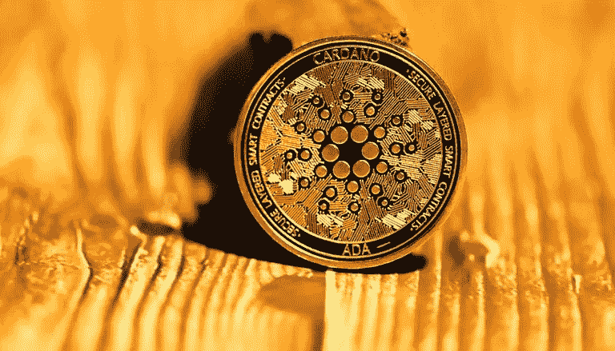

# 下一代密码？以太坊之战——黑仔

> 原文：<https://medium.com/geekculture/what-is-next-gen-crypto-the-battle-to-be-the-ethereum-killer-cf8e4beb125d?source=collection_archive---------6----------------------->

自比特币诞生以来，加密货币已经走过了漫长的道路。区块链最初是数字代币的分布式平台，但现在区块链是支撑这个星球上一些最大的金融交易的支柱。数十亿美元定期在几分钟内跨国转移，却没有最高权力。大规模分布式应用允许…