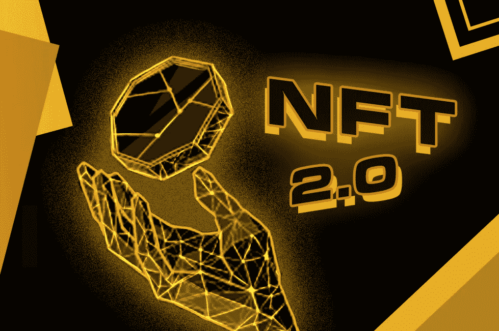
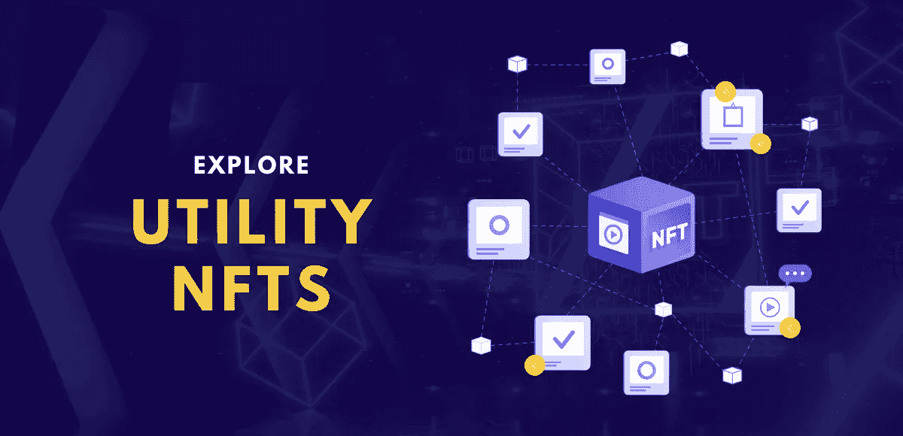
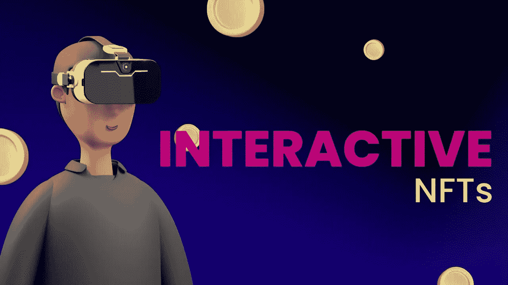

# 什么是 NFT 2.0？它将如何带来可信和透明的改变？

> 原文：<https://medium.com/geekculture/what-is-nft-2-0-how-will-it-bring-about-a-change-with-trustworthiness-and-transparency-cafaeb8ac0fc?source=collection_archive---------14----------------------->

众所周知，不可替换令牌(NFT)是与区块链相关联的数字资产，其元数据附带有不可改变的所有权细节。NFT 时代已经走过了漫长的道路——自 2014 年第一次 NFT 发布以来——随着 2017 年[**crypto 朋克 NFT 发布**](https://en.wikipedia.org/wiki/CryptoPunks) 等等。NFT 市场经历了起起落落，但这些项目从未忽视 NFT 市场的发展。如果您是 NFT 项目的所有者，并且不确定 NFT 版本 2.0，那么这篇文章适合您。

# 你可能知道，但仍然；

唯一性和所有权是不可替换令牌的两个主要属性。区块链技术让这两个特征成为可能。区块链也被称为分布式账本技术，实质上是指由全球计算机网络更新的电子表格。此网络上的计算机都没有权限。只有在网络中的大多数节点同意之后，新的事务才被正式记录。

# 效用驱动的 NFT 空间

NFTs 和实用程序是不可分的。当谈到公用事业时，它包括早期接入、商品、未来空投的承诺等等。不管是哪种情况，效用有时会与可能永远不会实现的虚假承诺混淆。为了让非专利艺术品不辜负它们被认为的价值，收藏者必须获得资产所有权之外的效用。

[**为面向未来的 NFT 企业创建一个公用事业驱动的 NFT 市场**](https://www.appdupe.com/nft-marketplace-development) 。您所要做的就是弄清楚什么是效用 NFT 以及如何实现它。

拥有猿猴的好处不止于此，即使无聊猿猴俱乐部(BAYC)和变异猿猴游艇俱乐部(MAYC)的成员也很高兴能加入这样一家有声望的公司。一个这样的平台， [**Nifty Tailor**](https://niftytailor.com/) ，重组了 NFT 的公共事业，为收藏家创造持久的价值。为了让 BAYC 和 MAYC 的持有者生产出穿着原始持有者选择的各种服装的衍生猿，Nifty Tailor 推出了有史以来第一个链上可验证的衍生集合。

从二级市场衍生品销售中，持有者获得版税。有了 Nifty Tailor，知名品牌无需开发自己的藏品就可以进入 NFT 市场，让收藏家和艺术家可以接触到次级经济。

# 当前的 NFT 空间

在三年多的建立和发展过程中，NFT 生态系统不断扩展，包含许多不同的组件，导致市场规模显著增长。

在其短暂的历史中，NFT 已经涌现到加密货币领域，2021 年的交易量超过了 170 亿美元。预计到 2026 年，这一数额将增加到 1470 亿美元。更令人惊讶的是，这一数量由不到 400，000 的持有人拥有，相当于每个用户 47，000 美元的交易量。

NFT 市场有很好的市场资本化，帮助企业家启动 NFT 市场，迎合目标受众。此外，NFT 空间已经取得了相当大的进展——(例如)2017 年 CryptoPunks 可以免费铸造——但现在，punk NFTs 可以获得巨额美元。

# 交互式 NFTs 的发展

NFT 1.0 仅仅是区块链链接多媒体的像素表示——允许用户拥有、购买/出售数字资产。NFT 2.0 是升级版，允许用户互动和体验他们的数字资产。一些倡议已经在发展中，以扩大互动 NFT 的利基，这是 NFT 市场的一小部分。你可以在游戏中寻找项目，元宇宙等。，需要 NFT 但还没有代币，就像投资常规项目一样。

智能的、交互式的和反应式的 NFT 改变了原始内容的状态或外观，以响应来自用户、环境或其他来源的输入。随着时间的推移，行动号召、学习和适应，甚至使用对话式人工智能都会对它们产生影响。

也被称为体验式 NFT，这些是纪念粉丝体验的数字收藏品。这种 NFT 有扩展的潜力:从可收藏到刺激游戏爱好者。

类似于剪贴簿，体验式 NFT 可以收集起来并与朋友分享，展示你最喜欢的共享体验。想象一下，记下你和高中好友最喜欢的音乐会或你和祖父母去看的最后一场棒球比赛的回忆。像这样的社区可能会用更多的物质或账户徽章来奖励社交互动。

## NFT2.0 和 Web3 共存

区块链爱好者的共识是，为了 Web3 的成功，Web2 必须失败。虽然普遍的想法可能支持这一想法，但事实是，当与 Web2 协同运作时，Web3 会比单独运作时表现得更好。

那么 Web2 和 Web3 将如何无缝交互呢？可能令人惊讶的是，NFT 是解决方案。虽然现在非功能性测试的应用很少，但其潜力不可低估。除了数字化的动物，这些标志代表着更重要的东西:可以展示的所有权。专注于所有权使我们能够预测更广泛的未来用例，包括简单的事情，如汽车的所有权和可验证的身份。

NFT 2.0 将引领密码行业，鼓励新时代的企业家 [**创造支持这些美德的 NFT 市场**](https://www.appdupe.com/nft-marketplace-development) 。

## 结论

NFTs 的全新迭代——NFT 2.0 空间将简化数字收藏品生态系统的每个方面。主要品牌在继续进入 Web3 市场时必须小心谨慎，以正确把握其 NFT 项目的影响，以及如何更广泛地考虑代币。