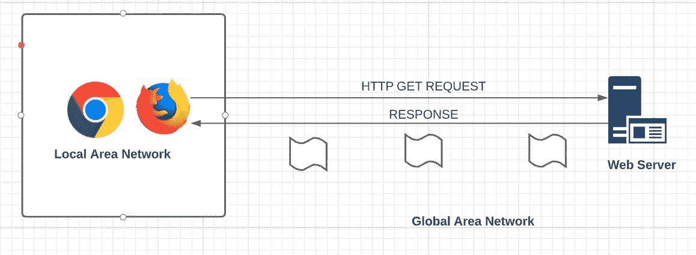
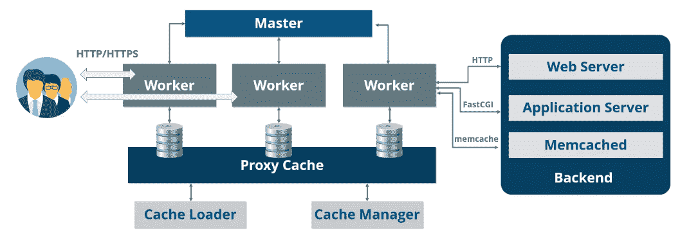

# Nginx 是什么？

> 原文：<https://medium.com/geekculture/what-is-nginx-2edfdad3722b?source=collection_archive---------1----------------------->

在本文中，我们将了解什么是 Nginx 以及 Nginx 的重要事实。在这里，我打算向您提供开始使用 Nginx 的所有基础知识。

我们在这里讨论，

*   什么是 web 服务器？
*   Nginx 是什么？
*   Nginx 架构以及为什么要学习、使用 Nginx？
*   Nginx 配置设置
*   如何安装 Nginx，如何部署成 web 服务器？

## **什么是网络服务器？**

当你在浏览器的搜索栏上点击 www.google.com 的 T4，几秒钟后你就能看到谷歌主页。但是你知道流程是怎么处理出来给你看页面的吗？

Web Server Request from User Browser

首先，这个请求是由你局域网中的浏览器发起的，然后这个特定的请求传到全球局域网，到达一台基本上为你的主页服务的计算机。那台特定的计算机会向您发回包含该页面所有内容的响应。响应从全球广域网传到你的局域网，最后，它服务于你的浏览器。为你提供网页的计算机只不过是一台网络服务器。为您请求的网页提供服务的计算机是 web 服务器。

Web 服务器是提供所需网页的计算机。每个 web 服务器都有一个 IP 地址和一个域名。

当您尝试在浏览器上请求此 URL 时，[**https://medium . com/geek culture/zuul-API-gateway-2 BCD F4 DD 33 e 6**](/geekculture/zuul-api-gateway-2bcdf4dd33e6)

你一输入这个 URL，请求就产生了，并传到你的局域网，这个请求传到一个域名为**medium.com**的服务器。现在，web 服务器所做的就是获取页面名称为**geek culture/zuul-API-gateway-2 BCD F4 DD 33 e 6**的页面，这就是我们想要获取的索引页面。获取之后，它会将响应返回给全局网络和您的局域网。

我们来谈谈这个 web 服务器。当你使用网络服务器时，你需要能使你的计算机成为网络服务器的软件应用程序。任何计算机都可以成为网络服务器。要将您的计算机转换为 web 服务器，您需要安装服务器软件并将您的计算机连接到互联网，互联网基本上是全球局域网。世界上有各种各样的网络服务器软件。

Web Server Softwares

## Nginx 是什么？

Nginx 是**开源软件**和用于**反向代理缓存和负载均衡**的 web 服务器。Nginx 还提供 HTTP 服务器功能。它主要是为了获得最佳性能和稳定性而设计的。Nginx 提供了像 **IMAP、POP3 和 SMTP** 这样的功能作为电子邮件的代理服务器。最后，它使用了**非线程**和**事件驱动架构**。当你使用 Nginx 作为你的网络服务器时，你可以确保你的页面加载时间绝对减少和安全。现在你对 Nginx 和什么是 web 服务器有了一个基本的概念。

## **Nginx 架构以及为什么要学习、使用 Nginx？**

Nginx 通过支持**事件驱动、异步和非阻塞模型**来使用**主从架构**。

Nginx Architecture

我们知道传统的处理器或线程意味着使用每个处理器线程处理并发连接，并阻塞输入或输出操作。这里，基本上，如果我们有一个进程线程模型，所发生的是线程创建的每个单独的进程都需要。现在，根据应用程序的不同，它在 CPU 和内存消耗方面的效率可能会非常低。想象一下，你正在实现一个拥有大量网页和每个网页上如此多数据的网站。就 CPU 和内存消耗而言，它的效率可能非常低。如果我们使用单独的处理器，就需要一个新的运行时环境，分配堆和堆栈内存，还需要新的执行上下文。这将导致性能下降、线程崩溃或上下文切换。

为了避免这种复杂性，Nginx 采用主从架构。Nginx 主要关注在众多操作系统中正在进行的高级基于事件机制的开发。Nginx 大量使用事件通知，这导致特定的处理器执行特定的任务。例如，如果我们有 10 项任务。您可能有 10 个不同的处理器。正因为如此，处理器运行高效，而被称为**worker 的单线程处理器数量有限。**在图中，我们有 3 个工人，对于这 3 个工人中的每一个，Nginx 可以在一秒钟内处理 1000 个并发连接和请求。Nginx 不会为每个连接生成一个进程或线程。工作处理器的基本功能是接受来自共享监听套接字的新请求，执行高效的运行循环，并设置每个工作处理器处理数千个连接。所以每个工人可以处理 1000 个请求。在 Nginx 架构中，有一个主处理器和多个工作处理器。还有一些特殊用途的处理器，比如你在图中看到的代理现金。它有一个缓存、一个加载器和一个缓存管理器。

**Nginx Master 进程:** Master 负责读取和验证配置(创建、绑定和穿越套接字)。它还负责启动、终止和维护配置的工作处理器数量。如果您有 10 个工作处理器，并不要求这 10 个工作处理器都运行 1000 个不同的处理器。少数工人可能有较少数量的工人，而其他人可能有更多的处理器在其上工作。主节点还负责在没有任何服务中断的情况下进行重新配置，控制不间断的二进制升级，并重新打开日志文件和编译嵌入式 purls 脚本。

Nginx 的一切都是在配置文件中定义的。

**缓存加载器:** Cashing Loader 负责检查磁盘缓存项，并用缓存元数据填充 Nginx 内存数据库。Cashing Loader 为 Nginx 实例做好准备，以便处理已经存储在磁盘上的文件，这些文件位于专门分配的目录结构中。它遍历目录，用元数据检查缓存内容，更新共享内存中的相关条目，然后在一切就绪可以使用时存在。

**缓存管理器:**负责缓存到期和失效。在引擎正常运行期间，它保留在内存中，并在出现故障时由主进程重新启动。

**用例:**如果你请求一次页面。过一段时间后，您将再次请求相同的页面。发生的情况是，您想要检索的这个页面不符合请求和接受响应的完整过程。它存储在缓存中，缓存加载器和缓存管理器会查看您正在搜索的页面，并立即发送回缓存的页面。

## **为什么要用 Nginx？**

*   易于安装和维护——将 Nginx 安装到您的本地机器上只需几个步骤，并确保您有一个为您工作的 web 服务器，而且它非常易于维护，因为您知道您只需键入一个命令就可以重启或停止服务器。你还可以做许多功能。
*   减少用户的等待时间——当你使用 Nginx 时，你不需要等待很长时间。
*   提高性能和负载平衡——Nginx 提高了性能。如果您有 2 个或更多的 web 服务器在运行同一个应用程序，Nginx 可以通过将流量路由到这些 web 服务器来提高性能，您知道这样可以提高整体速度。它还提供负载平衡，所以基本上，负载平衡器是一种设备或服务，它将流量负载分布在两个或更多的 web 服务器上。它提供了容错能力并提高了性能。
*   可伸缩性—众所周知，像 Apache 和 Internet 信息服务(IIS)这样的传统 web 服务器可以毫无问题地处理传入的请求，直到并发请求的数量达到一定的限制。如果请求增加，性能最终会下降，这是因为这些服务器的设计方式以及服务 web 请求的模型。在这种情况下，如果您使用 Nginx，它可以轻松处理数量不断增加的并发请求。
*   动态升级— Nginx 是为数不多的无需停机和中断业务即可修补或升级的系统之一。

## Nginx 配置设置

Nginx 的核心设置主要在 Nginx 配置文件中配置。配置文件基本上被组织成上下文。您主要可以设置两种类型的上下文。

*   **事件背景**
*   **HTTP 上下文**

配置文件的这种结构使您能够提到配置的一些高级分层，因为每个上下文都可以有嵌套的上下文，这些上下文继承父上下文的所有内容，但也可以根据需要覆盖设置。

在这些上下文中，Nginx 配置文件最重要的部分是，

*   **工作进程** —这是一个定义 Nginx 将使用的工作处理器数量的设置。由于 Nginx 是单线程的，因此工作线程的数量等于 CPU 内核的数量。
*   **工作者连接** —每个工作者进程的最大同时连接数。并告诉多少人可以同时接受 Nginx 服务。
*   **访问登录和错误日志**—Nginx 将使用这些文件来记录任何错误和访问尝试。这些日志通常用于调试和故障排除。
*   **Gzip**—Nginx 响应的 Gzip 压缩设置。通过默认情况下被注释掉的子设置的方式来启用它将会导致相当大的性能提升。

所以在本教程中，我们讨论了什么是 web 服务器？Nginx 是什么？Nginx 架构以及为什么要学习、使用 Nginx？Nginx 配置设置。我们来讨论一下如何安装 Nginx，如何部署成 web 服务器？在另一篇文章中。希望大家对 Nginx 有个基本的了解。

谢谢大家！