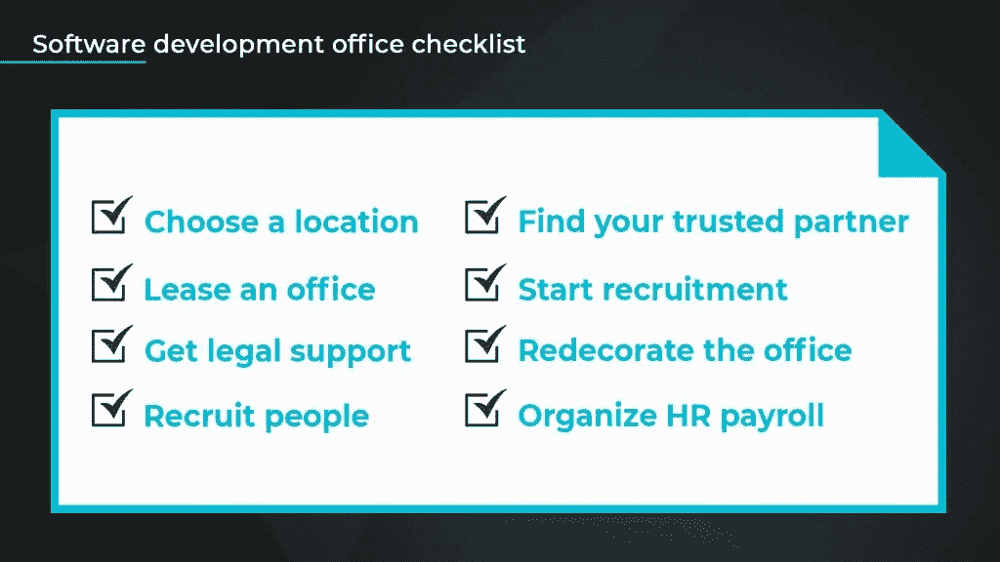

# 什么是离岸开发中心(ODC):所有的好处和可能的风险

> 原文：<https://medium.com/geekculture/what-is-offshore-development-center-odc-all-benefits-and-possible-risks-3a4c75157986?source=collection_archive---------14----------------------->

在全球范围内，我们正在经历巨大的人才短缺，尤其是在 IT 部门。专家预测，到 2030 年，如果找不到解决方案，全球组织可能会损失 8.4 万亿美元的利润。

为了遏制人才短缺，大多数公司都在利用外包和外包。根据 [Statista 的数据，](https://www.statista.com/statistics/189788/global-outsourcing-market-size/)2019 年全球外包产业达到 925 亿美元，其中离岸开发中心(ODC)服务占了其中很大一部分。

此外，研究表明，超过 80%的世界 500 强组织选择使用 ODC 框架进行软件开发。目前，[乌克兰为 100 多家财富 500 强公司提供软件开发服务](https://www.atlanticcouncil.org/blogs/ukrainealert/ukraines-booming-it-sector-can-drive-positive-change/)。

在本文中，我们全面地了解了什么是离岸开发中心，如何使用它，等等。我们将深入探讨:

*   离岸软件开发中心意味着什么
*   离岸开发中心的优势
*   选择离岸开发中心时要注意什么
*   设置 ODC 的基础知识
*   以及[如何为你的项目雇佣离岸开发人员](https://newxel.com/blog/where-and-how-to-hire-offshore-developers-in-2021/)

# 什么是离岸开发中心(ODC)？

离岸开发中心是指不在您所在国家的软件开发服务场所。

渴望以较低成本从国际人才中获益的公司可以设立一个远程办公室。他们可以建立一个 ODC，基本上是一个拥有合适的基础设施和人员的办公室，从头到尾执行开发功能。

例如，当你在乌克兰建立一个离岸开发中心时，与你在美国或英国运营一个类似的中心相比，你将花费更少的运营成本。看看这些[乌克兰外包率](https://newxel.com/blog/outsourcing_rates/)看看当你外包给东欧国家时你能节省多少。

# 谁需要离岸开发中心？

根据他们的需求，不同类型的技术公司可以从 ODC 中受益。这些公司包括:

*   软件公司
*   IT 服务公司
*   电子商务公司
*   电信学
*   云服务
*   金融科技公司
*   数据提供者
*   物联网及其他

开发革命性技术的企业需要特殊的人才来完成这项工作。初创公司和老牌公司都同意，一个专门的离岸开发中心是一个很好的选择。

# **顶级海上开发中心的好处**

与 ODC 一起工作对组织来说有很多好处。以下是离岸开发中心的一些突出优势:

*   **获得技能娴熟的多元化人才库**

建立一个离岸开发中心会让你的公司接触到一群知识丰富、才华横溢的员工。与在美国相比，在乌克兰和波兰雇佣一名开发人员也需要更少的时间。

*   **提高效率和可靠性**

离岸开发中心在开发项目上花费的时间更少，因此效率更高。这是因为他们有大量的专家和良好的基础设施。他们的价格友好，服务高度可靠。

*   **使用已建立的基础设施**

离岸开发中心已建立的基础设施和人员是寻求外包开发项目但缺乏全球项目交付专业知识的公司的完美解决方案。否则，一个公司开发一个 It 应用程序需要几个月甚至几年的时间和大量的资金。

*   **降低开发成本**

离岸开发中心是降低成本和确保交付质量一致的好方法。你的项目将保持在正轨和预算之内。你知道吗，通过外包到乌克兰这样的国家，你可以节省高达 40%的开发成本。

*   **让您专注于主要业务**

如果你的公司不是完全专注于信息技术，管理你自己的 IT 部门是一项艰巨的任务。将这些棘手的 IT 任务外包给 ODC 将为您省去麻烦。然后你可以将这种努力投入到其他重要的有利可图的任务中。

# 如何建立离岸开发中心

这里有一个非常有用的离岸开发中心清单，可以帮助你开始。

要建立离岸开发中心，您将:

*   **选择一个位置**

谈到如何建立一个离岸软件开发中心，最重要的一步是为你的离岸开发中心选址。基于经济考虑，东欧和亚洲是 IT 公司的两个热门地点。但是在为你的 ODC 选择地点时，考虑到 IT 人员扩充服务，乌克兰已经迅速成为最受欢迎的目的地。

**为什么是乌克兰？**

*   截至 2020 年，乌克兰有超过 212，000 名受过高等教育的 IT 专家，估计其中 84%拥有学士学位。很多人英语也很流利。
*   乌克兰的 IT 产业经历了令人称道的增长，从 2013 年占 GDP 的 0.06%增长到 3.3%，价值 50 亿美元。
*   乌克兰与美国有着友好的关系，80%的工作来自美国。
*   寻找值得信赖的合作伙伴

要成功建立离岸开发中心，你需要一个可以信任的合作伙伴。找一个了解你的业务、了解当地法律和条件的人，他可以帮你联系一个有才华的团队，为你提供卓越的服务。

为您的 ODC 选择合作伙伴时，请参考此信息图:

*   **开始招募**

你的成功很大程度上取决于和你一起工作的人。因此，招聘是这一过程的重要组成部分。雇佣高素质的专家，并与你的合作伙伴保持惊人而持久的关系。建立一个有良好历史和推荐的程序员部门。

*   **找到一间办公室**

获得一个拥有软件工程师团队的离岸开发办公室，以及顺利开展业务所需的所有资源。创建一个鼓励生产力、激励开发人员并吸引来访客户的工作空间。

*   **获得法律支持**

为你的离岸开发中心获得法律支持是必要的。合适的当地律师会帮助达成最好的交易。

*   **进行采购**

建立离岸软件开发中心的另一个重要步骤是使其设备齐全。

*   **组织人力资源工资发放**

对于你的新 ODC，你需要一个有组织的会计和人力资源工资系统。找一个会计来处理发票，找一个专家来确保你遵守规定。还要有人帮你监控员工的表现。

让开发团队为您的离岸项目工作并不容易。但是我们可以帮忙！在 Newxel，我们的目标是通过向公司提供所需的所有资源，帮助公司建立离岸开发中心。[点击此处获取更多信息](https://newxel.com/#contact)，我们将帮助您开始！

# 离岸开发中心模式及其风险

以下是设置 ODC 的相关风险:

*   **组织结构挑战:**不同的公司有不同的结构。在你的国家起作用的东西在你建立 ODC 的地方可能不起作用，这可能会影响一切。
*   **沟通挑战:**与海外团队合作时，要特别注意沟通方面。建立渠道，在适当的时间轻松接触到他们。在你的交流计划中考虑时区的差异。
*   **数据隐私和安全风险:**认识到这种风险的存在。确保您的离岸供应商已经建立了强有力的安全措施和政策，并有人监督其有效性。签署保密协议和离岸开发中心的安全协议，然后密封的合作伙伴关系，以保护您的公司。
*   **法律风险:**考虑到离岸软件开发过程的复杂性，该过程涉及许多法律风险。在参与之前，批判性地评估特定国家的法律环境，找出这是否适合你的业务。

# 最后的想法

对许多公司来说，建立离岸开发中心是一个绝妙的选择。企业可以将工作外包到其他国家，而不是使用内部员工设置或基于家庭的开发人员。事实上，这可以成为内部团队的延伸。

对于美国、欧洲和英国的许多企业来说，在乌克兰建立一个离岸软件开发中心是绝对的胜利。这个国家有一个真正友好的立法机构，友好的成本，以及适合外国创业的环境。找到像 Newxel 这样合适的合作伙伴，你将会成功。