# Oracle 中的优化器提示是什么？

> 原文：<https://medium.com/geekculture/what-is-optimizer-hint-in-oracle-fd3c1b612e97?source=collection_archive---------14----------------------->

在这里，我们将了解 oracle 中的优化器提示和用法

oracle optimizer hint

**什么是优化器提示？**

*   有时候优化器不会做我们想做的事情，因为它只是程序员为了帮助我们而编写的一段代码。
*   所以它不可能总是使用最好的方法。
*   有时，我们希望优化你，让你做一些不同于最佳选择的事情。因为我们可能知道，我们的数据比优化器更好。
*   我们可能会建议优化器做一些它不想做的事情。
*   这可能有几个原因。
*   例如，如果统计信息是旧的，优化器很可能会执行一个错误的执行计划，或者因为选择性是由优化器估计的，如果我们比优化器更了解特定查询的选择性，我们可以命令它使用不同的方法。
*   因此，为了推荐优化器做某事，我们使用优化器。
*   优化你的手，基本上迫使优化器选择一个特定的动作，例如，通过使用适当的提示，你可以告诉优化器使用一个特定的访问路径，或者你可以命令
*   它使用不同的方法，或者你可以说使用全表扫描等。我们手里有很多优化，会引导优化者做一些特定的事情。
*   然而，有时优化器可能不听您的，即使您在查询中使用了一些提示，
*   如果优化器认为你想要的不是合理的东西。
*   它可能不会这样做，但这种情况发生的次数很少，所以它很可能会做你想让它做的事情。

> "**提示用于改变执行计划，并强制优化器使用最佳执行计划。此外，它还会影响优化器的决策。它根据特定的标准选择某个执行计划**

*   但基本上，提示可以对单个表、多标签查询块或特定语句进行操作。

**甲骨文中的提示有哪些类型？**

提示类型:

1.单表=在一个表或视图上指定单表提示。INDEX 和 USE_NL 是单表提示的示例。

2.多表=多表提示类似于单表提示，只是该提示可以指定一个或多个表或视图。
LEADING 是多表提示的一个例子。请注意，USE_NL(table1 table2)不被视为多表提示，因为它实际上是 USE_NL(table1)和 USE_NL(table2)的快捷方式。

3.查询块=查询块提示对单个查询块进行操作。STAR_TRANSFORMATION 和 UNNEST 是查询块提示的例子。

4.Statement =语句提示适用于整个 SQL 语句。ALL_ROWS 是语句提示的一个示例。

**如何使用提示？**

*   正如您所记得的，在编写所有查询时，我们可以很容易地向文章添加一些注释，例如添加注释，我们可以很容易地使用 select close 中的提示。
*   唯一要做的就是在第一个星号后面加一个加号。
*   因此，如果编译器看到斜杠和+符号在一起，它将理解下一个文本是一个提示

> **select /*+提示名(p1 p2 p3…) */列名 from 表名；**

*   这里，这个区域内的所有东西都被认为是提示
*   它可能有一个或多个参数，如果有多个参数，我们通过在参数之间留一个空格来写它们。
*   提示可以用在选择、更新或删除关键字之后
*   我们可以使用表名或它的别名作为提示参数。但是如果有别名，我们就不能使用表名
*   它只能是一个提示区域
*   我们应该小心我们选择的提示，特别是当你使用多个提示的时候。我们可能会将优化器引向一个糟糕的执行计划。
*   在这个例子中，查询没有任何提示，让我们获取它的执行计划，并查看优化器决定的访问路径。

**没有提示的询问。它执行范围扫描:**

> **SELECT employee_id，last_name
> FROM employees e
> 其中 last _ name LIKE ' A %；**

Range scan

*   它选择的范围再次超过应用程序名称索引作为最佳选择，其成本也是如此。

**使用提示命令优化器使用全表扫描:**

*   在我们的下一个查询中，我们使用全表 can 提示，因此我们希望优化器选择全表扫描作为访问路径。
*   为了做到这一点，我们把作为提示名，把表的别名作为括号内的参数。

> **SELECT/*+FULL(e)*/employee _ id，last _ name
> FROM employees e
> 其中 last _ name LIKE ' A %**

*   执行计划结果显示成本太高，所以我们让优化器处于不利的位置。所以我们应该非常小心
*   我们使用表的别名作为提示的基础。

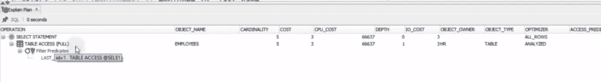

Full Table Scan

如果我在下一个查询中直接使用表名会怎么样？

**使用带有表名的提示作为参数:**

*   我们直接使用表名作为搜索的前缀。

> **SELECT/*+FULL(employees)*/employee _ id，last _ name
> FROM employees
> 其中 last _ name LIKE ' A %**

*   正如您所看到的，它没有考虑我们的提示，因为当表有别名时，我们不能使用表名，所以如果表有别名，我们需要使用别名。
*   但是如果表没有别名，我们可以使用表名。

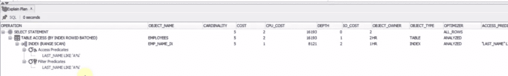

Index access scan

*   在我们的下一个例子中，我使用了一个不合理的提示，原因是即使我在 where 子句中使用了姓氏列，我也在试图强制优化器使用部门想法索引。

**使用多个提示，优化器选择全表扫描作为最佳选择:**

> SELECT/*+INDEX(EMP _ NAME _ IX)FULL(e)*/employee _ id，last _ NAME
> FROM employees e
> 其中 last _ name LIKE ' A %

*   但是这不太符合逻辑，因为我们试图找到姓氏以“A%”开头的雇员，试图在部门和索引中查看这些雇员。

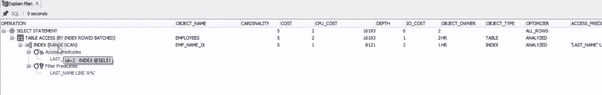

*   但是这个指标作为一个部门是视情况而定，而不是名称。
*   所以优化器会认为这不是一个合理的请求。它不会考虑这个提示。
*   如果我们看到执行计划的结果，它不会考虑我们的请求，而是对名称索引执行索引大脑扫描
*   因为我们在搜索姓氏。

当我们改变提示的顺序时。但是这并没有改变优化器的决定:

> **SELECT/*+FULL(e)INDEX(EMP _ NAME _ IX)*/employee _ id，last_name
> FROM employees e
> 其中 last _ name LIKE ' A %**

*   在上面的例子中，我们使用了多个提示
*   正如我们已经知道的，如果我们想写多个提示，我们应该把它们写到一个命令区。
*   在本例中，我们告诉优化器对 name 列使用全扫描和索引扫描。
*   所以这不是一个合理的请求，但是这会使优化器困惑，它很可能会选择最有保证的方法。
*   这是一种成功的表访问方法
*   现在让我们得到执行计划，看看会发生什么。

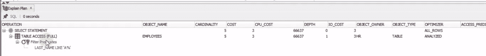

Full table access

*   如您所见，这不是全表扫描，实际上是一个更好的选择。这有时可能会改变。
*   这是没有保证的。
*   我们认为这是因为全表扫描

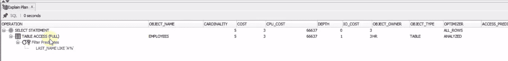

*   如您所见，它再次选择了全表扫描作为最佳选择，但是当然，使用索引会更好。
*   在我们接下来的例子中，我将在接下来的时间里向你展示如何正确使用多只手。
*   我没有使用任何暗示。

**不使用提示:**

> SELECT
> e.department_id，d.department_name，
> MAX(薪金)，AVG(薪金)
> FROM employees e，departments d
> 其中 e . department _ id = e . department _ id
> GROUP BY e . department _ id，d . department _ name；

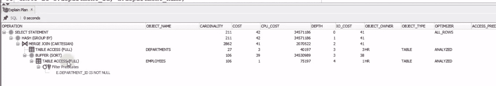

*   如您所见，它对两个表执行全表扫描，并选择 department 的表作为驱动表。
*   在下一个查询中，我添加了一个前导提示。作为一个参数，我首先添加雇员表的列表，然后添加部门表的列表。

**使用多个提示更改执行计划:**

> **SELECT/*+LEADING(e d)INDEX(d DEPT _ ID _ PK)INDEX(e EMP _ DEPARTMENT _ IX)*/
> e . DEPARTMENT _ ID，d.department_name，
> MAX(薪金)，AVG(薪金)
> FROM employees e，departments d
> 其中 e . DEPARTMENT _ ID = e . DEPARTMENT _ ID
> GROUP BY e . DEPARTMENT _ ID，d . DEPARTMENT _ name；**

*   因为他们有别名，我写了 E 和 D，中间有一个空格。
*   这是我们使用引导暗示的方式。
*   此外，我添加了更多的索引提示，我命令优化器使用类似于两个表中的索引的部门。
*   如您所见，我首先输入了一个表 E，然后输入了一个空格和该表的索引名。
*   所以我希望优化器选择 employees 表作为驱动表，并使用这两个表的索引。
*   让我们来看看这个查询的执行计划

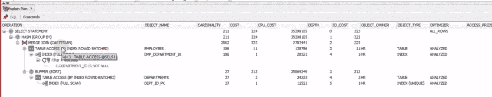

Index scan access

*   正如您现在看到的，employees 表在顶部，这意味着它是一个驱动表，我们的索引在两个表中都使用。
*   因此，我们使用三只手，优化程序使用了所有的手。
*   正如这里可以理解的，提示必须针对不同的动作，这意味着不应该覆盖其他动作。
*   在下一个示例中，我们有两条访问路径。

**有两条访问路径时使用提示:**

> **SELECT/*+INDEX(EMP _ DEPARTMENT _ IX)*/employee _ id，last_name
> FROM employees e
> 其中 last _ name LIKE‘A %’
> 和 DEPARTMENT _ id>120；**

*   这里，我在 where 子句中同时使用了姓氏和部门
*   在第一个例子中，我在提示中使用了部门 id 索引。
*   实际上，即使你没有写提示，它也会选择这个索引。但是我会给你看一些不同的东西。
*   作为执行计划的结果，它在 emp_department_ix 上执行索引范围扫描

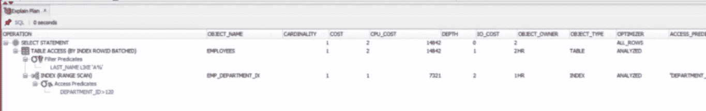

Index Range Scan

**当我们改变姓氏搜索的选择性时:**

> **SELECT/*+INDEX(EMP _ DEPARTMENT _ IX)*/employee _ id，last _ name
> FROM employees e
> 其中 last _ name LIKE‘Al %’
> 和 DEPARTMENT _ id>120；**

*   在上面的例子中，我把 where 子句的姓改成了“Al”
*   如果我们看到执行计划结果，优化器访问 emp_name_ix 上的索引范围扫描是最佳选择，即使我们命令优化器使用 emp_department_ix，它也不听我们的，而是使用名称索引。

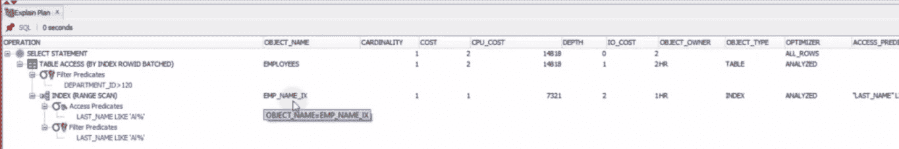

Index Range Scan

> **原因是优化器认为姓氏列对新的现实更具选择性。这意味着它认为将只搜索字母 a 搜索部门，这将更有选择性，所以我会使用它，因为我们已经在姓氏搜索“Al”中做了更改，所以优化器认为这将更有选择性，所以我可以使用名称的索引对我来说将更容易。**

*   即使我们推荐使用部门列索引，它也发现这不是一个合理的要求，以至于我不想听它们
*   因此，优化器有时会监听我们，但有时到现在还没有，所以我不能通过使用提示向您展示显著的增加。
*   原因是这些表格准备充分，统计数据是最新的，而且表格非常小。在一个大的数据库中，你会更有效地使用它。
*   在下一个例子中，我们将使用没有提示的连接、分组

> **SELECT customers . cust _ first _ name，customers.cust_last_name，
> MAX(数量 _ 售出)，AVG(数量 _ 售出)
> FROM sales，customers
> WHERE sales . cust _ id = customers . cust _ id
> GROUP BY customers . cust _ first _ name，customers . cust _ last _ name；**

*   让我们看看这个查询的执行计划

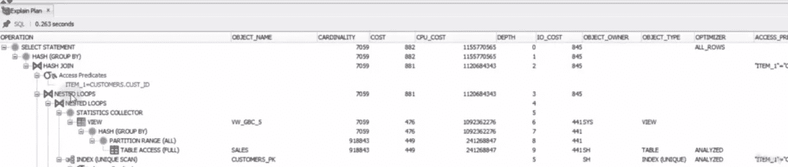

Multiple joins,group by without hint

*   结果显示成本太高，即 882 英镑
*   下一个例子我已经使用了具有相同查询的并行结果，查询性能得到了提高

**执行并行执行时的性能提升提示:**

> **SELECT/*+PARALLEL(4)*/customers . cust _ first _ name，customers.cust_last_name，
> MAX(QUANTITY_SOLD)，AVG(QUANTITY _ SOLD)
> FROM sales，customers
> 其中 sales . cust _ id = customers . cust _ id
> GROUP BY customers . cust _ first _ name，customers . cust _ last _ name；**

*   在这个例子中，我使用了 parallel 提示，并且基本上将读取任务分解为多个线程。如果我们使用并行的四个 all 任务将读取我们的表和连接，那么它将显著提高性能
*   让我们看看上面这个查询的执行计划

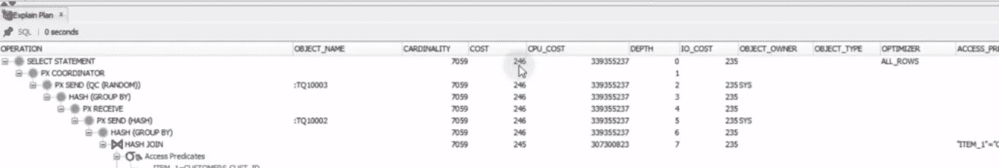

Parallel hint

*   结果显示查询值的开销是 246，几乎比我们之前的开销值快了四倍。
*   如果我们使用并行提示值 100，会不会阻碍时间更快？
*   不幸的是，没有，因为他们分别阅读相关的规则，然后加入它们，这也是有成本的，尤其是 CPU 的成本
*   很可能它会比前一个查询运行得慢，所以我们要根据我们的表、cpu、查询来为我们的查询找到最佳的并行执行计数..等等

**结论:**

*   在这篇博客中，我们讨论了什么是暗示？如何在我们的查询中使用提示。
*   此外，我们使用合理的提示，优化器将根据这些提示更新其执行计划，因此我们可以大大提高性能。
*   我们应该非常小心，这个提示也可能会降低性能
*   有时候如果你的预测不是那么合理，优化器就不会听从你的指挥，去做它认为最好的事情。
*   我们需要对此保持谨慎，因为随着时间的推移，表的结构或容量或者列的选择性可能会发生变化。
*   有时我们可能会让乐观者做出更糟糕的决定，即使它在过去表现良好。因此，使用提示可能会显著提高性能，但我们在使用提示时应该小心