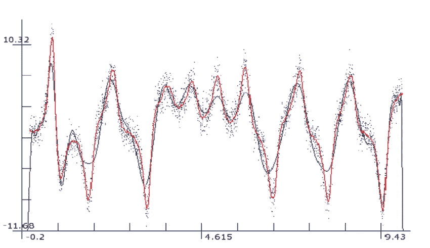

# 机器学习中的过拟合和欠拟合是什么？

> 原文：<https://medium.com/geekculture/what-is-overfitting-and-underfitting-in-machine-learning-8907eea8a6c4?source=collection_archive---------44----------------------->

Photo by [Sid Balachandran](https://unsplash.com/@itookthose?utm_source=medium&utm_medium=referral) on [Unsplash](https://unsplash.com?utm_source=medium&utm_medium=referral)

什么是过拟合和欠拟合？它经常出现在你训练和测试机器学习模型或深度学习模型的时候。如果你要建立一个通用的模型，那么就不应该给出过拟合和欠拟合的情况。

什么是良好概括的模型？这意味着你的模型训练得很好，对你看不见的数据(测试数据)也表现得很好。因此，与过拟合和欠拟合模型相比，良好概括的模型给出较少的训练误差和较少的测试误差。

当谈到过拟合和欠拟合时，需要理解一些基本术语，以便对整个事情有一个清楚的了解

1.  **信号** =这是指帮助识别模型的一般模式的数据
2.  **噪声** =这是指数据集中的特定对象有一些特殊情况的数据。

举个例子，如果我们想预测一个动物是不是鸟，我们知道有羽毛是鸟的一个共同特征，因为这是一个信号。但是拥有很高的体重并不是一个共同的特征(鸵鸟)。因此，一个模型必须特别注意那个特征，并且它不遵循公共特征集。它叫噪音。

3.**偏差** =这是指误差。这意味着模型表现不好，预测值和真实值相差很大。

4.**方差** =这是指模型输出的可变性。当模型在训练数据方面表现良好，但在测试数据方面表现不佳时，就会出现这种情况。

# **过拟合**

过度拟合主要发生在模型复杂度高于数据复杂度的时候。这意味着模型已经捕捉到了共同的模式，也捕捉到了噪音。就好像该模型已经完全覆盖了所有的数据点，即使它没有避免数据集中不准确的数据点。

**overfitting — it has captured all of the points**

当模型给出过度拟合的情况时，它具有低训练误差(低偏差)。因为它已经获取了所有的数据点。但是当它用看不见的数据执行时。它的性能很差(方差很大)。因为它没有预测新数据的能力。它只能对训练数据集中的相似数据表现良好。

# **如何避免过拟合问题**

1.  对训练模型使用交叉验证。
2.  到了早停边界就停止训练。
3.  避免不准确的数据特征。
4.  正规化。
5.  创建一个验证数据集来验证模型。
6.  使用辍学(安)。

# **欠配合**

当模型复杂度低于数据复杂度时，会发生欠拟合。这意味着这个模型甚至不能捕捉普通的模式数据(信号)。因此，模型没有很好地学习，并且它给出了高训练误差(高偏差)以及高测试误差(低方差)。这个模型的预测是不可信的，它给出随机输出作为预测。

**underfitting, it has unlabeled to find the most fitted line**

# **如何避免欠拟合问题**

1.  训练好模型。
2.  增加模型复杂性(增加特征数量)。

通常，在机器学习模型训练和测试时，过拟合是最容易出现的问题。不合适的情况并不经常发生。

# 感谢您的阅读！