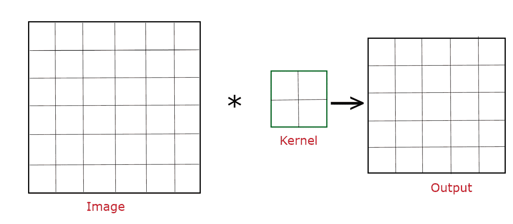
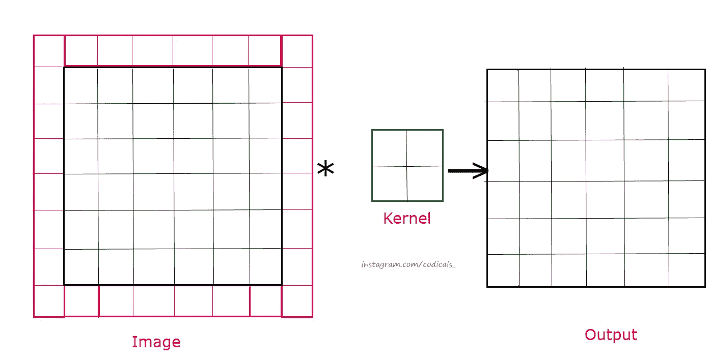
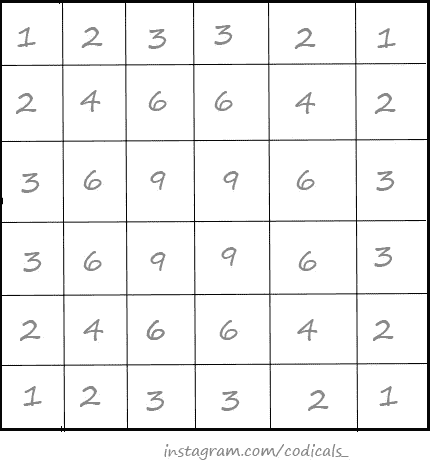
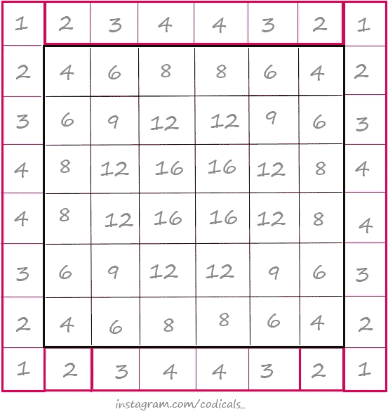

# 什么是填充，为什么它很重要？

> 原文：<https://medium.com/geekculture/what-is-padding-and-why-it-is-important-b887ebdb4a9f?source=collection_archive---------16----------------------->

首先，让我们关注一下**什么是填充**？

当我们在做卷积时，在我们的图像上使用内核，输出的大小会减小。这给了我们一种感觉，我们一定丢失了一些信息，因为输出的大小在减少。

可以使用以下公式计算输出尺寸:

> dim_o/p = dim_img- dim_kernel + 1

因此，为了不丢失图像中的信息并保持输入到输出的尺寸不变， ***我们应用了填充。*** 通过应用填充，我们给图像增加额外的维度，用 0 或 255 填充它们，这个图像的输出将等于填充前输入的图像。

Fill all the red pixels in the image with 0 or 255

现在来说说， ***我们为什么要做填充呢？***

如果我们仔细观察一个像素被解析了多少次，我们会发现边界和角点像素被解析得更少，因为有可能丢失这些部分的信息。因此，我们应用填充并从图像中获取最大信息。

Number of times pixel parsed before applying Padding

从上图可以看出，边界像素被解析的最少(一次或两次)，位于那里的信息将保持未被探索。现在，让我们对它进行填充，看看图像像素被解析了多少次。

Number of times pixels of image parsed after applying padding

填充后，图像的每个像素至少被解析 4 次，这意味着我们正在提取每一条信息，包括角落和边界。

敬请关注，继续学习。

关注 [Instagram](https://www.instagram.com/codicals_/) 上的最新更新。