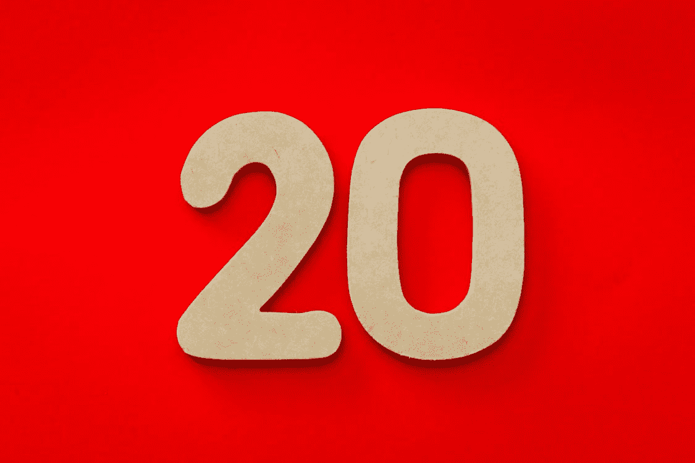

# 什么是帕累托原理及其对数据科学的影响

> 原文：<https://medium.com/geekculture/what-is-pareto-principle-and-its-implications-on-data-science-a7719cabd023?source=collection_archive---------10----------------------->

## 帕累托原理连同代码一起解释了如何绘制帕累托图

Source: [Pexels Free for Use Photo](https://www.pexels.com/ko-kr/photo/20-1339865/)

# 介绍

在学习数据科学的时候，你可能会遇到一个叫做“帕累托原理”的术语。事实上，这一原则不仅仅局限于数据科学或量化领域…