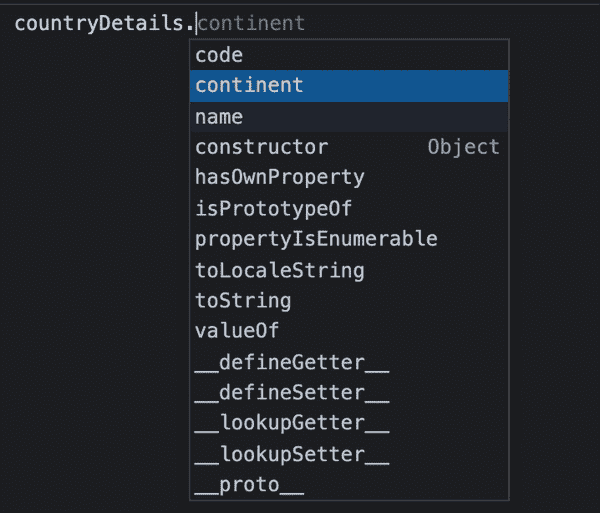
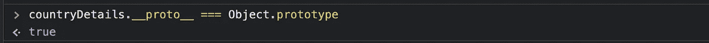
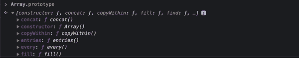
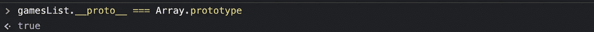
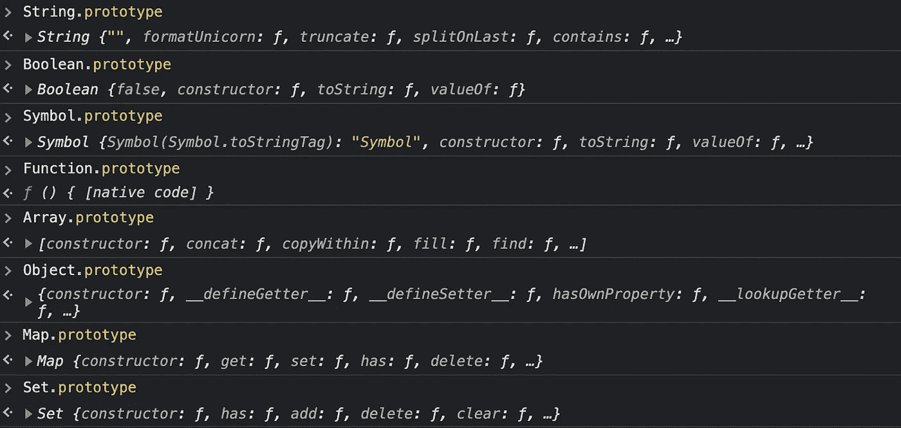
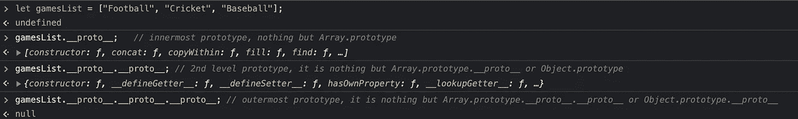
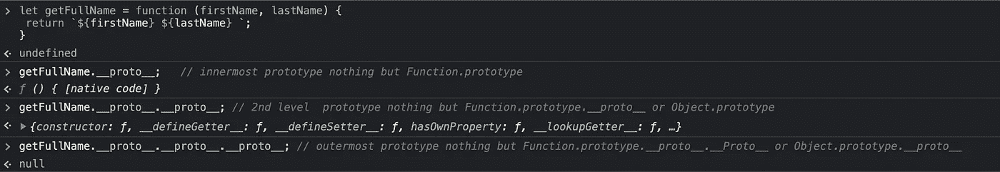

# JavaScript 中的原型是什么

> 原文：<https://medium.com/geekculture/what-is-prototype-in-javascript-7e8d78afd302?source=collection_archive---------12----------------------->


image credit: [https://unsplash.com/photos/pl9DrjAMV6I?utm_source=unsplash&utm_medium=referral&utm_content=creditShareLink](https://unsplash.com/photos/pl9DrjAMV6I?utm_source=unsplash&utm_medium=referral&utm_content=creditShareLink)

原型是 JavaScript 中最可怕的概念之一。但是不要被这个关键词搞得不知所措。这篇文章解释了什么是原型，以及为什么我们称 JavaScript 为基于原型**的面向对象**语言。

让我们以一个简单的对象为例:

```
let countryDetails = {
  name: "India",
  code: "+91",
  continent: "Asia"
};
```

现在我们可以使用点运算符来访问该对象的属性:

```
countryDetails.name       // "India"
countryDetails.code       // "+91"
countryDetails.continent  // "Asia"
```

这很简单，但是除了访问 *countryDetails* 对象内部的属性，我们还可以访问其他一些方法，比如 toString、hasOwnProperty 等等。



首先，我们需要了解这些属性/方法是从哪里秘密添加到我们的 *countryDetails* 对象中的。

我们创建或定义的每个对象都会从 ***对象继承一些属性。对象*** 是 Javascript 内置关键字，它有一个名为 *prototype 的属性。*


***对象*** 的这个*原型*属性反过来又是一个简单的对象，包含 toString、hasOwnProperty 等几个方法。

这就是为什么我们的 *countryDetails* 对象也有这些从内置 ***对象继承的秘密属性。***

我们创建的每个对象都有一个名为 ***__proto__，*** 的属性，该属性指向***object . prototype .***

由上面的陈述我们可以得出 *countryDetails。__proto__ 等于****object . prototype .***



现在让我们看另一个例子，但是这次是一个数组。

```
let gamesList = ["Football", "Cricket", "Baseball"]
```

正如你已经猜到的，即使是这个*game list*数组也有一些有用的方法，比如 length、push、pop、sort 等等。

我们可以访问这些有用的数组方法，因为它从 ***数组继承了这些方法。prototype*** 也是另一个 Javascript 内置关键字，它有一个名为 *prototype 的属性。*



与前面的 object 示例类似，我们创建的每个数组都有一个名为 ***__proto__，*** 的属性，该属性指向***array . prototype .***

所以我们很容易说*game list。__proto__ 等于****object . prototype .***



类似地，我们在 JavaScript 中使用的所有类型的数据都有自己的秘密方法。



*注意:即使字符串、数组、集合和映射在 Javascript 中不是独立的数据类型，它们也有自己特殊的关键字来适应特定的方法。*

现在让我们来理解为什么我们称之为“JavaScript 中的一切都是对象”

尽管数组、函数、集合、映射、布尔等各种数据都有自己的具有有用属性的原型对象，但在这个原型对象内部有一个名为 *__proto__* 的属性，总是指向***object . prototype .***

别糊涂了，我来简单解释一下:

```
*gamesList.__proto__ ===* ***Array.prototype;          //***true***Array.prototype.__proto__ === Object.prototype;   //***true***Function.proptype.__proto__*** === ***Object.prototype; //***true***Set.proptype.__proto__*** === ***Object.prototype;      //***true***Map.proptype.__proto__*** === ***Object.prototype;      //***true***Boolean.proptype.__proto__*** === ***Object.prototype;  //***true
```

最终，JavaScript 中的所有数据类型都从***object . prototype .***继承方法

最后，当我们试图访问***object . prototype . _ _ proto _ _***时，它给出空值。从*游戏列表追溯的方式。__proto__* 到***object . prototype . _ _ proto _ _***称为原型链接。

如果你仍然困惑，看看原型是如何追溯到***object . prototype .***的

1.  将数组追溯到其原型:



2.将函数追溯到其原型:



在不同级别访问这些原型方法的优先级是基于原型链接的。

> prototype 的真正强大之处在于，当我们向原型对象添加自定义方法，并在该类型下的任何变量中使用它时。在我的下一篇文章中，我将通过实例展示我们如何开发这样的定制方法。

## 让我们回忆一下到目前为止我们对原型的了解:

1.  *prototype* 是一个内部具有强大内置属性的对象，如数组的 *push* 、 *pop* 、 *slice* 等。以及*拆分*、*字符*、*截断*等字符串。*调用*，*绑定*，*应用*进行功能。
2.  最里面的原型对象可以通过 *__proto__* 属性访问，并且可以追溯到***object . prototype .***
3.  除了像数组的 *push* 、 *pop* 和字符串的 *split* 、 *charAt* 这样的数据特定的原型方法，我们还可以从***object . prototype .***中访问 *isPrototypeOf* 、 *hasOwnProperty* 和其他属性
4.  访问这些原型方法的优先级基于原型链接。

Chidanandan **P** (如果这个名字很难发音，就叫他 ***Chidu*** )是 Lowe's 的一名软件开发工程师，在那里他帮助构建推动 Lowe's 及其各种业务的技术和解决方案。