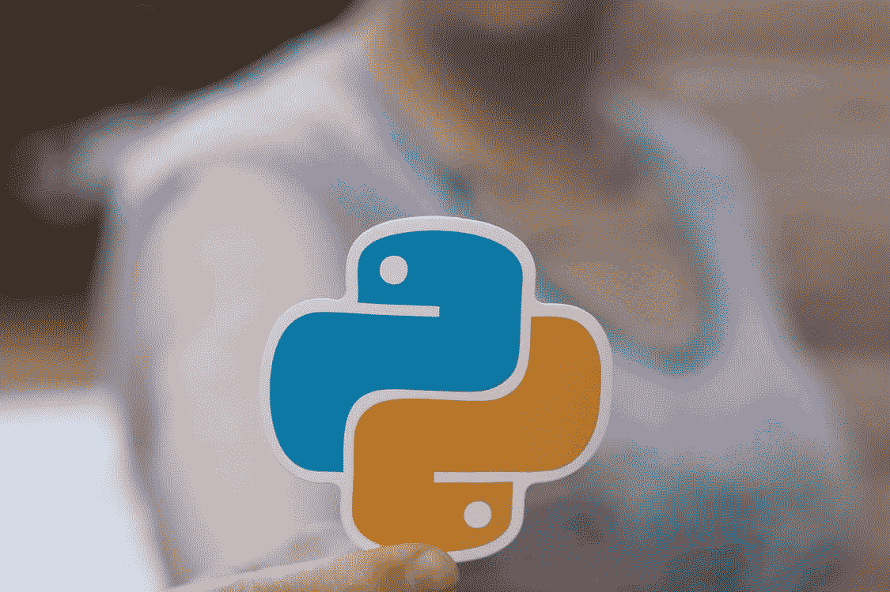
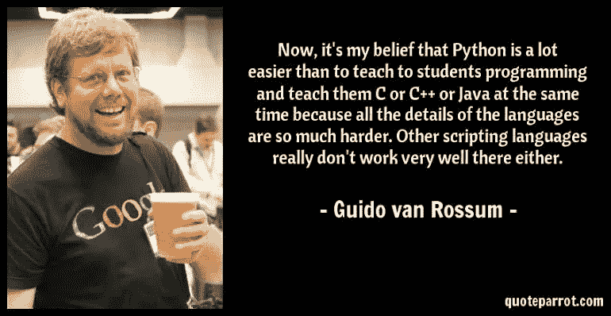
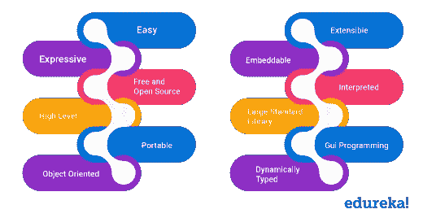
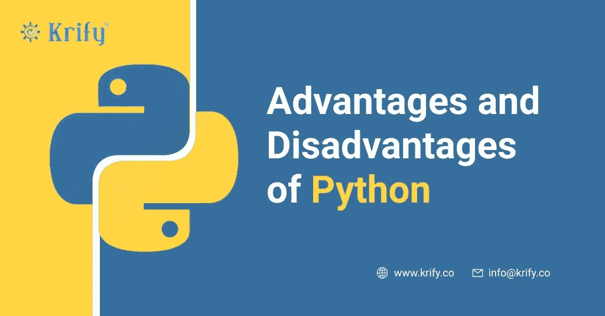
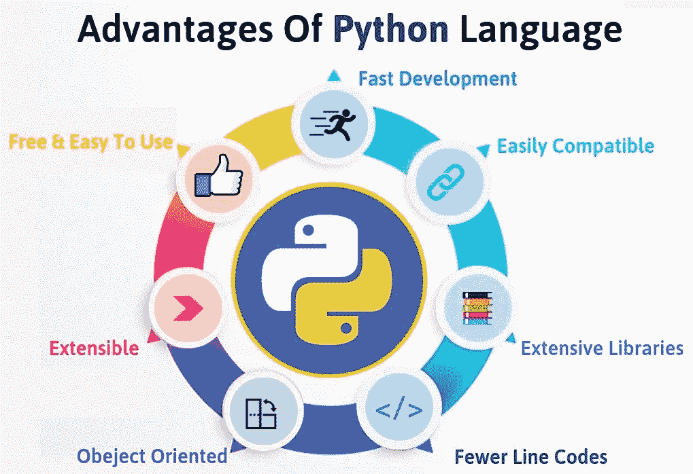
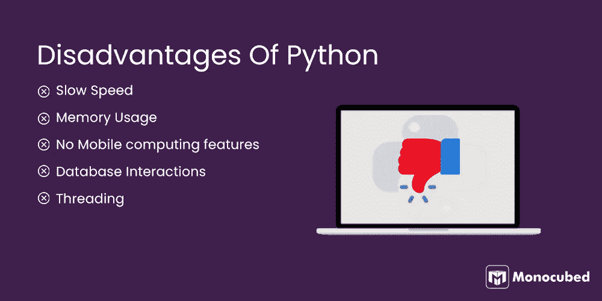
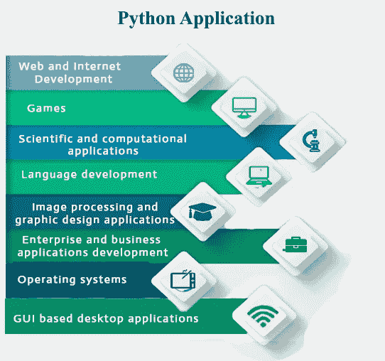

# Python 简介

> 原文：<https://medium.com/geekculture/what-is-python-9a3902a66cb3?source=collection_archive---------6----------------------->

对于那些想要对 Python 语言有简要和基本了解的读者来说，这是一本终极指南。

Source: Pexels

P **ython** **是由**[**Guido Van Rossum**](https://en.wikipedia.org/wiki/Guido_van_Rossum)**于 90 年代初(1991 年 2 月** **)在荷兰国家数学和计算机科学研究所**开发的。Python 是一种高级的、解释性的、交互式的、面向对象的编程语言。它的适应性允许你做许多事情。使用 Python，您可以编写基础项目和脚本，并进一步制作复杂和大范围的项目。Python 还有大量的内置库和模块。

[**吉多·范罗森**](https://en.wikipedia.org/wiki/Guido_van_Rossum) **:**

Source: [https://twitter.com/](https://twitter.com/)

# **用途:**

1.  构建桌面应用程序和视频游戏。

2.对数据进行数学、统计和科学分析。

3.构建 web 应用程序。

4.执行自动化任务。

在 PC 编程领域，你可以随处找到 Python。例如，Python 是世界上一些最著名网站的基础，举几个例子，包括 Reddit、Dropbox 和 YouTube。Python 网络结构 Django 同时支持 Instagram 和 Pinterest。

# **Python 的特点:**

Source: [https://www.edureka.co/](https://www.edureka.co/)

Python 有；许多因素使它成为最令人难忘的第一种编程语言:

1.  开源和免费:python 是一种开源编程语言，这意味着任何人和每个人都可以创建 python 或为其做出贡献。有一个在线平台，人们可以聚集在一起，努力改进 Python。
2.  易于编码:Python 是一种对程序员非常友好的语言，这意味着任何人都可以在几天内学会编码。与 C、C++、Java 等其他面向对象的编程相比。
3.  **Python 支持 GUI**:GUI(**G**raphical**U**ser**I**interface)是编程语言的一个重要方面，因为它为获得的结果增加了可视化的视角。
4.  面向对象的方法:Python 使用其面向对象的方法，这意味着它识别或认可类和对象封装的概念，因此从长远来看，允许程序更加流畅和高效。
5.  **高度可移植性**:假设您在 windows 上运行 python，并且需要切换到 Linux 或 Mac 框架，那么您无疑可以在 Python 中完成类似的任务，而不必担心修改代码。这在其他编程语言中是荒谬的，因此使得 python 成为任何人都希望在商业中找到的最方便的语言之一。

# **Python 的优缺点:**

Source: www.[krify.co](https://krify.co/)

***优点:***

Source: [https://www.deviantart.com/](https://www.deviantart.com/)

***缺点:***

Source: [www.deviantart.com/](www.monocubed.com)

# **Python 的应用:**

Source: [https://www.javatpoint.com/](https://www.javatpoint.com/)

# **使用 Python 的机构/组织:**

1.  NASA(***N***national***A***eronautics 和***S***pace***A***administration)
2.  谷歌
3.  网飞
4.  照片墙
5.  Reddit

# **结论:**

我真的希望这篇文章是一个很好的读物，也是启发每个人思考如何在数据科学领域发展的灵感来源。我希望读者对什么是真正的 python 有一个粗略的概念，这将为您提供一些方向，以便您可以开始进入编程世界的旅程。

# **最后……..**

建议和反馈请**评论**。我还在学习。请帮助我提高，这样我可以通过提升我的写作技能和知识来帮助你，并通过我随后的文章发布以更好的方式向你展示我自己。

下一篇文章将讨论数据分析师和数据科学家之间的区别。

希望你会喜欢这个故事！！

谢谢大家，编码快乐:)

Photo by [Pete Pedroza](https://unsplash.com/@peet818?utm_source=medium&utm_medium=referral) on [Unsplash](https://unsplash.com?utm_source=medium&utm_medium=referral)

 [## Mlearning.ai 提交建议

### 如何成为 Mlearning.ai 上的作家

medium.com](/mlearning-ai/mlearning-ai-submission-suggestions-b51e2b130bfb)