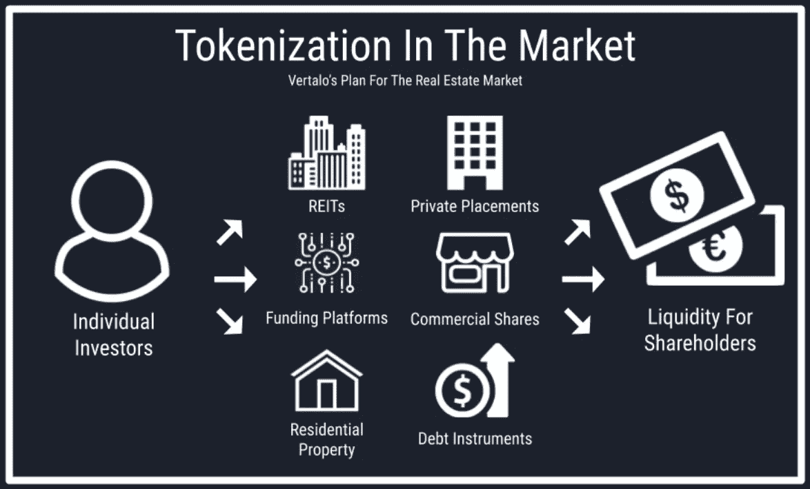

# 什么是房地产令牌化？房地产的标记化如何在加密空间中提供流动性？

> 原文：<https://medium.com/geekculture/what-is-real-estate-tokenization-90e5bfbc3aca?source=collection_archive---------15----------------------->

Real estate tokenization

波士顿咨询集团最新发布的报告震惊了世界各地的许多人。你相信到 2030 年，包括自然资源和房地产在内的令牌化非流动性资产的总规模估计将达到近 16 万亿美元吗？房地产标记化的巨大增长归因于各种因素，如可负担性、安全性、房地产的碎片化和透明度。对标记化兴趣的增长为房地产标记化平台的需求铺平了道路。因此，房地产令牌化平台已成为区块链空间中最赚钱的业务之一。如果您也想开发一个房地产虚拟化平台，那么您来对地方了。让我们直接进入如何房地产令牌化平台可以在加密世界有利可图的风险投资。

**房地产令牌化**

将不动产属性分割成数字令牌代表了不动产属性及其所有权利。为此，智能合同用于指定合同细节。

**房地产证券化的类型**

**商业地产符号化:**顾名思义，任何商业物业的符号化都称为商业地产符号化。通过将资产分割成更小的部分，降低小投资者的准入门槛，增加他们的流动性，可以提高这类资产的流动性。

**住宅房地产标记化:**住宅物业的标记化，业主可以标记其部分或全部物业。他们也可以增加资本收益和股息。

**单一房地产令牌化:**拥有多处房产的人将从单一房地产令牌化中受益，因为它降低了流动性溢价，并有助于通过将其单一房地产资产令牌化来筹集资本。

**奖杯令牌化:**用户可以将自己最无价、最昂贵的资产，即所谓的奖杯资产，进行令牌化，安全地为项目筹集资金。

[**房地产证券化的好处**](https://www.blockchainappfactory.com/real-estate-tokenization?utm_source=srinivasan&utm_medium=medium&utm_campaign=12oct2022)

**流动性:**通过细分，投资者的数量不仅仅局限于较富裕的投资者群体，从而打开了更大的潜在投资者池，房地产的令牌化确保了更高的流动性。

透明度:在房地产行业，建立信誉和信任至关重要。由于数据存储在区块链网络上，所有交易对网络上的每个人都是可见的。这种透明度确保了对市场的信任和信心。

**自动化:**一些耗时的流程，如产权转让、文件验证、股息支付和合规性，通过智能合同实现了自动化。这为所有相关方节省了时间和金钱。

**消除地域限制:**符号化消除了房地产属性的地域壁垒。世界各地的任何人都可以投资代表房地产的代币。

**房地产证券化的未来**

随着令牌化，对房地产的访问呈指数级增长。此前，只有机构投资者才能投资顶级房地产。现在由于房地产令牌化，连散户和机构都可以积极投资房地产。这打开了一个更大的投资池，并导致房地产资产的流动性水平更高。

股票可以实时交易，这为定期在市场上进行有利可图的房地产投资提供了可能性。这也有可能改变私募股权和风险资本的未来商业模式。

[**房地产令牌化流程**](https://www.blockchainappfactory.com/real-estate-tokenization?utm_source=srinivasan&utm_medium=medium&utm_campaign=12oct2022)

**资产识别:**根据类别识别您的资产，并评估其价值。

**智能合同开发:**一旦你确定了资产的价值，就为资产建立智能合同。资产的智能合同包含与之相关的条款和条件。

**安全令牌生成:**在交易资产之前创建安全令牌。所有者必须选择代币的数量和交易平台。

**代币分发:**在分发代币之前，向潜在投资者推销代币。然后你可以在流行的交换平台上列出你的代币。

**综上所述，**随着令牌化非流动性资产的数量与日俱增，房地产令牌化市场显示出非常有前景的迹象。预计房地产令牌化将在未来几年彻底改变整个行业。由于入门投资者的门槛也很低，发行人可以拥有更大的投资者群体。你也可以通过开发一个房地产令牌化平台来利用这个高回报的市场。现在就聘请一家专业的房地产令牌化平台开发公司来入门。