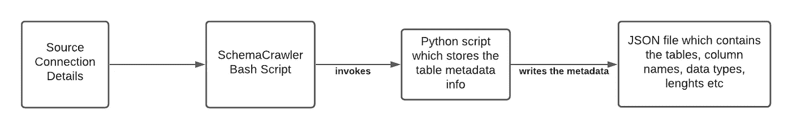
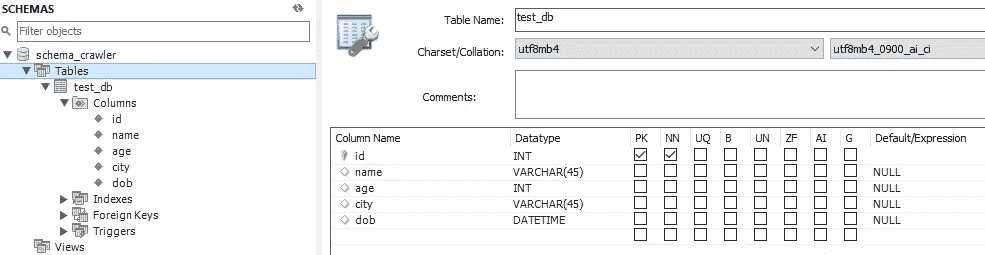
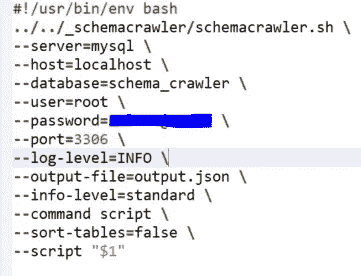
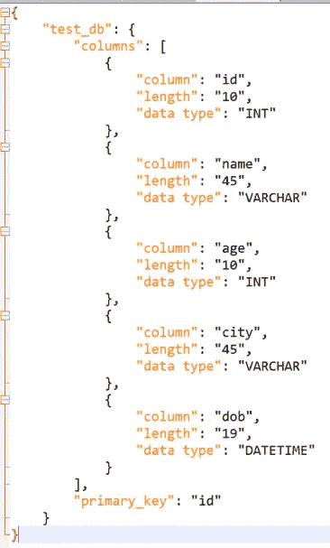
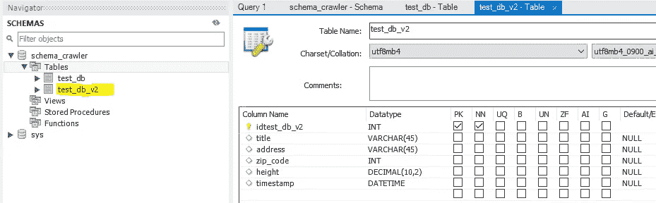

# 什么是 SchemaCrawler，为什么需要它？

> 原文：<https://medium.com/geekculture/what-is-schemacrawler-and-why-would-you-need-it-b9c496054533?source=collection_archive---------11----------------------->

Photo by [Nivek.Old.Gold](https://www.flickr.com/photos/128691640@N04/) on [Flickr](https://www.flickr.com/)

在这篇博文中，我将解释如何使用模式爬虫工具从给定的模式中获取表细节。为了保持解释和工作流程简单，我将做一个关于爬行 MySQL localhost 表的演练，并向您展示元数据信息的输出 json。

## 介绍

SchemaCrawler 是一个开源工具，您可以简单地利用它来抓取数据库模式/表对象，并以可读的格式提取元数据输出。它是高度可定制的，您可以使用他们在发行版示例中提供的样板代码，并实现更多的用例。

他们的[网站](https://www.schemacrawler.com/)上的定义是:

> SchemaCrawler 是一个免费的数据库模式发现和理解工具。SchemaCrawler 为数据治理提供了一系列有用的特性。您可以使用正则表达式[搜索数据库模式对象](https://www.schemacrawler.com/schemacrawler-grep.html)，并以可读的文本格式输出模式和数据。输出服务于数据库文档，并被设计成[不同于其他数据库模式的](http://en.wikipedia.org/wiki/Diff)。SchemaCrawler 还生成[模式图。你可以用任何标准的脚本语言对你的数据库执行脚本。使用](https://www.schemacrawler.com/diagramming.html) [lint 可以发现潜在的模式设计问题。](https://www.schemacrawler.com/lint.html)

## 安装步骤:

1.  进入主页面-[https://www.schemacrawler.com](https://www.schemacrawler.com/)你会找到下载发行版的地方([https://github.com/schemacrawler/SchemaCrawler/releases/](https://github.com/schemacrawler/SchemaCrawler/releases/)
2.  下载最新的 zip 文件并解压。
3.  一旦你拉开拉链，你会看到一个 README.html。打开它，你会看到要下载的先决条件。
4.  确保 JAVA 路径设置正确后，进入发行版中的 __downloader 目录。
5.  通过调用
    安装您需要的库。/download.sh 插件
    。/download.sh 杰克逊
    。/download.sh python
    。/download.sh velocity(不确定是否有必要，但我还是安装了)
    之后你就可以开始了。
6.  你可以使用他们已经在发行版中提供的测试数据库。为此，您需要从根目录进入 _testdb 目录并运行**。/startdbserver.sh** 。这将为您创建示例模式和表。您也可以查看目录中的 README 页面以获得任何帮助。
7.  或者，您可以直接传入不同的连接详细信息，以便爬行到源数据库中。为此，你需要从根目录进入/examples/python 目录并编辑 **python.sh** 。例如，您可以用自己的 RDBMS 替换默认连接细节，或者用其他可选标志替换任何其他连接。如果你输入**，你可以查看更多关于旗帜的信息。/schemacrawler.sh -h** 进入 __schemacrawler 目录。您可以简单地在 python.sh 中使用下面的例子，通过相应地更改值:

    #！/usr/bin/env bash
    ../../_ schema crawler/schema crawler . sh \
    —server = MySQL \
    —host = localhost \
    —database = testdb \
    —user = username \
    —password = user 1234 \
    —port = 3306 \
    —log-level = INFO \
    —output-file = output . JSON \
    —INFO-level = standard \
    —命令脚本\

8.  一旦设置了连接细节，就可以在/examples/python 目录下测试 **tables.py** 脚本，方法是执行 shell 脚本和 python 脚本作为参数:
    **。/python.sh tables.py**
9.  这将为您提供表名、子表等。然后，您可以修改脚本以引入更多元数据，如主键、数据长度、数据类型等。

## 演示演练:

Workflow Diagram

为了这个测试，我在本地主机中创建了一个示例 MySQL 模式和一个表。

schema and table details

然后我继续编辑 **python.sh (** 驻留在 examples/python 目录 **)** 以获得我的本地主机的连接细节

python.sh

参数解释

> **服务器**:连接系统类型
> **主机**:连接
> **数据库的主机**:你要抓取的数据库名称
> **用户**:连接的用户名
> **密码**:连接端口
> **的密码**:连接端口
> **日志级别**:设置日志级别例如:关闭、严重、警告、信息、全部【T2 缺省值是 standard，但是您可以将其更改为 minimum、standard、detailed、maximum
> **command** :您可以选择是执行我提供的示例中的脚本，还是运行 shell 命令( **command=** execute)，或者引入模式的细节( **command=** schema)， 或者执行过滤(**命令**= filter)
> **sort-tables**:是否按字母顺序对表进行排序
> **脚本**:您可以在这里直接传入 python 脚本的名称，但是在我的示例中，我是在运行 bash 脚本 python.sh 时从一个参数中获取它的

编辑完上述 bash 脚本后，我修改了/examples/python 位置中现有的 **tables.py** python 脚本。除非您需要该表的更多细节，否则您可以简单地使用为测试目的提供的默认脚本。

我在上面所做的是，我在给定的模式中引入了可用表的列名、数据类型、长度和主键。由于 SchemaCrawler 工具的隐式序列化程序读取和提取表/列的不必要信息有点复杂，所以我只提取了有用的元数据信息，并将它们写入 JSON 并保存为 **tables.json** 。您仍然可以通过使用以下两个参数来使用隐式序列化特性，而不是使用我在上面的 **python.sh** 中使用的**命令脚本**参数。
—命令序列化
—输出格式=JSON

tables.json 如下所示

tables.json

如果您将上面的输出与我之前展示的 MySQL 表的截图进行比较，它应该是匹配的。你可以带任何数量的桌子进来。例如，假设我在 MySQL 本地主机中创建了另一个表

test_db_v2

一旦我通过 schema crawler 运行 python.sh，它应该会拉入新表以及之前的表(test_db)的详细信息

## 最终想法:

如果您在任何需要自动化和维护各种源系统类型(例如:DB2、Postgres、Oracle 等)的表/模式元数据细节的项目中工作，这个工具会非常方便。).如果您要从头开始为每个源系统类型实现一个爬虫，这将极大地减少您需要投入的开发工作。