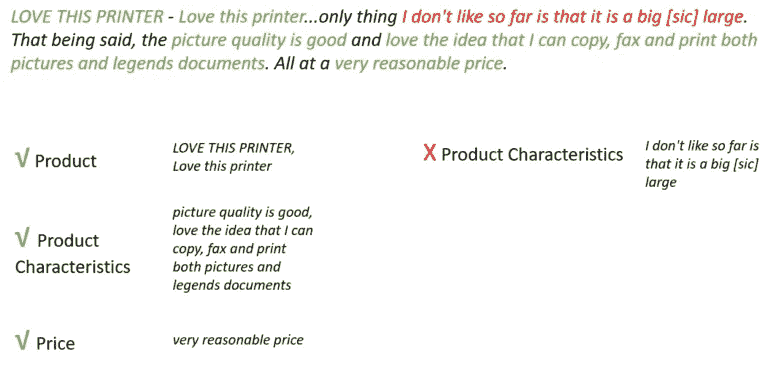
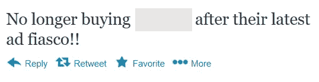
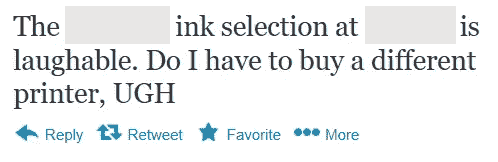
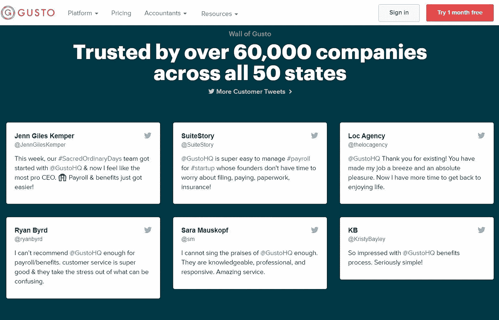

# 什么是情感分析？

> 原文：<https://medium.com/geekculture/what-is-sentiment-analysis-827607c34aa7?source=collection_archive---------4----------------------->

教机器理解情感

情感分析是我们越来越经常听到的另一个流行词，但可能并不完全理解它的作用或使用方法。商业中的情感分析应用给公司和客户都带来了好处，例如改进产品和服务，识别竞争的优势和劣势，以及有针对性的广告。

*情感分析*，也称为*情感检测*或*观点挖掘*，是对给定文本中可能表达人们对实体、个人、问题、事件、主题及其属性的观点、评价、态度和情感的情感**极性**的分类。简单地说，它回答了“作者对这个话题有什么感觉？”同答案*正*或*负*，但也可能包括*空档*。

换句话说，情感分析识别语言中带有积极、消极或中性情感的单词或模式。作为人类，我们解释情感不仅基于我们的语言知识，还基于社会背景。计算机在快速识别语言模式方面非常出色，但当情感的解释严重依赖于上下文时，它们面临准确性挑战。例如，人类很容易理解*便宜*这个词在指价格时是正面的，但在指质量时是负面的。也可能有这样的情况，一个词在一个领域可能只是陈述一个事实，但在另一个领域却承载着情感。酒店评论中的“红色”一词(“墙上有一张有红花的图片”)只是陈述一个事实，而在技术评论中，“红色”一词，如“我的图片打印成红色”，将是负面的。因此，在对情感极性进行分类时，需要教会计算机如何考虑这种背景。这就是为什么许多情感分析工具最近采取特定领域或特定主题的情感分析的形式，通过将范围限制在已知的上下文来提高准确性。

# 情感程度

除了极性之外，我们可能还想通过使用情绪的**度**来了解意见的积极或消极程度。一些情感词汇或短语带有更强烈的感情。例如，“电影没那么好”比“电影糟糕透了”负面程度要低。在我们的分析中包括情绪极性的程度可以为决策提供更好的见解。

# 情感的类型

我们可能感兴趣的另一个方面是情绪的类型:快乐、悲伤、厌恶、失望、惊讶、恐惧、期待、信任等等。例如，句子“我期待更快的下载速度”，不仅是消极的，而且还带有失望的情绪。另一个例子是句子“我担心下一部复仇者联盟电影将不会包括我最喜欢的漫威超级英雄”，其中情绪是负面的，我们可以识别恐惧的情绪。同样，在肯定句“我等不及要试用新 iPhone 了！”，我们也有一种期待感。

# 情感分析用在哪里？

随着社交媒体的出现，情感分析已经成为一种非常流行的挖掘公众意见的方式。长期以来一直使用情感分析来分析开放式调查问题的答案；然而，这种数据通常是有限的，并且需要相当大的努力来收集。然而，数百万人在社交媒体平台上自由分享他们的观点，我们可以利用这些公共数据，通过情感分析做出明智的商业决策。

# 公司产品或服务评估

许多公司使用情感分析来提取和理解客户对其产品或服务的意见。网站、论坛和社交媒体上的评论对公司产品和/或服务的优势和局限性提供了有益的见解。这些见解可以用于发现需要改进的可能问题，因为特定领域的情感分析可以自动将正面和负面评论分类到相关主题和子主题中。想象一下从数百万客户体验的快速总结中获得的好处，其中可以实时跟踪客户对诸如“产品质量”等主题的感受。让我们来看看下面的评论:

特定领域的情感分析工具可以识别出客户对产品的某些方面有积极的感觉，但对产品的大小没有。

# 竞争对手情报

虽然了解公司自身产品和服务的优势和局限性很有帮助，但了解其竞争对手的状况也很重要。他们可能希望在竞争对手的产品或服务中加入客户喜欢的功能，或者避免竞争对手的客户不喜欢的功能。下面，将某公司的打印机与竞争对手公司的类似打印机(打印机 X)进行比较。该公司的打印机因其易于设置和界面而受到青睐，但竞争对手的一款打印机具有后置进纸的附加功能。

# 市场情报

如果一个组织托管其他公司的产品或服务，了解人们喜欢什么以及需要改进什么是很有用的。这些信息可以帮助公司决定是否继续提供产品或服务，以及推广哪些产品或服务。类似地，如果一家公司通过其他公司销售他们的产品，他们可以分析客户评论，以确定销售者或新供应商销售他们产品的问题。在以下推文中，与该品牌相关的负面感受表明销量可能会下降；销售这个品牌的公司可能需要考虑到这一点。

另一个例子是下面的推文:

顾客对特定商店中某品牌产品的选择不满意；除非品牌与商店一起解决这个问题，否则这可能会对他们的销售产生影响。

# 广告

许多当前的广告策略是基于包含人们对产品或服务的评论，也称为客户评价。情感分析允许公司从数百万可用评论中找出他们希望展示的正面评论，以获得客户的信任。同样，他们可能希望通过识别竞争对手产品和服务的负面趋势来展示自己相对于竞争对手的优势。例如，Gusto 在他们的 Twitter 账户上转发积极的客户评论，但也在他们的网站上展示其中一些评论，作为一种广告策略。

*原载于 2018 年 5 月 18 日*[*【https://www.megaputer.com】*](https://www.megaputer.com/what-is-sentiment-analysis/)*。*