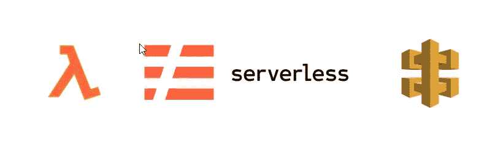
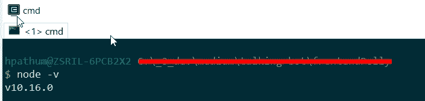
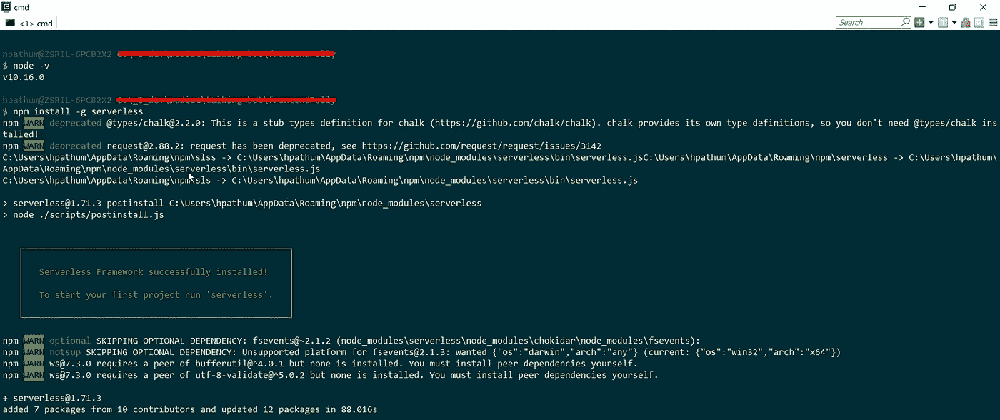
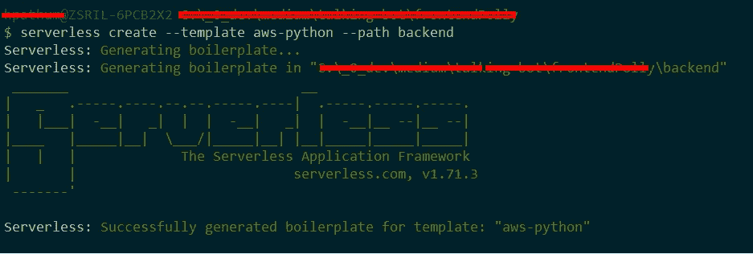
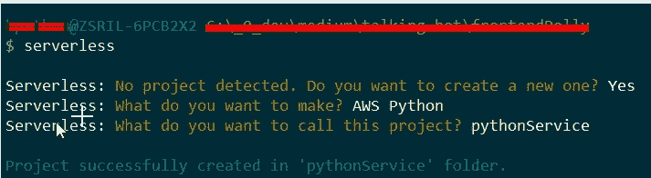
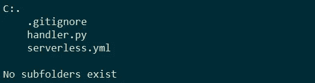
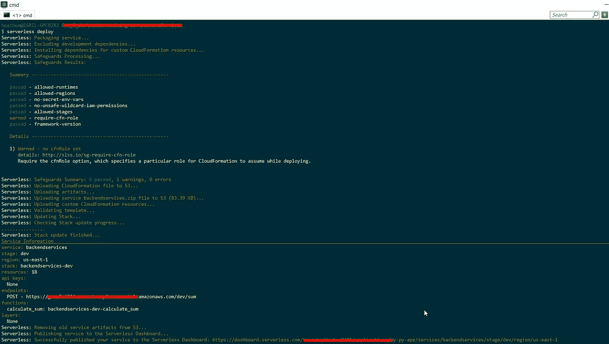
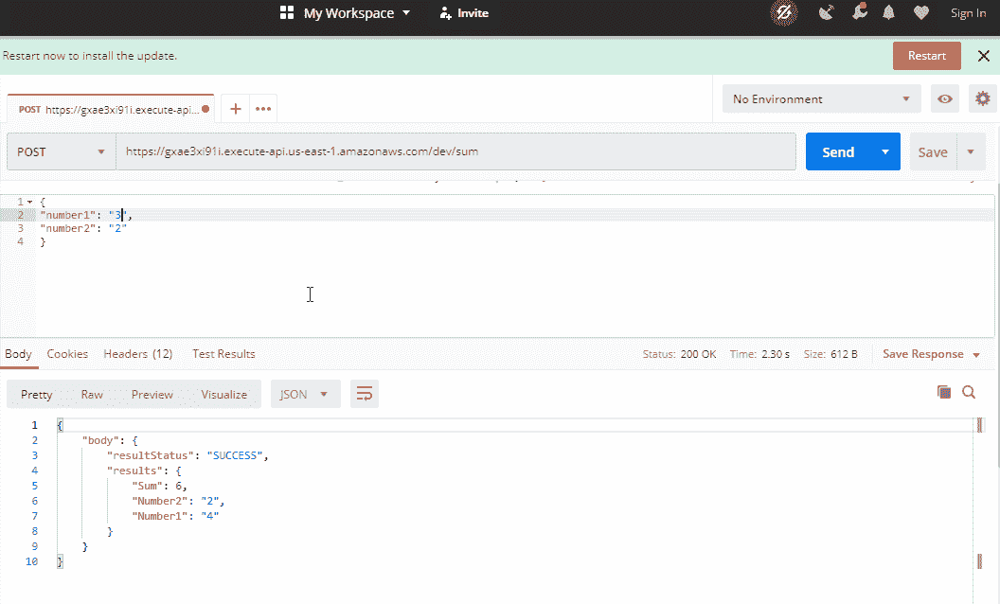

# 什么是无服务器框架，用 AWS Lambda 构建无服务器 API？

> 原文：<https://medium.com/geekculture/what-is-serverless-framework-build-serverless-api-with-aws-lambda-2a38830a466?source=collection_archive---------0----------------------->



**什么是** [**无服务器**](https://www.serverless.com/learn/why/) **？**

S 无服务器是将您的所有基础设施需求抽象为一个简单的配置，并为您进行部署。简单地说，它允许用户编写和部署后端服务，而不用担心底层基础设施。即使我们称之为无服务器仍然使用物理服务器，但程序员不需要担心那些服务器。基础设施不是你的责任。扩展和性能是自动处理的，您只需为您使用的确切资源付费

像 AWS、Azure 和 Google Cloud 这样的云提供商负责提供基础设施来执行这段代码。这种发送给云提供商运行的书面代码以功能的形式出现，通常被称为功能即服务(FaaS)。因此，收费是根据执行代码所使用的资源数量来计算的(只为每个函数执行时所用的处理时间付费)。

[AWS 无服务器概述](https://aws.amazon.com/serverless/)

[微软 Azure 无服务器概述](https://azure.microsoft.com/en-us/solutions/serverless/#overview)

[谷歌云无服务器概述](https://cloud.google.com/serverless)

而不涉及无服务器架构的更多细节。让我们来关注一下今天的话题什么是无服务器框架，我们可以用它来做什么样的工作。

**什么是** [**无服务器框架**](https://www.serverless.com/framework/docs/) **？**

另一个使用 Node.js 编写的开源 web 框架使我们能够构建可伸缩的应用程序，而无需担心基础设施的供应和管理。这将有助于摆脱服务器扩展、资源供应等。最初，它只支持在 AWS Lambda 上构建应用程序，但当前的无服务器框架能够在许多其他支持功能即服务的云提供商中构建和部署应用程序，其中很少是这样的，

*   谷歌云:[云功能](https://cloud.google.com/functions/docs/concepts/overview)
*   IBM BlueMix: [IBM 云功能](https://cloud.ibm.com/docs/openwhisk?topic=openwhisk-getting-started)
*   甲骨文云:[甲骨文功能](https://docs.cloud.oracle.com/en-us/iaas/Content/Functions/Concepts/functionsoverview.htm)
*   AWS: [AWS Lambda](https://aws.amazon.com/lambda/)
*   微软 Azure: [Azure 功能](https://azure.microsoft.com/en-in/services/functions/)

等等。

这里有所有的[无服务器基础设施提供商](https://www.serverless.com/framework/docs/providers/)

让我们用 Python 实现一个简单的 AWS Lambda 无服务器 API

作为第一步，我们需要将 **Node.js** 安装到本地机器上，因为无服务器是 node.js CLI 工具。可以使用 node.js 版本检查命令来验证安装。

```
node -v
```



> 注意:无服务器运行在节点 v6 或更高版本上

下一步是安装无服务器框架。在 cmd 中键入以下 npm 命令。

```
npm install -g serverless
```



您可以使用以下命令来验证它，

```
serverless -v
```

现在，我们需要配置 AWS 帐户来代表您供应和管理资源。

*   登录 [AWS 账户](https://aws.amazon.com/)(如果没有账户，创建一个 AWS 账户)
*   接下来将创建一个 IAM 用户和[访问角色](https://www.serverless.com/framework/docs/dashboard/access-roles/)，通过启用无服务器框架来发布临时访问密钥以在 AWS 中部署服务，从而保护 AWS 上的服务部署。(在本文中，我使用默认的 AWS 配置文件)

```
serverless config credentials --provider aws --key <AccessKey> --secret <secretKey> --profile <profile name>
```

一旦成功，我们可以在。本地计算机中的 aws 文件夹。


现在让我们使用无服务器创建一个简单的后端服务。

在 cmd 中使用以下命令将创建一个服务。

```
serverless create --template aws-python --path backend
```



使用上面的命令，我们可以创建 python 服务。有许多模板可用于在无服务器框架中创建服务。[查看此处](https://www.serverless.com/framework/docs/providers/aws/cli-reference/create/#available-templates)。

如果你不记得命令，在控制台中键入*无服务器*，如下图所示，我们可以创建服务。



这将在项目目录中创建两个文件。



默认 *serverless.yml* 如下图所示

默认 *handler.py* 看起来像

handler.py

让我们修改这两个文件来创建一个简单的 API，我们可以用它来添加两个数值。

作为第一步，我们应该将 *serverless.yml 修改为 dec*

*   定义服务的名称:后端服务*(这应该是特定无服务器帐户的唯一服务名称)。*
*   为了在无服务器仪表盘(*dashboard.serverless.com*)中监控无服务器项目，我们可以提到 *app* 和 *org。*
*   接下来，我们应该提到云提供商的配置。在我们的例子中，我们使用 AWS 作为我们的云服务提供商。(应该需要配置 AWS 配置)
*   在最后一部分，我们包括了 lambda 函数。在我们的例子中，我们希望定义一个 POST API。

更多信息请参考[此处](https://www.serverless.com/framework/docs/providers/aws/guide/variables/)。

让我们看看修改后的 *serverless.yml* ，它包含了 POST API 的所有必要配置。

现在我们应该在 handler.py 中实现服务。

让我们编写一个简单的 python 函数来添加两个数值并返回 JSON 响应。

现在所有的实现和配置都完成了

让我们使用无服务器命令来部署它

```
serverless deploy
```

一旦您执行这个命令，它将在 AWS 中提供所有必要的资源并部署我们的代码。



成功的部署将返回端点 URL。

让我们尝试一下使用无服务器框架创建的简单 API



现在轮到你试一试了……..

> ** *注意:请检查 AWS CloudFormation，在那里您可以看到为特定无服务器项目提供的所有 AWS 资源。*

请在这里随意发表你的问题…！！！！！！！！！！！！！