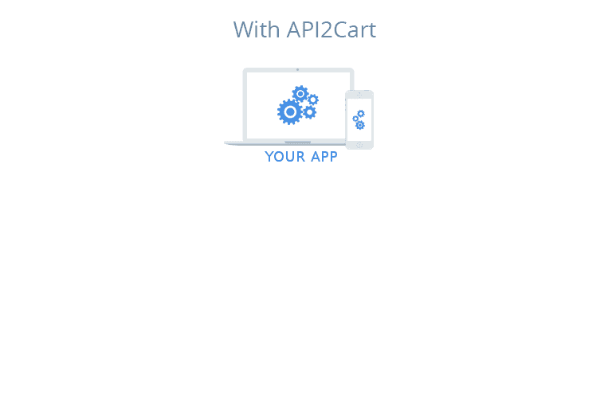

# 什么是购物车 API 集成？

> 原文：<https://medium.com/geekculture/what-is-shopping-cart-api-integration-312db8afcf31?source=collection_archive---------11----------------------->

今天，全球各地的电子商务 B2B SaaS 公司都在努力获得优势，并保持领先地位。事实是，无论你提供什么样的解决方案，这都是一个竞争激烈的行业。因为与电子商务软件行业相关的每个细分市场的竞争都是无止境的，所以脱颖而出是至关重要的。最好的方法之一是利用购物车 API 集成。

您管理的软件集成的购物平台越多，您就越有可能通过满足当今商家不断增长的需求和帮助他们简化运营来战胜竞争对手。

在本文中，我们将更深入地研究[购物车 API 集成](https://api2cart.com/ecommerce/integrate-shopping-carts/)的开发，我们将向您展示如何以最小的努力来执行它。

# 购物车 API 到底是什么？

[**购物车 API**](https://api2cart.com/api-technology/shopping-cart-api-what-pitfalls-you-should-be-aware-of/?utm_source=medium&utm_medium=referral&utm_campaign=shoppingcartapin.kov) ，也称为购物平台的应用编程接口，是一种访问存储在网上商店的众多种类的数据的独特类型。使用 API，您可以无缝地将您的软件连接到购物车，并从购物车中提取与产品、订单、发货、类别、客户或库存相关的信息。

例如，库存管理软件提供商可以使用购物车 API 将他们的解决方案连接到各种平台，并基于这些平台访问商店的产品和订单。之后，这些解决方案可以在客户的销售渠道中更新和同步这些数据。

当您连接到多个平台时，您可以轻松检索执行软件操作所需的所有信息，并确保多个平台上客户在线商店之间的无缝数据同步。在这个过程中，API 成为两个应用程序(您的软件和购物车)相互交互的媒介。

# 什么是购物车 API 集成？

集成过程包括在电子商务软件(如多渠道系统、库存管理系统或仓库管理服务)和购物车(如 Magento、WooCommerce、Shopify、PrestaShop 等)之间建立可靠的连接。

这种连接涉及使用编码和编程语言来确保数据被自动提取，并且在两个系统之间正确地设置连接。为了更好地理解这个概念，我们来看看一些著名的购物车 API 示例。

# 2022 年最受欢迎的购物车 API

**1。Shopify API**

Shopify 在全球拥有超过 100 万的参与用户，被认为是最受欢迎的购物车解决方案之一。 [Cart API](https://shopify.dev/api) Shopify 使您能够轻松创建能够与该平台交互的工具，并使用定制的方法处理订单、客户、产品和类别。

Shopify 支持 XML 和 JSON 格式，并提供了无数种处理数据的方法，使软件开发人员可以轻松地为客户提供优质服务。

**2。亚马逊 API**

这个巨大的市场拥有超过 3.1 亿的月用户，其中 9000 万是付费用户(Amazon Prime)，有一个强大的 API，允许您处理来自其商店的大量数据。

Amazon cart API 使您能够在系统和 Amazon 之间交换数据，访问订单、付款、评论、列表、类别等信息。除了这些数据之外，您还可以使用 API 来检索信息，比如卖家资料、客户反馈、产品评论或卖家反馈。

但是，这个 API 将通信数据限制为 XML 或 CSV 文件。这意味着开发人员需要具备从亚马逊检索信息的适当技能。

**3。Magento API**

也许最受欢迎的平台是 SaaS 商业提供商想要整合他们的解决方案的 Magento。Magento API 支持 XML 和 JSON 格式，提供了四种访问和更新数据的独特方法:POST、PUT、GET 和 DELETE。此外，它利用 XML-RPC 客户端进行通信，并且跨越 REST 和 SOAP APIs。

**4。易贝 API**

另一个广受欢迎的平台是易贝，我们建议你在选择集成你的软件时重点关注它。这个平台月活跃用户总数已经超过 1.78 亿，超过 100 万的产品列表，竞争无疑是激烈的。

易贝 API 可以使用 XML 通过互联网直接与易贝数据库通信。使用这个 API，软件供应商可以轻松地显示产品列表、查看关于客户和产品的信息、获取类别、检索完整的项目列表，以及执行许多其他类似的任务。

**5。WooCommerce API**

WooCommerce 拥有超过 240 万个活跃网站，已成为电子商务市场的真正领导者，被公认为市场上最稳定的购物车之一。使用 [WooCommerce API](https://woocommerce.com/document/woocommerce-rest-api/) ，软件提供商可以轻松处理与产品、类别、订单、发货、税收等相关的数据。

使用 WooCommerce API，您可以读取、创建、删除、更新或导入您需要的任何类型的数据来运行您的软件。您还可以利用 REST API 无缝地过滤订单、删除库存以及执行许多其他类似的活动。

**6。Ecwid API**

Ecwid 的 API 是一个具有 oAuth2 身份验证的 RESTful API，允许软件开发人员管理 Ecwid 电子商店数据、定制店面和发送更新。与这个 API 集成使您能够访问宝贵的在线商店数据，如产品、订单、客户、运输信息或库存详细信息。然后，您可以通过您的系统管理这些信息。

因为 Ecwid 有一个 RESTful API，所以您可以轻松地从 Ecwid 存储信息中获取数据、更新、创建和删除信息。

**7。沃尔玛 API**

沃尔玛是一个巨大的在线市场，销售来自美国和加拿大数千家卖家的产品。沃尔玛商店的数量约为 14 万家。

与沃尔玛整合包括将你的应用程序或软件与沃尔玛 API 连接，从而能够检索所有关于沃尔玛产品、类别、定价、发货等的信息。

沃尔玛有两组 API:商品 API 和交易 API。使用它们可以管理沃尔玛商品、价格、库存、订单等。

开发与沃尔玛 API 的集成是一个复杂的过程，可能需要几个月才能完成。

# 为购物车集成开发选择统一的 API

既然你已经很好地意识到了[购物车 API 集成](https://api2cart.com/ecommerce/shopping-cart-integration-which-ones-to-integrate-with-and-why/)的重要性，并且知道了 2022 年的顶级购物车 API，那么是时候找出你如何一次连接所有这些 API 了。考虑到与手动集成相关的挑战，以及增加满足客户所有需求所需的集成数量的重要性，不言而喻，统一的解决方案要比手动集成好得多。

这样一个允许你一次连接你的软件和 40+购物车 API 的解决方案被称为 [API2Cart](https://api2cart.com/?utm_source=medium&utm_medium=referral&utm_campaign=shoppingcartapin.kov) 。借助这一集成解决方案，您可以轻松添加、删除、更新和修改客户商店中的所有数据。此外，您可以使用 100 多个 API 方法来处理数据，同时实现独特的好处:降低 TCO，减少集成时间，并最小化财务投资。

这项服务可以免费试用 30 天。你所需要做的就是[在 API2Cart](https://app.api2cart.com/#register?utm_source=medium&utm_medium=referral&utm_campaign=shoppingcartapin.kov) 上注册你的免费试用账户。如果您有任何其他问题，也可以通过电话、电子邮件或网站聊天联系 API2Cart 经理。公司全天候工作。